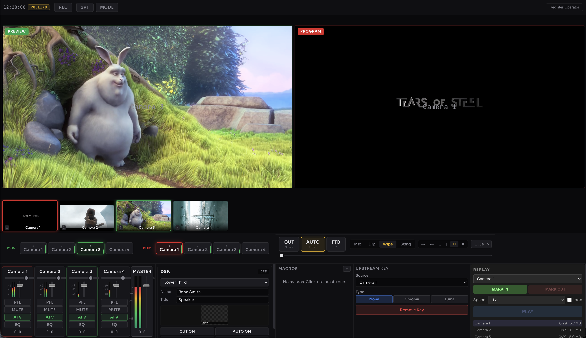
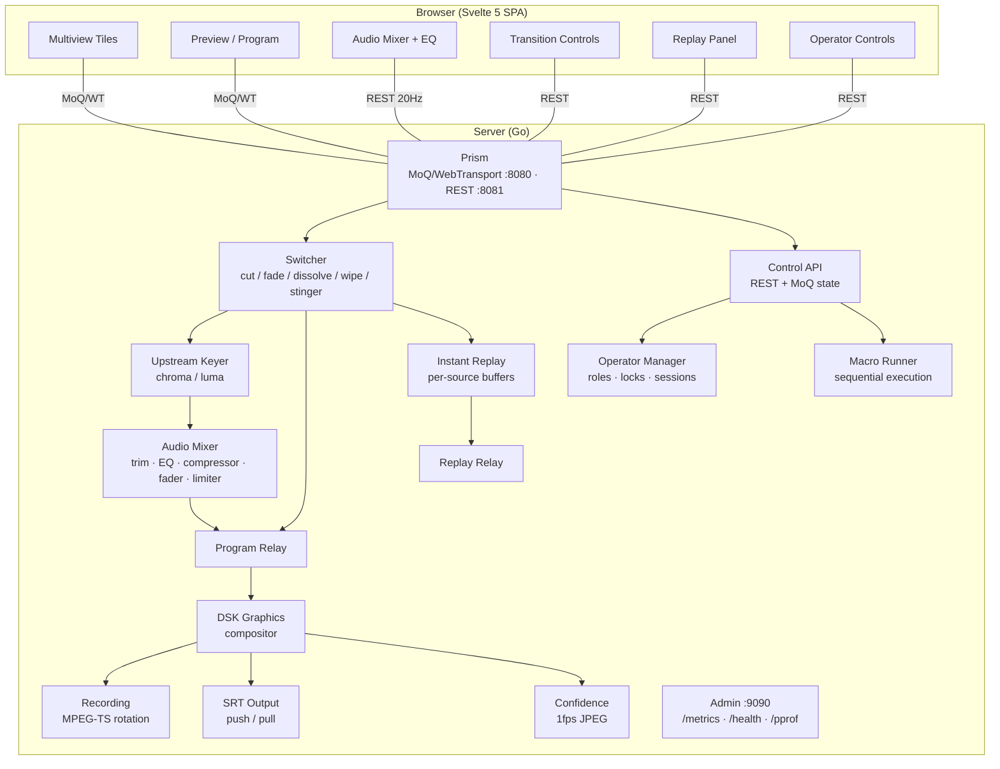

# SwitchFrame

Browser-based live video switcher for multi-camera production. Built on [Prism](https://github.com/zsiec/prism) (MoQ/WebTransport media server).



## What It Does

SwitchFrame is a video switcher that runs in the browser. Sources come in via Prism's MoQ ingest, the Go server handles all switching/mixing/encoding, and browsers connect over WebTransport to view sources and control the switcher via REST.

The server produces the authoritative program output — the browser is a control surface, not the mixer.

## Features

### Video

- Hard cut with keyframe gating (waits for IDR before forwarding)
- Mix, dip-to-black, and wipe transitions (100–5000ms)
- 6 wipe directions: horizontal L/R, vertical T/B, box center-out, box edges-in
- Stinger transitions from PNG sequences with per-pixel alpha
- Manual T-bar at 20Hz throttled updates
- Fade to black with reverse (smooth fade back in)
- Per-source delay buffer (0–500ms, for lip-sync correction)
- Freerun frame synchronizer aligns multi-source frames to common 90 kHz tick
- GOP cache for keyframe on cut
- Resolution mismatch handled by bilinear scaler (speed-critical) or Lanczos-3 (quality-critical, used in transitions and replay)
- Upstream chroma and luma keying per source, computed in YUV420 domain
- H.264 output with BT.709 colorspace signaling, limited-range black level (Y=16)
- Always-on re-encode through decode→process→encode for consistent SPS/PPS

### Audio

- Server-side FDK AAC decode/mix/encode
- Per-channel: fader, mute, AFV, input trim (-20 to +20 dB)
- 3-band parametric EQ per channel (RBJ biquad, 80–16,000 Hz)
- Single-band compressor per channel (threshold, ratio, attack, release, makeup gain)
- Equal-power crossfade on cuts (cos/sin ramp, ~23ms)
- Brickwall limiter at -1 dBFS on master bus
- BS.1770-4 LUFS loudness metering: momentary (400ms), short-term (3s), integrated (dual gating)
- Per-channel peak metering in state broadcast
- Per-source audio delay (0–500ms) for lip-sync correction
- Signal chain: Trim → EQ → Compressor → Fader → Mix → Master → Limiter → Encode
- Passthrough optimization: bypasses decode/encode when single source at 0 dB with EQ and compressor bypassed
- Client-side PFL (pre-fade listen), per-operator, no server involvement

### Output

- MPEG-TS recording with time-based (default 1h) and size-based rotation
- Multi-destination SRT output with per-destination lifecycle (add/remove/start/stop independently)
- SRT push (caller) and pull (listener, up to 8 connections) per destination
- 4MB ring buffer per SRT caller with keyframe resume on overflow
- 1 fps confidence monitor (320x180 JPEG thumbnail of program output)
- Output viewer only active when at least one output is running

### Instant Replay

- Per-source GOP-aligned circular buffers (1–300 seconds, configurable via `--replay-buffer-secs`)
- Mark-in / mark-out with wall-clock precision
- Variable-speed playback (0.25x–1x) with frame duplication for slow-mo
- WSOLA time-stretching for pitch-preserved audio at slow speeds
- Frame blending via pluggable interpolator interface
- Loop mode
- Output routed to dedicated `"replay"` relay

### Graphics

- Downstream keyer (DSK) with RGBA alpha compositing
- Upstream chroma key per source (Cb/Cr squared distance, spill suppression, configurable replacement color)
- Upstream luma key per source (clip range, softness)
- Templates: lower third, full-screen card, ticker
- Cut on/off or 500ms fade on/off

### Multi-Operator

- 4 roles: director, audio, graphics, viewer
- 5 lockable subsystems: switching, audio, graphics, replay, output
- Per-operator bearer tokens with 60s heartbeat timeout
- Stale sessions auto-release locks; director can force-unlock
- When no operators are registered, all requests pass through (backward-compatible)

### Macros

- 5 action types: cut, preview, transition, wait, set_audio
- Sequential execution with context cancellation
- File-based JSON storage with atomic writes
- Keyboard triggers via Ctrl+1–9

### UI

- Traditional broadcast layout: multiview, preview/program buses, audio mixer, transition controls
- Simple mode (`?mode=simple`): sources + CUT/DISSOLVE only, for volunteers
- Keyboard shortcuts for all actions (press `?` for overlay)
- Responsive: 4 CSS breakpoints (1920/1024/768px), `pointer: coarse` touch targets
- Audio level bars on multiview tiles, LUFS metering with EBU R128 color coding
- Tabbed bottom panel: Audio, Graphics, Macros, Keys, Replay, Presets
- Preset save/recall, macro run/edit/delete, upstream key config, replay controls
- Operator registration, subsystem lock indicators

### Infrastructure

- WebTransport (QUIC/HTTP3) for state sync, REST polling fallback
- Prometheus metrics, pprof, debug snapshot endpoint
- Bearer token API auth
- Single-binary deployment with embedded UI (build tag `embed_ui`)
- Docker image (`debian:bookworm-slim`, non-root user, built-in health check)
- GitHub Actions CI: go vet, golangci-lint, race-detected Go tests, vitest, playwright, Docker build

## Quick Start

### Prerequisites

| | Version | Install |
|---|---|---|
| Go | 1.25+ | [go.dev/dl](https://go.dev/dl/) |
| Node.js | 22+ | [nodejs.org](https://nodejs.org/) |
| FFmpeg libs | — | See below |

**macOS:**

```bash
brew install ffmpeg fdk-aac pkg-config
```

**Linux (Debian/Ubuntu):**

```bash
sudo apt-get install -y libavcodec-dev libavutil-dev libx264-dev libfdk-aac-dev pkg-config
```

### Run the Demo

```bash
git clone https://github.com/zsiec/switchframe.git
cd switchframe
cd ui && npm ci && cd ..
make demo
```

Open **http://localhost:5173**. Four simulated cameras appear.

### Controls

| Action | Mouse | Keyboard |
|---|---|---|
| Set preview | Click source tile | `1`–`9` |
| Hard cut | Click **CUT** | `Space` |
| Auto transition | Click **AUTO** | `Enter` |
| Fade to black | Click **FTB** | `F1` |
| Toggle DSK | — | `F2` |
| Manual transition | Drag T-bar | — |
| Hot-punch to program | — | `Shift+1`–`9` |
| Run macro | — | `Ctrl+1`–`9` |
| Transition type: mix | — | `Alt+1` |
| Transition type: dip | — | `Alt+2` |
| Switch bottom panel | — | `Ctrl+Shift+1`–`6` |
| Audio faders | Drag fader | — |
| Toggle mute/AFV | Click button | — |
| Record | Click **REC** | — |
| SRT output | Click **SRT** | — |
| Fullscreen | — | `` ` `` |
| Keyboard help | — | `?` |
| Simple mode | Add `?mode=simple` to URL | — |

## Development

```bash
make dev          # Go server + Vite dev server (no demo sources)
make demo         # 4 simulated cameras, open localhost:5173
make build        # Production binary with embedded UI → bin/switchframe
make docker       # Multi-stage Docker image
make test-all     # Go tests + Vitest + Playwright E2E
make lint         # go vet + svelte-check
make format       # gofmt + prettier
make clean        # Remove build artifacts
```

### Tests

```bash
cd server && go test ./... -race    # Go (with race detector)
cd ui && npx vitest run             # Frontend unit tests
cd ui && npx playwright test        # E2E (builds static app, serves on :4173)
```

~1100 Go tests, 575 Vitest tests, 45 Playwright E2E tests. All pass with `-race`.

### Project Structure

```
server/                     Go module (github.com/zsiec/switchframe/server)
  cmd/switchframe/          Entry point, admin endpoints, static embed
  switcher/                 State machine, frame routing, frame sync, delay buffer, GOP cache
  audio/                    FDK AAC decode/mix/encode, EQ, compressor, crossfade, limiter, LUFS
  transition/               YUV420 blend, bilinear + Lanczos-3 scaler, smoothstep easing
  output/                   MPEG-TS recording, SRT caller/listener, confidence monitor, multi-destination
  control/                  REST API handlers, auth middleware, MoQ state publisher
  codec/                    FFmpeg/OpenH264 bindings, NALU/ADTS helpers, encoder auto-detect
  graphics/                 DSK compositor, chroma/luma keyer, upstream key processor
  stinger/                  PNG sequence store (zip upload, path traversal prevention, memory limit)
  macro/                    File-based JSON store, sequential runner
  operator/                 Registration, sessions, role-based locking
  replay/                   GOP-aligned buffers, clip extraction, variable-speed player, WSOLA
  preset/                   File-based save/recall
  metrics/                  Prometheus counters, gauges, histograms
  debug/                    Snapshot collector, circular event log
  demo/                     Simulated camera sources
  internal/                 Shared types (ControlRoomState, SourceInfo, etc.)
ui/                         SvelteKit frontend (Svelte 5 + TypeScript)
  src/components/           30+ Svelte 5 components (runes syntax)
  src/lib/api/              REST client + TypeScript types
  src/lib/state/            Reactive store with MoQ update handler
  src/lib/transport/        WebTransport connection + MoQ media pipeline
  src/lib/audio/            Client-side PFL
  src/lib/video/            Dissolve renderer (Canvas 2D, WebGPU stub)
  src/lib/keyboard/         Capture-phase keydown handler
  src/lib/graphics/         Graphics template publisher
  src/lib/prism/            Vendored Prism TS modules (MoQ, decode, render)
```

## Architecture



### Design Decisions

- **Server-side switching.** The server produces the program output. The browser is a control surface and preview monitor, not the mixer.
- **YUV420 blending in BT.709.** All transitions, keying, and compositing happen in YUV420 to avoid YUV↔RGB round-trips. This matches how hardware switchers (ATEM, Ross) work.
- **MoQ for state and media.** Single QUIC connection carries both control state (JSON snapshots) and video/audio frames.
- **Always-on re-encode.** Every program frame goes through decode→process→encode. This costs CPU but guarantees consistent SPS/PPS across transition boundaries so browsers don't need to reconfigure VideoDecoder.
- **Audio passthrough.** When a single source is at 0 dB with EQ and compressor bypassed, the mixer skips decode/encode entirely.
- **Lock-free hot path.** `atomic.Pointer` for source viewers, `RLock` for frame routing. Transitions validate under write lock, do the actual blend work without the lock, then publish under write lock.
- **Raw YUV pipeline.** Single decode at ingest, processing chain (keying → compositing) operates on raw YUV420, single encode at output. No multi-encode generation loss.

## Configuration

### CLI Flags

| Flag | Default | Description |
|---|---|---|
| `--demo` | `false` | Start with 4 simulated camera sources |
| `--demo-video <dir>` | — | Use MPEG-TS clips from directory (requires `--demo`) |
| `--log-level` | `info` | `debug`, `info`, `warn`, `error` |
| `--admin-addr` | `:9090` | Admin/metrics server address |
| `--api-token` | auto-generated | Bearer token for API auth (or `SWITCHFRAME_API_TOKEN` env var) |
| `--frame-sync` | `false` | Enable freerun frame synchronizer |
| `--replay-buffer-secs` | `60` | Per-source replay buffer in seconds (0 to disable, max 300) |

### Environment Variables

| Variable | Description |
|---|---|
| `SWITCHFRAME_API_TOKEN` | API authentication token (overridden by `--api-token` flag) |
| `APP_ENV=production` | JSON structured logging |

### Ports

| Port | Protocol | Purpose |
|---|---|---|
| 8080 | QUIC/HTTP3 | WebTransport (MoQ media + state) |
| 8081 | HTTP/TCP | REST API |
| 9090 | HTTP/TCP | Admin: Prometheus metrics, health, pprof |
| 9000 | UDP | SRT listener (configurable) |

### Video Codec Selection

On startup, the server probes H.264 encoders in order:

1. NVENC (CUDA)
2. VA-API (Linux)
3. VideoToolbox (macOS)
4. libx264 (CPU)
5. OpenH264 (requires `openh264` build tag)

Hardware encoder recommended for 1080p. libx264 is marginal above 720p.

## API

All endpoints require `Authorization: Bearer <token>` except in demo mode. When operators are registered, commands also check role permission and subsystem lock ownership.

### Switching

| Method | Endpoint | Description |
|---|---|---|
| `GET` | `/api/switch/state` | Full control room state |
| `POST` | `/api/switch/cut` | Hard cut to source |
| `POST` | `/api/switch/preview` | Set preview source |
| `POST` | `/api/switch/transition` | Start transition (mix/dip/wipe/stinger, 100–5000ms) |
| `POST` | `/api/switch/transition/position` | T-bar position (0–1) |
| `POST` | `/api/switch/ftb` | Fade to black / reverse |

### Sources

| Method | Endpoint | Description |
|---|---|---|
| `GET` | `/api/sources` | List sources with health, tally, delay |
| `POST` | `/api/sources/{key}/label` | Set source display label |
| `POST` | `/api/sources/{key}/delay` | Set source delay (0–500ms) |
| `PUT` | `/api/sources/{key}/position` | Set source display position |
| `PUT` | `/api/sources/{key}/key` | Configure upstream chroma/luma key |
| `GET` | `/api/sources/{key}/key` | Get upstream key config |
| `DELETE` | `/api/sources/{key}/key` | Remove upstream key |

### Audio

| Method | Endpoint | Description |
|---|---|---|
| `POST` | `/api/audio/trim` | Set channel input trim (-20 to +20 dB) |
| `POST` | `/api/audio/level` | Set channel fader level |
| `POST` | `/api/audio/mute` | Set channel mute |
| `POST` | `/api/audio/afv` | Set audio-follows-video |
| `POST` | `/api/audio/master` | Set master output level |
| `PUT` | `/api/audio/{source}/eq` | Set EQ band (Low/Mid/High) |
| `GET` | `/api/audio/{source}/eq` | Get all EQ bands |
| `PUT` | `/api/audio/{source}/compressor` | Set compressor parameters |
| `GET` | `/api/audio/{source}/compressor` | Get compressor settings + gain reduction |

### Output

| Method | Endpoint | Description |
|---|---|---|
| `POST` | `/api/recording/start` | Start MPEG-TS recording |
| `POST` | `/api/recording/stop` | Stop recording |
| `GET` | `/api/recording/status` | Recording status (filename, bytes, duration) |
| `POST` | `/api/output/srt/start` | Start SRT output (legacy single-destination) |
| `POST` | `/api/output/srt/stop` | Stop SRT output (legacy) |
| `GET` | `/api/output/srt/status` | SRT status (legacy) |
| `POST` | `/api/output/destinations` | Add SRT destination |
| `GET` | `/api/output/destinations` | List all destinations |
| `GET` | `/api/output/destinations/{id}` | Get destination status |
| `DELETE` | `/api/output/destinations/{id}` | Remove destination |
| `POST` | `/api/output/destinations/{id}/start` | Start destination |
| `POST` | `/api/output/destinations/{id}/stop` | Stop destination |
| `GET` | `/api/output/confidence` | Program thumbnail (JPEG, ≤1fps) |

### Stinger Transitions

| Method | Endpoint | Description |
|---|---|---|
| `GET` | `/api/stinger/list` | List loaded stinger clips |
| `POST` | `/api/stinger/{name}/upload` | Upload PNG sequence as zip (256MB limit) |
| `POST` | `/api/stinger/{name}/cut-point` | Set cut point (0–1) |
| `DELETE` | `/api/stinger/{name}` | Delete stinger clip |

### Graphics (DSK)

| Method | Endpoint | Description |
|---|---|---|
| `POST` | `/api/graphics/on` | Cut overlay on |
| `POST` | `/api/graphics/off` | Cut overlay off |
| `POST` | `/api/graphics/auto-on` | Fade overlay in (500ms) |
| `POST` | `/api/graphics/auto-off` | Fade overlay out (500ms) |
| `GET` | `/api/graphics/status` | Overlay status |
| `POST` | `/api/graphics/frame` | Upload RGBA overlay (up to 4K) |

### Instant Replay

| Method | Endpoint | Description |
|---|---|---|
| `POST` | `/api/replay/mark-in` | Set replay in-point (wall clock) |
| `POST` | `/api/replay/mark-out` | Set replay out-point |
| `POST` | `/api/replay/play` | Play clip (speed 0.25x–1x, loop option) |
| `POST` | `/api/replay/stop` | Stop replay playback |
| `GET` | `/api/replay/status` | Replay state, marks, position |
| `GET` | `/api/replay/sources` | Per-source buffer info (frames, GOPs, duration) |

### Macros

| Method | Endpoint | Description |
|---|---|---|
| `GET` | `/api/macros` | List all macros |
| `GET` | `/api/macros/{name}` | Get macro definition |
| `PUT` | `/api/macros/{name}` | Create or update macro |
| `DELETE` | `/api/macros/{name}` | Delete macro |
| `POST` | `/api/macros/{name}/run` | Run macro (sequential, cancellable) |

### Operators

| Method | Endpoint | Description |
|---|---|---|
| `POST` | `/api/operator/register` | Register operator (returns token) |
| `POST` | `/api/operator/reconnect` | Re-establish session from token |
| `POST` | `/api/operator/heartbeat` | Keep session alive (60s timeout) |
| `GET` | `/api/operator/list` | List operators with connection status |
| `POST` | `/api/operator/lock` | Acquire subsystem lock |
| `POST` | `/api/operator/unlock` | Release own lock |
| `POST` | `/api/operator/force-unlock` | Director force-release any lock |
| `DELETE` | `/api/operator/{id}` | Remove operator |

### Presets

| Method | Endpoint | Description |
|---|---|---|
| `GET` | `/api/presets` | List presets |
| `POST` | `/api/presets` | Create preset from current state |
| `GET` | `/api/presets/{id}` | Get preset |
| `PUT` | `/api/presets/{id}` | Update preset name |
| `DELETE` | `/api/presets/{id}` | Delete preset |
| `POST` | `/api/presets/{id}/recall` | Recall preset (best-effort with warnings) |

### Debug

| Method | Endpoint | Description |
|---|---|---|
| `GET` | `/api/debug/snapshot` | Debug snapshot (all subsystems) |

## Deployment

### Single Binary

```bash
make build
./bin/switchframe --api-token "your-secret-token"
```

The production build embeds the compiled UI. No Node.js needed at runtime.

### Docker

```bash
make docker
docker run -p 8080:8080 -p 8081:8081 -p 9090:9090 -p 9000:9000/udp \
  -e SWITCHFRAME_API_TOKEN="your-secret-token" \
  switchframe
```

`debian:bookworm-slim` base, non-root `switchframe` user, health check on `/health` (admin port).

## Browser Requirements

| API | Used For | Fallback |
|---|---|---|
| [WebTransport](https://developer.mozilla.org/en-US/docs/Web/API/WebTransport) | State sync + media | REST polling (500ms) |
| [WebCodecs](https://developer.mozilla.org/en-US/docs/Web/API/WebCodecs_API) | Video/audio decode | — |
| [SharedArrayBuffer](https://developer.mozilla.org/en-US/docs/Web/JavaScript/Reference/Global_Objects/SharedArrayBuffer) | Audio worklet ring buffer | — |
| [WebGPU](https://developer.mozilla.org/en-US/docs/Web/API/WebGPU_API) | Dissolve preview (not yet used) | Canvas 2D |

Tested in Chrome 120+ and Safari 26.4+. The dev server sets `Cross-Origin-Opener-Policy` and `Cross-Origin-Embedder-Policy` headers for `SharedArrayBuffer`.

## Dependencies

- [Prism](https://github.com/zsiec/prism) — MoQ/WebTransport media server (Go)
- [Svelte 5](https://svelte.dev/) / [SvelteKit](https://svelte.dev/docs/kit) — Frontend (static SPA build)
- [FDK-AAC](https://github.com/mstorsjo/fdk-aac) — AAC codec
- [FFmpeg libavcodec](https://ffmpeg.org/) — H.264 encode/decode
- [go-astits](https://github.com/asticode/go-astits) — MPEG-TS muxer
- [srtgo](https://github.com/zsiec/srtgo) — Pure Go SRT
- [Prometheus](https://prometheus.io/) — Metrics

## Documentation

- [API Reference](docs/api.md) — Endpoints with request/response examples
- [Deployment Guide](docs/deployment.md) — Production setup, Docker, TLS, monitoring
- [Architecture](docs/architecture.md) — System design, data flow, decisions

## License

[MIT](LICENSE)
