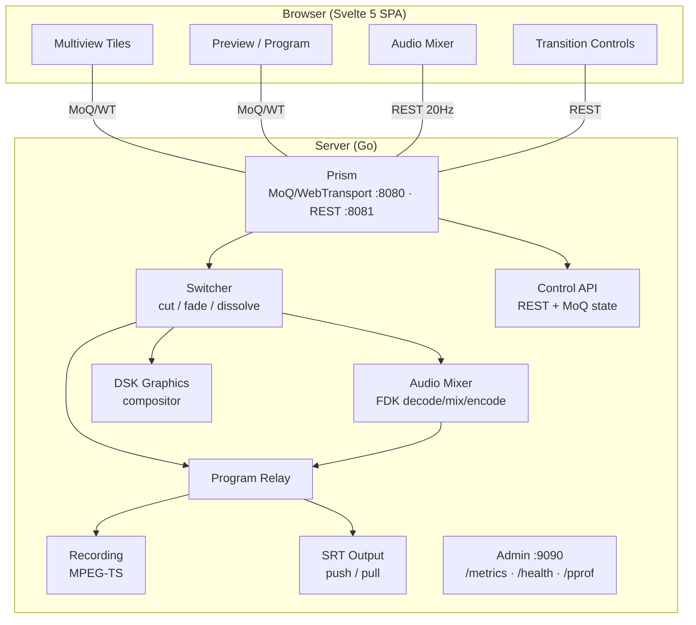

# SwitchFrame

A browser-based live video switcher for multi-camera production. Cut, dissolve, and mix between sources in real time — all from a web browser. Built on [Prism](https://github.com/zsiec/prism) (MoQ/WebTransport media server).

<!-- TODO: Add screenshot of the control room UI -->
<!--  -->

## Features

**Video Switching**
- Hard cut with keyframe gating (no decoder artifacts)
- Mix, dip-to-black, and wipe dissolve transitions (100–5000ms)
- Manual T-bar control at 20Hz
- Fade to black with smooth reverse
- Per-source configurable delay buffer (0–500ms)
- GOP cache for instant keyframe on cut

**Audio**
- Server-side FDK AAC decode/mix/encode
- Per-channel faders, mute, and audio-follows-video (AFV)
- Equal-power crossfade on cuts and transitions
- Brickwall limiter at −1 dBFS
- Zero-CPU passthrough when single source at unity gain
- Client-side PFL (pre-fade listen) with per-operator solo

**Output**
- MPEG-TS recording with time and size-based rotation
- SRT push (caller) and pull (listener, up to 8 connections)
- Reconnect with 4MB ring buffer and keyframe resume
- Zero overhead when no outputs are active

**Graphics**
- Downstream keyer (DSK) with alpha compositing
- Built-in templates: lower third, full-screen card, ticker
- Instant cut or 500ms fade on/off

**UI**
- Traditional broadcast control room layout (multiview, buses, audio mixer, transition controls)
- Simple mode for volunteers (`?mode=simple`) — just sources + CUT/DISSOLVE
- Keyboard shortcuts for every action (press `?` to see them)
- Optimistic UI with 2-second TTL for instant feedback
- Preset save/recall

**Infrastructure**
- WebTransport (QUIC/HTTP3) for sub-frame latency state sync
- REST polling fallback when WebTransport is unavailable
- Prometheus metrics + pprof debug endpoints
- Bearer token API authentication
- Single-binary deployment with embedded UI
- Docker image

## Quick Start

### Prerequisites

| | Version | Install |
|---|---|---|
| Go | 1.25+ | [go.dev/dl](https://go.dev/dl/) |
| Node.js | 22+ | [nodejs.org](https://nodejs.org/) |
| FFmpeg libs | — | See below |

**macOS:**

```bash
brew install ffmpeg fdk-aac pkg-config
```

**Linux (Debian/Ubuntu):**

```bash
sudo apt-get install -y libavcodec-dev libavutil-dev libx264-dev libfdk-aac-dev pkg-config
```

### Run the Demo

```bash
git clone https://github.com/zsiec/switchframe.git
cd switchframe
cd ui && npm ci && cd ..
make demo
```

Open **http://localhost:5173**. Four simulated cameras will appear.

### What You Can Try

| Action | Mouse | Keyboard |
|---|---|---|
| Set preview | Click source tile | `1`–`9` |
| Hard cut | Click **CUT** | `Space` |
| Dissolve | Click **AUTO** | `Enter` |
| Fade to black | Click **FTB** | `F1` |
| Toggle DSK | — | `F2` |
| Manual transition | Drag **T-bar** | — |
| Hot-punch to program | — | `Shift+1`–`9` |
| Audio faders | Drag fader | — |
| Toggle mute/AFV | Click button | — |
| Record | Click **REC** | — |
| SRT output | Click **SRT** | — |
| Fullscreen | — | `` ` `` |
| Keyboard help | — | `?` |
| Simple mode | Add `?mode=simple` to URL | — |

## Development

```bash
make dev          # Go server + Vite dev server (no demo sources)
make demo         # 4 simulated cameras, open localhost:5173
make build        # Production binary with embedded UI → bin/switchframe
make docker       # Multi-stage Docker image
make test-all     # Go tests + Vitest + Playwright E2E
make lint         # go vet + svelte-check
make format       # gofmt + prettier
make clean        # Remove build artifacts
```

### Running Tests

```bash
# Go (with race detector)
cd server && go test ./... -race

# Frontend unit tests
cd ui && npx vitest run

# E2E tests (builds static app, serves on :4173)
cd ui && npx playwright test
```

645 Go tests, 478 Vitest tests, and 45 Playwright E2E tests.

### Project Structure

```
server/                     Go backend (github.com/zsiec/switchframe/server)
  cmd/switchframe/          Binary entry point, admin endpoints, static embed
  switcher/                 Core switching engine (state machine, frame routing)
  audio/                    FDK AAC decode/mix/encode, crossfade, metering, limiter
  transition/               Dissolve engine (YUV420 blend, scaler, smoothstep easing)
  output/                   MPEG-TS recording, SRT caller/listener, ring buffer
  control/                  REST API handlers, auth middleware, MoQ state publisher
  codec/                    FFmpeg/OpenH264 bindings, NALU helpers, encoder auto-detect
  graphics/                 DSK compositor (overlay → YUV → encode)
  preset/                   Preset save/recall (file-based)
  metrics/                  Prometheus counters, gauges, histograms
  debug/                    Snapshot collector, circular event log
  demo/                     Simulated camera sources (synthetic or MPEG-TS clips)
  internal/                 Shared types (ControlRoomState, SourceInfo, etc.)
ui/                         SvelteKit frontend (Svelte 5 + TypeScript)
  src/components/           20+ Svelte 5 components (runes syntax throughout)
  src/lib/api/              REST API client + TypeScript types
  src/lib/state/            Reactive store with optimistic updates
  src/lib/transport/        WebTransport connection + MoQ media pipeline
  src/lib/audio/            Client-side PFL (pre-fade listen)
  src/lib/video/            Dissolve renderer (Canvas 2D + WebGPU stub)
  src/lib/keyboard/         Capture-phase keyboard shortcut handler
  src/lib/prism/            Vendored Prism TS modules (MoQ, decode, render)
```

## Architecture



**Key design choices:**
- Server-side switching — the server produces the authoritative program output, not the browser
- YUV420 blending (BT.709) — matches hardware switchers (ATEM, Ross), avoids YUV↔RGB round-trips
- MoQ for state + media — single QUIC connection carries both control state and video/audio
- Audio passthrough optimization — bypasses decode/encode when only one source is active at 0 dB
- Web Workers + SharedArrayBuffer — video decodes in a worker, audio uses AudioWorklet with lock-free ring buffers

## Configuration

### CLI Flags

| Flag | Default | Description |
|---|---|---|
| `--demo` | `false` | Start with 4 simulated camera sources |
| `--demo-video <dir>` | — | Use real MPEG-TS clips from directory (requires `--demo`) |
| `--log-level` | `info` | Log level: `debug`, `info`, `warn`, `error` |
| `--admin-addr` | `:9090` | Admin/metrics server listen address |
| `--api-token` | auto-generated | Bearer token for API auth (or set `SWITCHFRAME_API_TOKEN`) |

### Environment Variables

| Variable | Description |
|---|---|
| `SWITCHFRAME_API_TOKEN` | API authentication token (overridden by `--api-token` flag) |
| `APP_ENV=production` | Switches to JSON structured logging |

### Ports

| Port | Protocol | Purpose |
|---|---|---|
| 8080 | QUIC/HTTP3 | WebTransport (MoQ media + state) |
| 8081 | HTTP/TCP | REST API (used by Vite dev proxy, curl) |
| 9090 | HTTP/TCP | Admin: Prometheus metrics, health, pprof |
| 9000 | UDP | SRT listener (configurable) |

### Video Codec Auto-Detection

On startup, SwitchFrame probes available H.264 encoders and selects the best one:

1. NVENC (CUDA GPU)
2. VA-API (Linux GPU)
3. VideoToolbox (macOS GPU)
4. libx264 (CPU)
5. OpenH264 (fallback, requires build tag)

## API

All endpoints require `Authorization: Bearer <token>` (except in demo mode).

### Switching

| Method | Endpoint | Description |
|---|---|---|
| `GET` | `/api/switch/state` | Full control room state |
| `POST` | `/api/switch/cut` | Hard cut to source |
| `POST` | `/api/switch/preview` | Set preview source |
| `POST` | `/api/switch/transition` | Start dissolve (mix/dip/wipe, 100–5000ms) |
| `POST` | `/api/switch/transition/position` | T-bar position (0–1) |
| `POST` | `/api/switch/ftb` | Fade to black / reverse |

### Sources

| Method | Endpoint | Description |
|---|---|---|
| `GET` | `/api/sources` | List sources with health and tally |
| `POST` | `/api/sources/{key}/label` | Set source display label |
| `POST` | `/api/sources/{key}/delay` | Set source delay (0–500ms) |

### Audio

| Method | Endpoint | Description |
|---|---|---|
| `POST` | `/api/audio/level` | Set channel dB level |
| `POST` | `/api/audio/mute` | Set channel mute |
| `POST` | `/api/audio/afv` | Set audio-follows-video |
| `POST` | `/api/audio/master` | Set master level dB |

### Output

| Method | Endpoint | Description |
|---|---|---|
| `POST` | `/api/recording/start` | Start MPEG-TS recording |
| `POST` | `/api/recording/stop` | Stop recording |
| `GET` | `/api/recording/status` | Recording status |
| `POST` | `/api/output/srt/start` | Start SRT output (caller or listener) |
| `POST` | `/api/output/srt/stop` | Stop SRT output |
| `GET` | `/api/output/srt/status` | SRT output status |

### Graphics (DSK)

| Method | Endpoint | Description |
|---|---|---|
| `POST` | `/api/graphics/on` | Cut overlay on |
| `POST` | `/api/graphics/off` | Cut overlay off |
| `POST` | `/api/graphics/auto-on` | Fade overlay in (500ms) |
| `POST` | `/api/graphics/auto-off` | Fade overlay out (500ms) |
| `GET` | `/api/graphics/status` | Overlay status |
| `POST` | `/api/graphics/frame` | Upload RGBA overlay (up to 4K) |

### Presets

| Method | Endpoint | Description |
|---|---|---|
| `GET` | `/api/presets` | List presets |
| `POST` | `/api/presets` | Create preset from current state |
| `GET` | `/api/presets/{id}` | Get preset |
| `PUT` | `/api/presets/{id}` | Update preset name |
| `DELETE` | `/api/presets/{id}` | Delete preset |
| `POST` | `/api/presets/{id}/recall` | Recall preset |

### Debug

| Method | Endpoint | Description |
|---|---|---|
| `GET` | `/api/debug/snapshot` | Debug snapshot (all subsystems) |

## Deployment

### Single Binary

```bash
make build
./bin/switchframe --api-token "your-secret-token"
```

The production build embeds the compiled UI — no Node.js runtime needed in production.

### Docker

```bash
make docker
docker run -p 8080:8080 -p 8081:8081 -p 9090:9090 -p 9000:9000/udp \
  -e SWITCHFRAME_API_TOKEN="your-secret-token" \
  switchframe
```

The image is based on `debian:bookworm-slim` (~80MB + runtime libs) with a non-root `switchframe` user. Health check is built in (`/health` on the admin port).

## Browser Requirements

SwitchFrame uses modern web APIs for low-latency media:

| API | Required For | Fallback |
|---|---|---|
| [WebTransport](https://developer.mozilla.org/en-US/docs/Web/API/WebTransport) | Sub-frame state sync | REST polling (500ms) |
| [WebCodecs](https://developer.mozilla.org/en-US/docs/Web/API/WebCodecs_API) | Video/audio decode | — |
| [SharedArrayBuffer](https://developer.mozilla.org/en-US/docs/Web/JavaScript/Reference/Global_Objects/SharedArrayBuffer) | Audio worklet ring buffer | — |
| [WebGPU](https://developer.mozilla.org/en-US/docs/Web/API/WebGPU_API) | Dissolve preview (future) | Canvas 2D |

Tested in Chrome 120+ and Safari 26.4+. The dev server sets the required `Cross-Origin-Opener-Policy` and `Cross-Origin-Embedder-Policy` headers for `SharedArrayBuffer`.

## Built With

- **[Prism](https://github.com/zsiec/prism)** — MoQ/WebTransport media server (Go)
- **[Svelte 5](https://svelte.dev/)** — Frontend framework (runes reactivity)
- **[SvelteKit](https://svelte.dev/docs/kit)** — Static SPA build with adapter-static
- **[FDK-AAC](https://github.com/mstorsjo/fdk-aac)** — AAC audio codec
- **[FFmpeg libavcodec](https://ffmpeg.org/)** — H.264 video encode/decode
- **[go-astits](https://github.com/asticode/go-astits)** — MPEG-TS muxer
- **[srtgo](https://github.com/zsiec/srtgo)** — Pure Go SRT implementation
- **[Prometheus](https://prometheus.io/)** — Metrics and monitoring

## Documentation

- **[API Reference](docs/api.md)** — All endpoints with request/response examples
- **[Deployment Guide](docs/deployment.md)** — Production setup, Docker, TLS, monitoring
- **[Architecture](docs/architecture.md)** — System design, data flow, key decisions

## License

[MIT](LICENSE)
