# SwitchFrame Architecture

## 1. System at a Glance

SwitchFrame is a server-authoritative live video switcher: all switching, mixing, compositing, and encoding happen on the server. Browsers connect over WebTransport as thin control surfaces -- they display source previews and send operator commands, but the server produces the definitive program output. Sources arrive via Prism MoQ ingest (H.264/AAC cameras over the internet) or MXL shared-memory transport (uncompressed V210 from local infrastructure).

```mermaid
flowchart LR
    subgraph ingest ["Source Ingest"]
        moq["MoQ Sources<br/>(H.264 / AAC)"]
        mxl["MXL Sources<br/>(V210 shared mem)"]

        moq --> relay["Per-Source<br/>Prism Relay"]
        relay --> sv["sourceViewer"]
        sv --> sd["sourceDecoder<br/>H.264 → YUV420"]

        mxl --> v210["V210 → YUV420"]

        sd --> yuv["Raw YUV420"]
        v210 --> yuv
    end

    subgraph switching ["Switching Engine"]
        fsync["Frame Sync<br/>(align mixed rates)"]
        delay["Delay Buffer<br/>(lip-sync)"]
        core["Switcher Core<br/>(cut / preview /<br/>frame routing)"]
        trans["Transition Engine<br/>(mix, dip, wipe,<br/>stinger, FTB)"]

        fsync --> delay --> core
        core --> trans
    end

    subgraph vidpipe ["Video Pipeline"]
        direction LR
        usk["Upstream<br/>Key"] --> pip["PIP /<br/>Layout"]
        pip --> dsk["DSK<br/>Graphics"]
        dsk --> raw["Raw Sink"]
        raw --> enc["H.264<br/>Encode"]
    end

    subgraph audpipe ["Audio Pipeline"]
        direction LR
        adec["AAC<br/>Decode"] --> trim["Trim"]
        trim --> eq["EQ"]
        eq --> comp["Compressor"]
        comp --> fader["Fader"]
        fader --> mix["Mix"]
        mix --> master["Master"]
        master --> lim["Limiter"]
        lim --> aenc["AAC<br/>Encode"]
    end

    subgraph output ["Output"]
        prog["Program Relay"]
        browsers["Browsers<br/>(WebTransport / MoQ)"]
        rec["Recording<br/>(MPEG-TS)"]
        srt["SRT<br/>Destinations"]
        mxlout["MXL Output<br/>(shared mem)"]

        prog --> browsers
        prog --> rec
        prog --> srt
        prog --> mxlout
    end

    subgraph control ["Control Plane"]
        rest["REST API<br/>(HTTP/3)"]
        mqctl["MoQ Control Track<br/>(state broadcast)"]
    end

    yuv --> fsync
    trans --> usk
    enc --> prog
    aenc --> prog

    rest -.->|"commands"| core
    mqctl -.->|"state updates"| browsers
```

The key architectural insight is that every source is continuously decoded to raw YUV420, regardless of how it arrives. All video processing -- transitions, upstream keying, PIP compositing, graphics overlay, scaling -- operates in BT.709 YUV420, the same colorspace hardware broadcast mixers use internally. This eliminates costly YUV-to-RGB round-trips and means cuts between sources are instant: there is no keyframe wait because every source always has a current decoded frame ready.

Audio follows a similar always-ready model. Each channel flows through a fixed processing chain before being mixed to a stereo master bus. A passthrough optimization bypasses the entire decode/process/encode chain when a single source is at unity gain with no processing enabled, dropping audio CPU to near zero in the common case.
