# SwitchFrame Architecture

1. [System at a Glance](#1-system-at-a-glance)
2. [A Frame's Journey](#2-a-frames-journey)
3. [A Cut Happens](#3-a-cut-happens)
4. [A Transition Dissolves](#4-a-transition-dissolves)
5. [Audio Signal Chain](#5-audio-signal-chain)
6. [Compositing the Picture](#6-compositing-the-picture)
7. [Output Delivery](#7-output-delivery)
8. [Instant Replay](#8-instant-replay)
9. [The Browser](#9-the-browser)
10. [Control & Coordination](#10-control--coordination)
11. [Performance & Design Philosophy](#11-performance--design-philosophy)

---

## 1. System at a Glance

SwitchFrame is a server-authoritative live video switcher: all switching, mixing, compositing, and encoding happen on the server. Browsers connect over WebTransport as thin control surfaces -- they display source previews and send operator commands, but the server produces the definitive program output. Sources arrive via Prism MoQ ingest (H.264/AAC cameras over the internet) or MXL shared-memory transport (uncompressed V210 from local infrastructure).

The key architectural insight is that every source is continuously decoded to raw YUV420, regardless of how it arrives. All video processing -- transitions, upstream keying, PIP compositing, graphics overlay, scaling -- operates in BT.709 YUV420, the same colorspace hardware broadcast mixers use internally. This eliminates costly YUV-to-RGB round-trips and means cuts between sources are instant: there is no keyframe wait because every source always has a current decoded frame ready.

Audio follows a similar always-ready model. Each channel flows through a fixed processing chain before being mixed to a stereo master bus. A passthrough optimization bypasses the entire decode/process/encode chain when a single source is at unity gain with no processing enabled, dropping audio CPU to near zero in the common case.

## 2. A Frame's Journey

Following a single frame from camera to screen reveals how the pieces fit together. The path differs slightly for MoQ (H.264) and MXL (uncompressed V210) sources, but both converge on the same raw YUV420 processing pipeline.

### MoQ Source Path

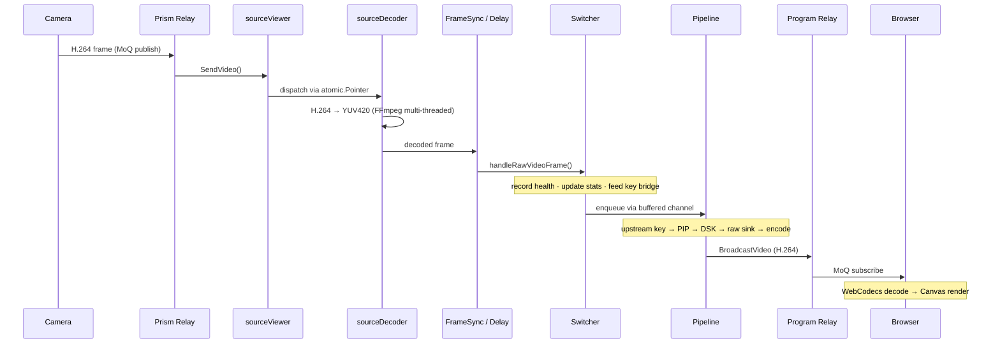

### MXL Source Path

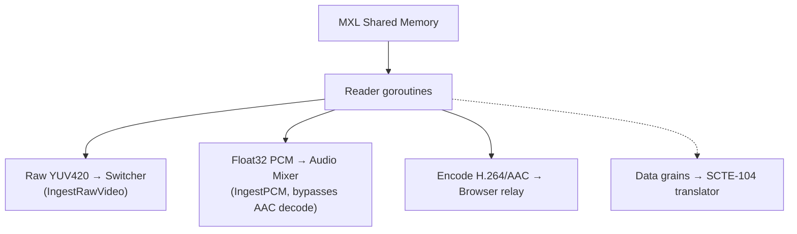

MXL sources bypass the sourceViewer and sourceDecoder entirely -- the V210-to-YUV420 conversion happens in the reader goroutine, and raw frames are injected directly into the switcher. Audio arrives as float32 PCM and skips AAC decoding. A third fan-out encodes to H.264/AAC for browser preview, since browsers cannot consume raw YUV over MoQ.

### Always-Decode Architecture

Every source gets a dedicated decoder goroutine that continuously produces YUV420 frames. This is the key enabling decision -- it eliminates GOP caches, pending-IDR flags, and keyframe gating. When the operator cuts to a new source, the next decoded frame flows through immediately. The tradeoff is CPU cost (N decoders always running), offset by FFmpeg's multi-threaded software decode.

### Frame Memory Management

YUV420 buffers are managed by a FramePool -- a mutex-guarded LIFO free list of pre-allocated buffers. This achieves >99% hit rate vs ~19% with Go's sync.Pool, because LIFO ordering keeps hot buffers in L1/L2 cache. Frames are returned to the pool after encode, and the pool pre-allocates 32 buffers at the pipeline resolution.

### Pipeline Architecture

The video pipeline is a chain of immutable processing nodes, built once and atomically swapped for reconfiguration. When something changes (compositor on/off, upstream key added, graphics layer toggled), a new pipeline is built and swapped in via atomic pointer. The old pipeline drains in-flight frames in a background goroutine. Zero frames are dropped during reconfiguration.

### Timing

The hot path holds locks for under 1us per frame. The async handoff between the switcher and pipeline uses an 8-frame buffered channel (~267ms at 30fps), decoupling source delivery jitter from encode latency. Always-on re-encode ensures consistent SPS/PPS across transition boundaries, so downstream decoders never need reconfiguration.

## 3. A Cut Happens

A cut is the simplest and most frequent operation: swap the program source instantly with no transition frames. Because every source is continuously decoded by its own goroutine, there is no keyframe wait -- the new source always has a current YUV420 frame ready.

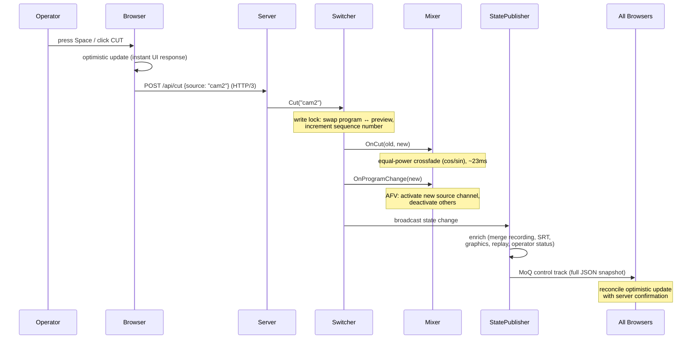

### Switcher State Machine

The switcher has a small state machine governing what operations are valid at any moment. A cut bypasses the transitioning state entirely -- it is a direct program/preview swap within the idle state.

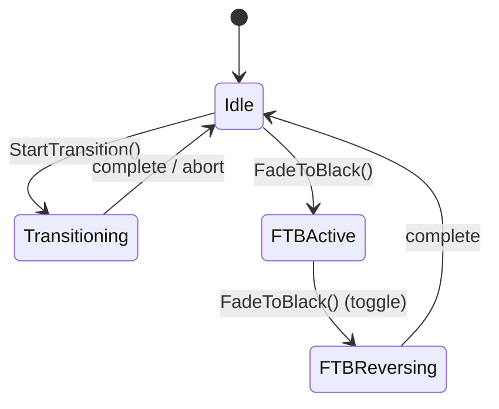

### Why Cuts Are Instant

The always-decode architecture is what makes cuts zero-latency. Every source has a dedicated `sourceDecoder` goroutine continuously producing YUV420 frames, so the new source already has a decoded frame in its ring buffer. On the next tick after `Cut()`, cam2's decoded frame flows through `handleRawVideoFrame` into the pipeline node chain and out to encode. There is no GOP replay, no IDR gating, no decoder warmup.

The audio mixer applies a one-frame (~23ms) equal-power crossfade between the old and new source to prevent audible clicks. The crossfade uses precomputed cos/sin lookup tables (1024 entries) to avoid per-sample `math.Cos` calls. Channels in AFV mode automatically activate or deactivate to match the new program source.

The browser applies the cut optimistically before the server confirms -- the UI swaps tally colors and source labels immediately on keypress. If the server rejects the cut (e.g., source offline, operator lacks permission), the pending action expires after 2 seconds and reverts to server state. In practice, the server confirms within a few milliseconds over the shared QUIC connection, and the MoQ control track update arrives before the timeout is relevant.

## 4. A Transition Dissolves

Unlike a cut, transitions blend between two sources over time. A fresh `transition.Engine` is created for each transition and destroyed on completion -- no persistent codec resources or blending state exist between transitions. Since both sources are already decoded to YUV420 by their per-source decoder goroutines, the engine receives raw frames directly and blends in BT.709 colorspace, matching how hardware broadcast mixers operate internally.

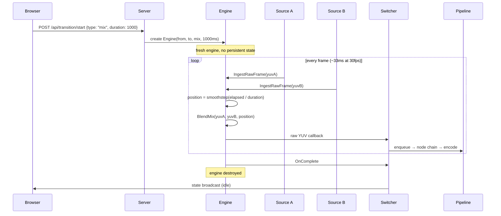

The transition engine supports five blend types, each operating directly on YUV420 planes:

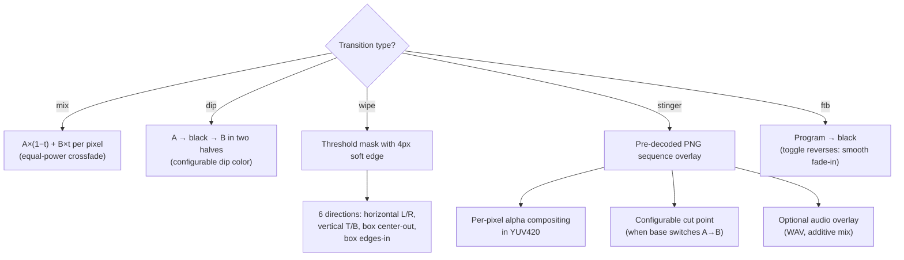

### Wall-Clock Frame Pairing

The engine stores the latest decoded frame from each source. Output is driven by the incoming "to" source's frame rate -- each arriving frame triggers a blend with whatever the "from" source's latest frame is. This means no buffering and minimal latency: the blend happens the instant a new frame arrives, using the freshest available partner frame. If sources run at different frame rates, the faster source simply reuses the slower source's latest frame.

### Smoothstep Easing and Manual Control

Automatic transitions use smoothstep easing: `t²(3 - 2t)`, which produces zero-derivative endpoints for a perceptually smooth start and stop with no abrupt jumps. T-bar manual control overrides automatic timing entirely -- the browser sends position updates via WebTransport datagrams at up to 60fps, and the engine uses the received position directly instead of computing from elapsed time. On T-bar release, one REST call confirms the final authoritative position.

### Resolution Mismatch and Watchdog

If sources have different resolutions, a scaler normalizes both to the program resolution during blending. Lanczos-3 is used for quality-critical paths (auto transitions), bilinear for speed-critical paths (T-bar scrubbing). A 10-second watchdog aborts stuck transitions if no frames arrive from either source, preventing the switcher from freezing in a transitioning state indefinitely.

## 5. Audio Signal Chain

Audio processing runs entirely server-side, mixing all active source channels into a stereo program output encoded as AAC. The pipeline has a critical optimization: when only one source is active at unity gain with no processing enabled, the mixer forwards raw AAC frames without decoding or re-encoding them -- zero CPU for audio in the most common case (a single camera live). Peak metering still runs in passthrough mode so VU meters always have data.

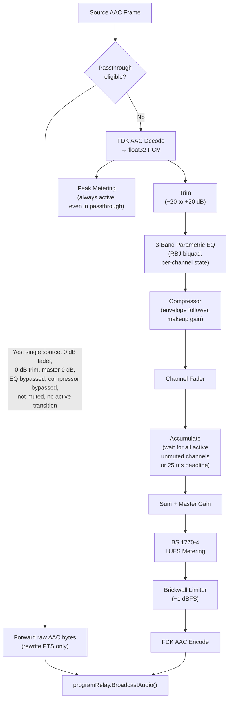

### Audio Transition Modes

During cuts and transitions, the mixer applies gain curves to the outgoing and incoming source to prevent audible clicks and match the visual blend. All curves use precomputed cos/sin lookup tables (1024 entries) to avoid per-sample trigonometric calls.

| Mode | Old Source Gain | New Source Gain | Use Case |
|------|----------------|-----------------|----------|
| Crossfade | cos(t * pi/2) | sin(t * pi/2) | Normal cut (~23ms) or mix dissolve |
| Dip to Silence | cos(2t * pi/2) then 0 | 0 then sin((2t-1) * pi/2) | Dip transition (two halves) |
| Fade Out | cos(t * pi/2) | 0 | Fade to black |
| Fade In | sin(t * pi/2) | 0 | FTB reverse (fade from black) |

### Mix Cycle

When multiple channels are active, each source's AAC frame is decoded to float32 PCM via FDK AAC. Per-channel processing applies trim, 3-band parametric EQ (RBJ biquad coefficients, Direct Form II Transposed, independent left/right filter state to prevent stereo crosstalk), and single-band compression with an exponential envelope follower. The mixer accumulates processed samples in a reusable mix buffer and flushes when all active unmuted channels have contributed -- or when a 25ms deadline expires, which prevents the pipeline from stalling if a source stops sending. The sum is scaled by the master fader, then passed through the brickwall limiter and AAC encoder.

### Loudness Metering

A BS.1770-4 loudness meter runs after the master fader, before the limiter. It applies two-stage K-weighting (head-related shelf filter plus an RLB high-pass) and provides three measurement windows: momentary (400ms sliding), short-term (3s sliding), and integrated (dual gating at -70 LUFS absolute and -10 LU relative to the ungated mean). LUFS values are cached as atomic float64s for lock-free reads by the state broadcast. The UI colors levels green (at or below -23 LUFS), yellow (at or below -14 LUFS), and red (above -14 LUFS), following EBU R128 conventions.

### AFV and Per-Source Delay

Channels default to AFV (Audio Follows Video) -- when the program source changes via a cut, the new source's audio channel activates and all other AFV channels deactivate. The `OnProgramChange` callback fires before the state broadcast so browsers see the updated audio state in the same snapshot as the video change. Per-source audio delay (0-500ms) provides lip-sync correction, buffering audio frames in a ring buffer so they arrive at the mixer time-aligned with their corresponding video frames downstream in the pipeline.

## 6. Compositing the Picture

Between the switching engine and the H.264 encoder sits a chain of compositing nodes that layer visual elements onto the program frame. Each node operates in-place on the same YUV420 buffer, adding upstream keys, PIP overlays, or graphics before the frame reaches the encoder. Inactive nodes are excluded at build time -- there is zero per-frame overhead for disabled features.

### Pipeline Node Chain

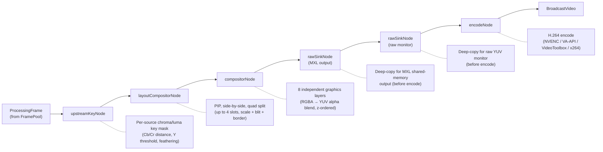

### Visual Layer Stack

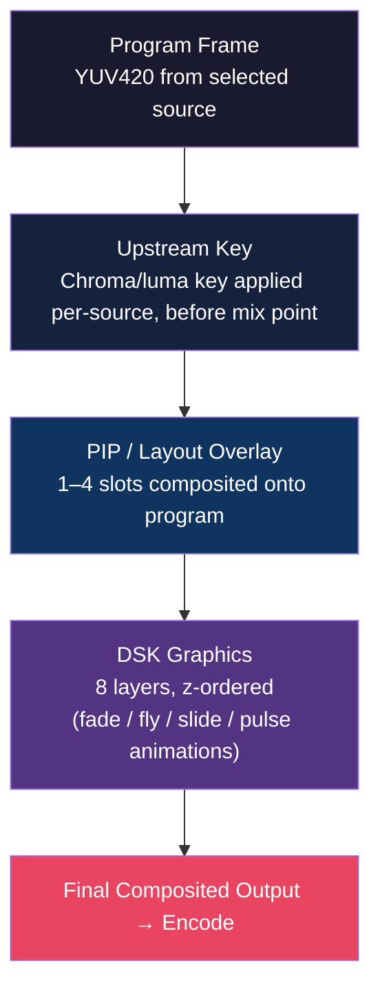

### Atomic Pipeline Swap

The pipeline is immutable once built. When configuration changes -- compositor toggled, key added, graphics layer enabled -- a new pipeline is built on the main goroutine and swapped in via atomic pointer. The old pipeline drains in-flight frames in a background goroutine before closing. This guarantees zero frame drops during reconfiguration. Triggers include `SetCompositor`, `SetKeyBridge`, `SetRawVideoSink`, and any compositor or key state change that might alter a node's `Active()` result.

### Upstream Keying

Per-source chroma and luma key generation operates in YUV420 domain, matching the colorspace of hardware broadcast mixers. Chroma keying uses Cb/Cr squared distance with configurable spill replacement color. Luma keying uses Y threshold with smoothness feathering. The `KeyProcessor` runs a chain of key configs per source, applied via `KeyProcessorBridge` before the mix point -- meaning keys are composited onto the source frame before it enters the transition engine or pipeline, not after.

### PIP and Layouts

The layout compositor supports PIP (corner overlay), side-by-side (50/50 split), and quad (2x2 grid) presets, plus arbitrary custom layouts. Each slot has source assignment, on/off state, position rect, z-order, border config, and scale mode (stretch or crop-to-fill). Slot transitions support cut, dissolve, and fly-in animations. Fast-control datagrams enable live PIP drag at 60fps via WebTransport binary protocol (~7 bytes per update) -- the browser sends position updates as datagrams, the layout compositor applies them directly on its fast path without state broadcast, and a single REST call on mouse release confirms the authoritative position.

### DSK Graphics

Up to 8 independent graphics layers are composited in z-order onto the program frame. Each layer holds an RGBA overlay, position rect, and animation state. Animations include fade (in/out over configurable duration), fly-in/out (4 directions computed from program dimensions), slide, and pulse (oscillating alpha between min and max values at a configurable frequency). Six built-in broadcast templates -- lower-third, news lower-third, full-screen card, score bug, network bug, and ticker -- render on an OffscreenCanvas in the browser and upload as RGBA via the REST API. Per-layer mutexes allow concurrent animation goroutines without blocking the pipeline's hot path.

## 7. Output Delivery

The program relay distributes the encoded H.264/AAC program to all consumers: browsers (MoQ), recordings (MPEG-TS files), SRT stream destinations, and optionally back to MXL shared memory. The output subsystem is completely dormant when no outputs are active -- zero CPU, zero memory, no viewer registered on the program relay. MXL output is tapped as a raw sink before encode (covered in Section 6); everything else in this section operates on the encoded H.264/AAC stream.

### Output Fan-Out

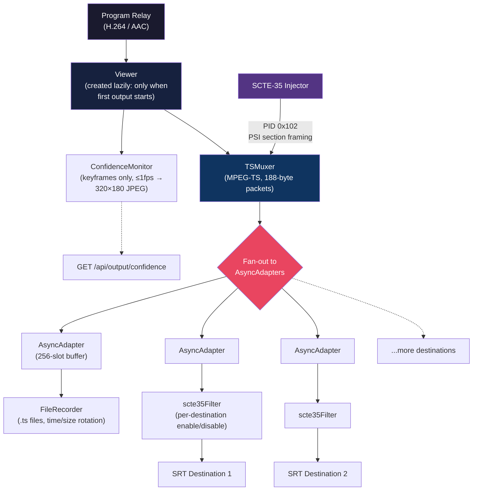

### SCTE-35 Ad Insertion Flow

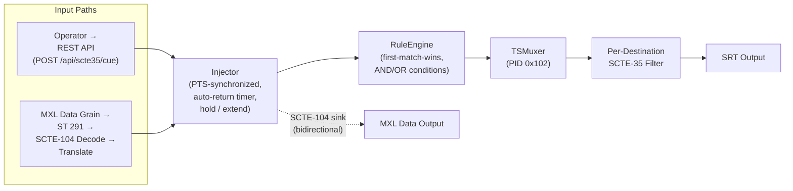

### Lazy Viewer Lifecycle

`output.Manager` creates the Viewer, TSMuxer, and ConfidenceMonitor and registers on the program relay only when the first output adapter starts (recording or any SRT destination). When the last adapter stops, everything tears down -- the viewer is removed from the relay, the muxer is closed, and the confidence monitor stops decoding. This ensures zero overhead when both recording and SRT are inactive. On startup, the manager fires an `OnMuxerStart` callback that requests an IDR keyframe from the encoder so the muxer can initialize immediately rather than waiting for the next GOP boundary.

### Recording

MPEG-TS format is crash-resilient -- there is no moov atom to lose, so a power failure or process crash leaves a valid file up to the last written packet. Files rotate by time (default 1 hour) or size, with sequential naming: `program_YYYYMMDD_HHMMSS_NNN.ts`. Rotation waits for the next keyframe to ensure each segment starts with a clean IDR. Each output adapter is wrapped in an AsyncAdapter with a 256-slot buffered channel (~8 seconds at 30fps). Writes from the muxer are non-blocking, so a slow output (stalled SRT connection, slow disk) never blocks recording or other outputs. When the buffer fills, writes are dropped and the drop counter is incremented.

### SRT

Two modes via zsiec/srtgo (pure Go, no cgo). Caller mode pushes to a remote endpoint with exponential backoff reconnection (1s to 30s ceiling) and a 4MB ring buffer for data preservation during disconnects -- if the ring overflows, playback resumes from the next keyframe. Listener mode accepts up to 8 incoming pull connections. Multi-destination support allows independent lifecycle per SRT destination (add/remove/start/stop via `/api/output/destinations`), each with its own AsyncAdapter wrapper. Per-destination SCTE-35 filtering strips ad insertion packets from destinations that have `SCTE35Enabled: false`, using a lightweight 188-byte TS packet filter that matches on the configured PID.

### SCTE-35

Splice_insert and time_signal injection into the MPEG-TS stream, PTS-synchronized to the program video clock via `Switcher.LastBroadcastVideoPTS()` (atomic load, 90 kHz MPEG-TS timebase). Auto-return timers end breaks at scheduled duration; hold and extend commands allow manual break management. A splice_null heartbeat goroutine runs at configurable intervals to signal continued presence. Signal conditioning via a rules engine with first-match-wins evaluation supports pass, delete, and replace actions using 8 comparison operators and AND/OR compound conditions. Bidirectional SCTE-104 translation over MXL data flows enables automation system integration -- incoming SCTE-104 messages are translated to SCTE-35 cues for injection, and injected cues are translated back to SCTE-104 for output to downstream automation (with echo suppression for SCTE-104-sourced events).

## 8. Instant Replay

The replay system continuously captures source frames into per-source circular buffers, independent of any operator action. When the director marks in and out points, the system extracts the clip and plays it back at variable speed with pitch-preserved audio. Replay output is routed to a dedicated "replay" relay so browsers can monitor playback without affecting the program.

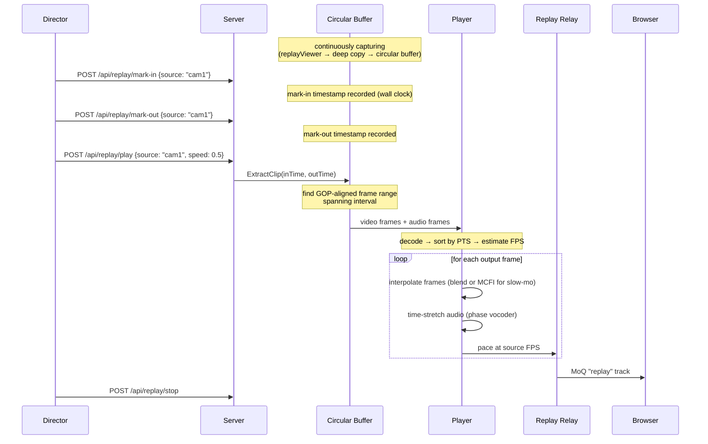

### Circular Buffers

Per-source GOP-aligned buffers store H.264 frames continuously, configurable from 1 to 300 seconds (default 60s, `--replay-buffer-secs` flag). Frames are deep-copied on capture to prevent race conditions with live processing -- the `replayViewer` attached to each source's relay receives frames via `SendVideo` and copies them into its ring buffer on every call, regardless of whether replay is active. Buffer trimming removes the oldest complete GOP when the buffer exceeds its configured duration. Wall-clock timestamps (`time.Now`) are stored alongside each frame rather than relying on source PTS, simplifying the operator workflow: mark-in and mark-out are just wall-clock instants, and `ExtractClip` finds the GOP-aligned frame range that spans the requested interval.

### Playback Pipeline

The player decodes all extracted frames, sorts by PTS to handle B-frame reorder, and estimates the source FPS from inter-frame timing. For slow-motion playback (speeds below 1.0x), frames are duplicated to fill the time gap -- at 0.25x speed, each source frame is emitted four times. An optional MCFI (motion-compensated frame interpolation) interpolator can synthesize intermediate frames instead of duplicating, using the same motion estimation engine and SIMD SAD kernels as the frame rate conversion system. This produces visually smoother slow-motion at the cost of additional CPU. A simpler alpha-blend interpolator is also available as a lighter alternative. Output is paced at the source FPS via timers, so a 30fps source plays back at 30fps regardless of the speed multiplier.

### Audio Time-Stretching

The primary audio path uses a phase vocoder for pitch-preserved slow-motion: STFT decomposes audio into spectral bins, phase advance is scaled by the stretch factor with spectral peak locking to reduce phasing artifacts, and COLA-normalized overlap-add resynthesizes the output. A WSOLA (Waveform Similarity Overlap-Add) implementation with normalized cross-correlation search serves as fallback if the phase vocoder encounters edge cases. Both paths rely on an FFT implementation with SIMD butterfly kernels on amd64 and arm64 (generic Go fallback on other platforms). At 1.0x speed, audio passes through unmodified -- no time-stretching is applied.

### Loop and Relay

The player supports loop mode, automatically restarting from the beginning of the clip after the last frame is emitted, and continuing until the director explicitly stops playback. Replay output is broadcast to a "replay" relay registered as a separate MoQ stream via `server.RegisterStream("replay")`. Browsers subscribe to this relay independently of the program stream, displaying replay in a dedicated monitor panel. This separation ensures that replay playback -- including looping, speed changes, and stop/start -- never interferes with the live program output or its recording and SRT destinations.

## 9. The Browser

The frontend is a Svelte 5 SPA (SvelteKit with static adapter) that serves as a thin control surface and monitoring display. It does not produce the program output -- it subscribes to source and program MoQ streams for monitoring, and sends REST commands over the shared QUIC connection. For production deployment, the built UI is embedded into the Go binary as static files via `//go:embed`, serving a single-binary appliance.

### Media Pipeline

Each source gets its own MoQ subscription with independent video and audio decode paths. Video decode runs in Web Workers to keep the main thread free for UI rendering. The same decoded frames feed multiple canvases (multiview tile, program monitor, preview monitor) through a clone callback in the decoder, avoiding redundant decode work.

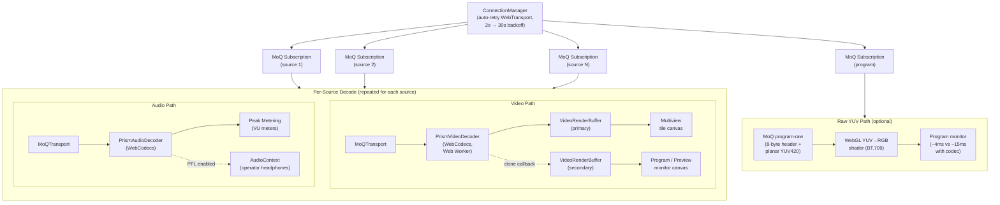

### Connection and State Management

The browser maintains two parallel communication paths with the server. On startup, both attempt to connect simultaneously -- REST provides an immediate fallback, while WebTransport upgrades the connection to event-driven MoQ updates once established.

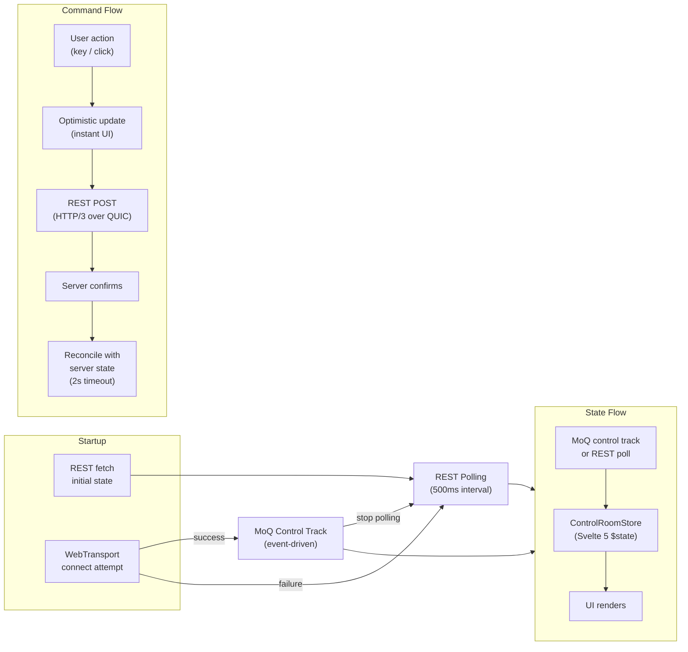

### Keyboard Shortcuts

All keyboard shortcuts use capture-phase `keydown` listeners with `event.code` for layout-independent keybinding. Shortcuts are suppressed when focus is in text inputs or contenteditable elements. A confirm mode (toggled via the UI) requires double-press for destructive actions like cut and hot-punch.

| Key | Action |
|-----|--------|
| `1`--`9` | Set preview source (by position) |
| `Shift`+`1`--`9` | Hot-punch to program |
| `Ctrl`+`1`--`9` | Run macro |
| `Space` | Cut (preview to program) |
| `Enter` | Auto transition |
| `F1` | Fade to black (toggle) |
| `F2` | Toggle DSK graphics |
| `F3` / `P` | Toggle PIP |
| `Alt`+`1` / `Alt`+`2` | Set transition type (mix / dip) |
| `Shift`+`B` / `R` / `H` / `E` | SCTE-35: ad break / return / hold / extend |
| `` ` `` | Toggle fullscreen |
| `?` | Shortcut overlay |

### Layout Modes

Two layout modes serve different operator skill levels. Traditional mode provides the full control surface -- multiview grid, preview/program monitors, audio mixer, transition controls, and tabbed panels for graphics, macros, replay, presets, SCTE-35, keying, and layouts. Simple mode is a volunteer-friendly layout with just preview/program windows, source buttons, CUT/DISSOLVE/FTB, and basic health indicators. Layout mode is detected from URL parameter (`?mode=simple`), falling back to localStorage, then defaulting to traditional. The URL parameter auto-persists to localStorage so bookmarked URLs are sticky.

### Rendering

WebCodecs provides hardware-accelerated H.264 decode in the browser. Each source's decoder runs in a Web Worker to avoid blocking the main thread. Multi-canvas rendering uses a clone callback in the decoder -- the primary `VideoRenderBuffer` feeds the multiview tile, and cloned frames feed the program/preview monitors via secondary buffers. This avoids redundant decodes when the same source appears in multiple places. For sources using the raw YUV monitor path (`program-raw` MoQ track), a WebGL shader converts BT.709 limited-range YUV420 to RGB directly, bypassing the H.264 encode/decode round-trip entirely for approximately 4ms total latency versus 15ms with the codec path.

### PFL (Pre-Fade Listen)

Per-operator headphone monitoring is implemented entirely client-side. Each PFL-enabled source gets its own `AudioContext` that decodes the source's audio stream independently of the server mixer. This means PFL has zero server overhead and each operator hears their own solo selection without affecting anyone else. All sources have their audio decoded for peak metering regardless of PFL state, so VU meters always have data. The `AudioContext` is created lazily and requires a user gesture to resume, satisfying browser autoplay policies.

## 10. Control & Coordination

Commands flow from browsers to the server as REST POST requests over HTTP/3, sharing the same QUIC connection used for media transport. State flows back to all browsers via a MoQ "control" track carrying full JSON snapshots -- not deltas -- so any browser connecting mid-session receives complete state immediately. This design was chosen because the MoQ specification says unknown message types cause `PROTOCOL_VIOLATION`, making custom control messages over MoQ fragile.

### Command and State Flow

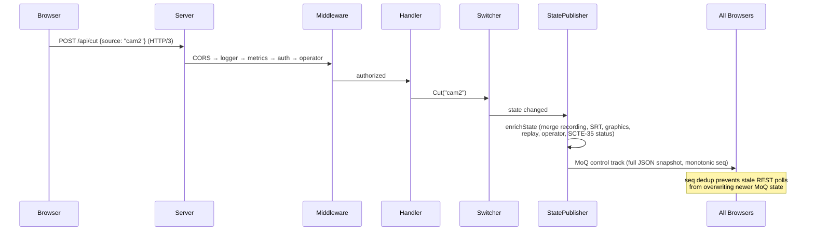

### Operator Middleware Decision Tree

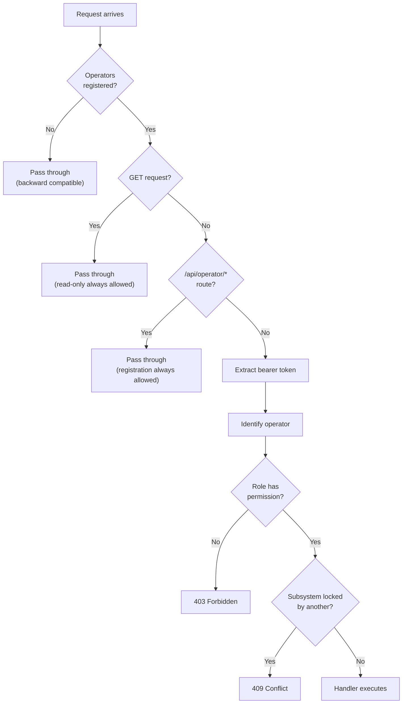

### Operator Roles and Permissions

| Role | Switching | Audio | Graphics | Replay | Output | Captions |
|------|-----------|-------|----------|--------|--------|----------|
| Director | &#10003; | &#10003; | &#10003; | &#10003; | &#10003; | &#10003; |
| Audio | -- | &#10003; | -- | -- | -- | -- |
| Graphics | -- | -- | &#10003; | -- | -- | -- |
| Captioner | -- | -- | -- | -- | -- | &#10003; |
| Viewer | -- | -- | -- | -- | -- | -- |

### State Broadcast

Every state update is a full JSON snapshot enriched with status from six subsystems: switcher, output (recording/SRT), graphics, replay, operator/locks, and SCTE-35. The `ChannelPublisher` handles backpressure by draining the oldest queued message when the channel is full -- safe because every message is a complete snapshot, so a dropped message is always superseded by the next one. A monotonic sequence number enables deduplication: browsers ignore any state with a sequence lower than what they have already seen, preventing stale REST polling responses from overwriting newer MoQ-delivered state.

### Multi-Operator System

Five roles map to six lockable subsystems. Each operator receives a 64-character hex bearer token at registration, included as an `Authorization: Bearer` header on every command. A `SessionManager` tracks heartbeats with a 60-second stale timeout -- if an operator stops heartbeating, their session is cleaned up and their locks are released automatically by a background goroutine running at 15-second intervals. Directors can force-release any lock, providing an escape hatch when an operator disconnects ungracefully. The system is fully opt-in: when no operators are registered, all requests pass through without authentication, preserving single-operator simplicity.

### Macro System

55 action types across 11 categories (switching, transitions, audio, graphics, stinger, recording, replay, SCTE-35, presets, keying/source, layout, captions). Macros are validated before save via `ValidateSteps()` -- errors block the save, while warnings are informational. The sequential executor runs steps with configurable delays and supports cancellation via context. Execution state is broadcast in real-time through the `ControlRoomState` so the UI can display step-by-step progress with per-step status (pending, running, done, failed, skipped). Only one macro can run at a time; attempting to start a second returns 409 Conflict.

## 11. Performance & Design Philosophy

Several cross-cutting design decisions shape the system's architecture. These choices prioritize real-time correctness and operational simplicity over theoretical flexibility.

### Design Decisions

| Decision | Rationale |
|----------|-----------|
| Server-side switching | Single authoritative output for recording, SRT, and all viewers |
| YUV420 blending (BT.709) | Matches hardware broadcast mixers; avoids costly YUV↔RGB round-trip |
| Always-decode architecture | Instant cuts, no keyframe wait; eliminates GOP cache complexity |
| Passthrough audio optimization | Zero CPU when single source at unity -- the common case |
| REST commands over HTTP/3 | Standard tooling, same QUIC connection; MoQ custom messages are fragile |
| Full state snapshots (not deltas) | Late-join support; no missed deltas, no state reconstruction |
| Per-transition engine lifecycle | No persistent codec resources between transitions; clean create/destroy |
| Encoder auto-detection | Same binary on GPU and CPU machines without configuration |
| Immutable pipeline with atomic swap | Zero-frame-drop reconfiguration; no locks on the processing hot path |
| MPEG-TS for recording | Crash-resilient (no moov atom); same muxer as SRT output |

### Performance Highlights

- **FramePool:** mutex-guarded LIFO free list, >99% hit rate vs ~19% with sync.Pool
- **Pipeline hot path:** sub-microsecond lock hold, zero allocations in steady state
- **Buffer-reuse APIs:** NALU conversion and TS muxing buffers grow once, reuse forever
- **Crossfade lookup table:** 1024-entry precomputed cos/sin, eliminates per-sample trig
- **Per-source frame sync locks:** global lock held only for source lookup, per-source for ring buffer
- **Atomic source stats:** single-writer pattern, lock-free reads via atomic.Uint32
- **Cache-line padding:** 56-byte padding on source viewer hot atomics prevents false sharing
- **SIMD kernels:** alpha blend, chroma key, luma key, SAD (amd64 + arm64 assembly)
- **GC tuning:** GOGC=400, GOMEMLIMIT=2G, runtime.LockOSThread on video processing goroutine
- **Frame rate conversion:** 4 quality levels (none, nearest, blend, MCFI)

### Technology Stack

| Layer | Technology | Purpose |
|-------|-----------|---------|
| Media transport | MoQ draft-15 / WebTransport | Low-latency media distribution |
| Server | Go 1.25+ | All switching, mixing, encoding logic |
| Media server | Prism (Go library) | MoQ protocol, relay fan-out, stream management |
| Video codec | FFmpeg libavcodec (cgo) | H.264 encode/decode (HW accel support) |
| Video fallback | OpenH264 (cgo, build tag) | Fallback when FFmpeg unavailable |
| Audio codec | FDK-AAC (cgo) | AAC decode/encode for audio mixing |
| Shared memory | MXL SDK (cgo, optional) | V210 video + float32 audio via shared memory |
| SRT transport | zsiec/srtgo (pure Go) | SRT caller and listener output |
| TS muxing | go-astits | MPEG-TS container for recording/SRT |
| Frontend | Svelte 5 + SvelteKit | Reactive SPA with static adapter |
| Video decode (browser) | WebCodecs API | Hardware-accelerated H.264 decode |
| Observability | Prometheus | Per-node pipeline timing, mix cycles, cuts |
| CI | GitHub Actions | Lint, test (Go + Vitest + Playwright), Docker |

### Build Tags

- `embed_ui` -- embed built UI into Go binary (production)
- `cgo && !noffmpeg` -- enable FFmpeg video codec
- `cgo && openh264` -- enable OpenH264 fallback codec
- `cgo && mxl` -- enable MXL shared-memory transport

### Network Ports

| Port | Protocol | Purpose |
|------|----------|---------|
| :8080 | QUIC/UDP | Media + API (WebTransport, MoQ, REST) |
| :8081 | TCP/HTTP | REST fallback (opt-in via --http-fallback) |
| :9090 | TCP/HTTP | Admin (Prometheus /metrics, pprof) |

---

## Further Reading

| | |
|---|---|
| **[API Reference](api.md)** | REST endpoints with request/response examples |
| **[Pipeline Architecture](pipeline.md)** | Processing nodes, frame pool, atomic swap internals |
| **[Concurrency Model](locking-and-concurrency.md)** | Lock inventory, frame flow diagrams, ordering rules |
| **[SCTE-35 Guide](scte35.md)** | Ad insertion, rules engine, SCTE-104 integration |
| **[MXL Guide](mxl.md)** | Shared-memory transport, V210 format, NMOS discovery |
| **[Deployment](deployment.md)** | CLI flags, Docker, TLS, monitoring |
