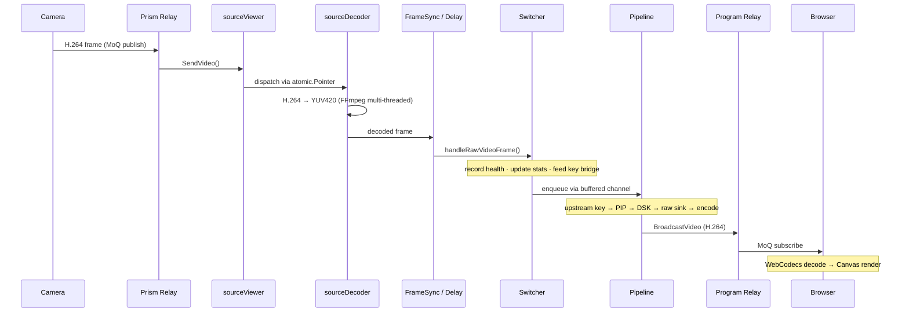
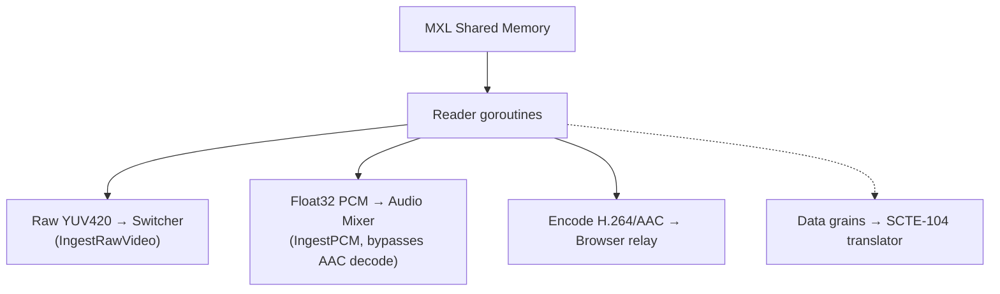
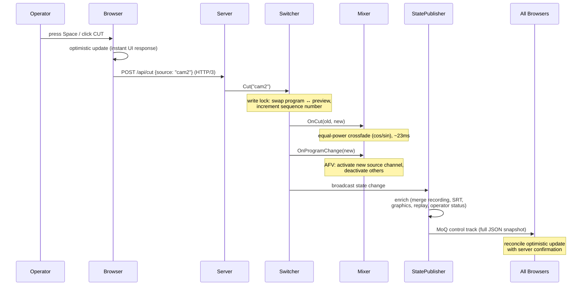
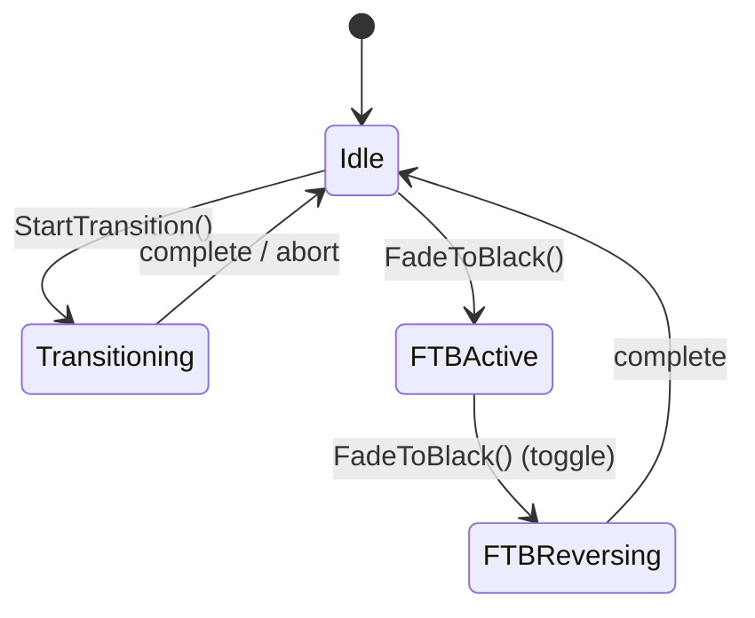
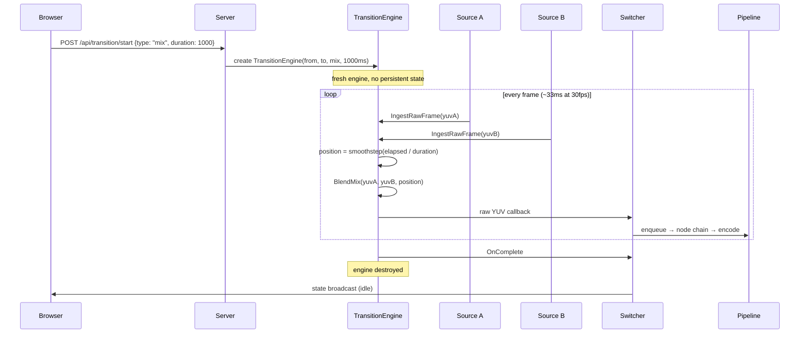
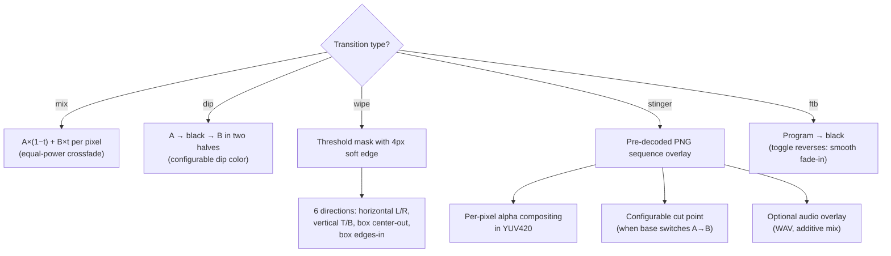
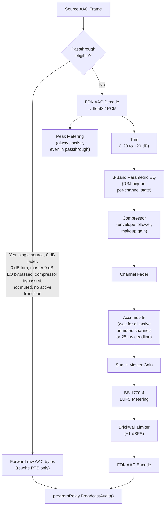
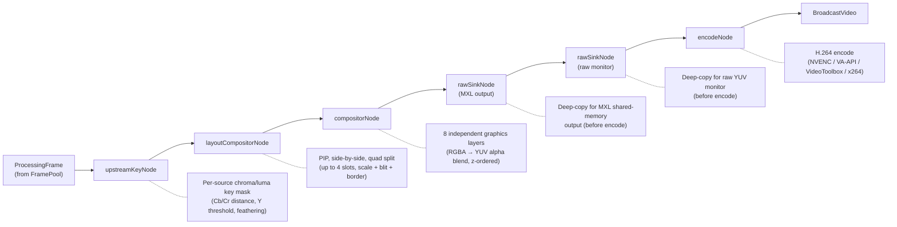
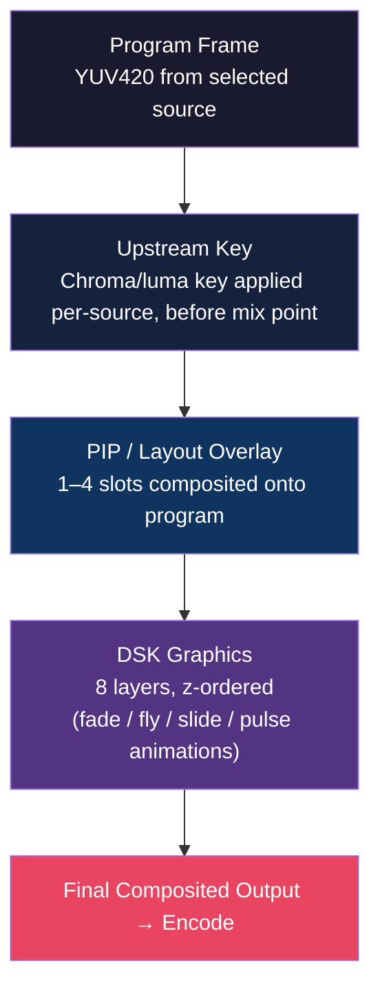

# SwitchFrame Architecture

## 1. System at a Glance

SwitchFrame is a server-authoritative live video switcher: all switching, mixing, compositing, and encoding happen on the server. Browsers connect over WebTransport as thin control surfaces -- they display source previews and send operator commands, but the server produces the definitive program output. Sources arrive via Prism MoQ ingest (H.264/AAC cameras over the internet) or MXL shared-memory transport (uncompressed V210 from local infrastructure).

```mermaid
flowchart LR
    subgraph ingest ["Source Ingest"]
        moq["MoQ Sources<br/>(H.264 / AAC)"]
        mxl["MXL Sources<br/>(V210 shared mem)"]

        moq --> relay["Per-Source<br/>Prism Relay"]
        relay --> sv["sourceViewer"]
        sv --> sd["sourceDecoder<br/>H.264 → YUV420"]

        mxl --> v210["V210 → YUV420"]

        sd --> yuv["Raw YUV420"]
        v210 --> yuv
    end

    subgraph switching ["Switching Engine"]
        fsync["Frame Sync<br/>(align mixed rates)"]
        delay["Delay Buffer<br/>(lip-sync)"]
        core["Switcher Core<br/>(cut / preview /<br/>frame routing)"]
        trans["Transition Engine<br/>(mix, dip, wipe,<br/>stinger, FTB)"]

        fsync --> delay --> core
        core --> trans
    end

    subgraph vidpipe ["Video Pipeline"]
        direction LR
        usk["Upstream<br/>Key"] --> pip["PIP /<br/>Layout"]
        pip --> dsk["DSK<br/>Graphics"]
        dsk --> raw["Raw Sink"]
        raw --> enc["H.264<br/>Encode"]
    end

    subgraph audpipe ["Audio Pipeline"]
        direction LR
        adec["AAC<br/>Decode"] --> trim["Trim"]
        trim --> eq["EQ"]
        eq --> comp["Compressor"]
        comp --> fader["Fader"]
        fader --> mix["Mix"]
        mix --> master["Master"]
        master --> lim["Limiter"]
        lim --> aenc["AAC<br/>Encode"]
    end

    subgraph output ["Output"]
        prog["Program Relay"]
        browsers["Browsers<br/>(WebTransport / MoQ)"]
        rec["Recording<br/>(MPEG-TS)"]
        srt["SRT<br/>Destinations"]
        mxlout["MXL Output<br/>(shared mem)"]

        prog --> browsers
        prog --> rec
        prog --> srt
        prog --> mxlout
    end

    subgraph control ["Control Plane"]
        rest["REST API<br/>(HTTP/3)"]
        mqctl["MoQ Control Track<br/>(state broadcast)"]
    end

    yuv --> fsync
    trans --> usk
    enc --> prog
    aenc --> prog

    rest -.->|"commands"| core
    mqctl -.->|"state updates"| browsers
```

The key architectural insight is that every source is continuously decoded to raw YUV420, regardless of how it arrives. All video processing -- transitions, upstream keying, PIP compositing, graphics overlay, scaling -- operates in BT.709 YUV420, the same colorspace hardware broadcast mixers use internally. This eliminates costly YUV-to-RGB round-trips and means cuts between sources are instant: there is no keyframe wait because every source always has a current decoded frame ready.

Audio follows a similar always-ready model. Each channel flows through a fixed processing chain before being mixed to a stereo master bus. A passthrough optimization bypasses the entire decode/process/encode chain when a single source is at unity gain with no processing enabled, dropping audio CPU to near zero in the common case.

## 2. A Frame's Journey

Following a single frame from camera to screen reveals how the pieces fit together. The path differs slightly for MoQ (H.264) and MXL (uncompressed V210) sources, but both converge on the same raw YUV420 processing pipeline.

### MoQ Source Path

### MXL Source Path

MXL sources bypass the sourceViewer and sourceDecoder entirely -- the V210-to-YUV420 conversion happens in the reader goroutine, and raw frames are injected directly into the switcher. Audio arrives as float32 PCM and skips AAC decoding. A third fan-out encodes to H.264/AAC for browser preview, since browsers cannot consume raw YUV over MoQ.

### Always-Decode Architecture

Every source gets a dedicated decoder goroutine that continuously produces YUV420 frames. This is the key enabling decision -- it eliminates GOP caches, pending-IDR flags, and keyframe gating. When the operator cuts to a new source, the next decoded frame flows through immediately. The tradeoff is CPU cost (N decoders always running), offset by FFmpeg's multi-threaded software decode.

### Frame Memory Management

YUV420 buffers are managed by a FramePool -- a mutex-guarded LIFO free list of pre-allocated buffers. This achieves >99% hit rate vs ~19% with Go's sync.Pool, because LIFO ordering keeps hot buffers in L1/L2 cache. Frames are returned to the pool after encode, and the pool pre-allocates 32 buffers at the pipeline resolution.

### Pipeline Architecture

The video pipeline is a chain of immutable processing nodes, built once and atomically swapped for reconfiguration. When something changes (compositor on/off, upstream key added, graphics layer toggled), a new pipeline is built and swapped in via atomic pointer. The old pipeline drains in-flight frames in a background goroutine. Zero frames are dropped during reconfiguration.

### Timing

The hot path holds locks for under 1us per frame. The async handoff between the switcher and pipeline uses an 8-frame buffered channel (~267ms at 30fps), decoupling source delivery jitter from encode latency. Always-on re-encode ensures consistent SPS/PPS across transition boundaries, so downstream decoders never need reconfiguration.

## 3. A Cut Happens

A cut is the simplest and most frequent operation: swap the program source instantly with no transition frames. Because every source is continuously decoded by its own goroutine, there is no keyframe wait -- the new source always has a current YUV420 frame ready.

### Switcher State Machine

The switcher has a small state machine governing what operations are valid at any moment. A cut bypasses the transitioning state entirely -- it is a direct program/preview swap within the idle state.

### Why Cuts Are Instant

The always-decode architecture is what makes cuts zero-latency. Every source has a dedicated `sourceDecoder` goroutine continuously producing YUV420 frames, so the new source already has a decoded frame in its ring buffer. On the next tick after `Cut()`, cam2's decoded frame flows through `handleRawVideoFrame` into the pipeline node chain and out to encode. There is no GOP replay, no IDR gating, no decoder warmup.

The audio mixer applies a one-frame (~23ms) equal-power crossfade between the old and new source to prevent audible clicks. The crossfade uses precomputed cos/sin lookup tables (1024 entries) to avoid per-sample `math.Cos` calls. Channels in AFV mode automatically activate or deactivate to match the new program source.

The browser applies the cut optimistically before the server confirms -- the UI swaps tally colors and source labels immediately on keypress. If the server rejects the cut (e.g., source offline, operator lacks permission), the pending action expires after 2 seconds and reverts to server state. In practice, the server confirms within a few milliseconds over the shared QUIC connection, and the MoQ control track update arrives before the timeout is relevant.

## 4. A Transition Dissolves

Unlike a cut, transitions blend between two sources over time. A fresh `TransitionEngine` is created for each transition and destroyed on completion -- no persistent codec resources or blending state exist between transitions. Since both sources are already decoded to YUV420 by their per-source decoder goroutines, the engine receives raw frames directly and blends in BT.709 colorspace, matching how hardware broadcast mixers operate internally.

The transition engine supports five blend types, each operating directly on YUV420 planes:

### Wall-Clock Frame Pairing

The engine stores the latest decoded frame from each source. Output is driven by the incoming "to" source's frame rate -- each arriving frame triggers a blend with whatever the "from" source's latest frame is. This means no buffering and minimal latency: the blend happens the instant a new frame arrives, using the freshest available partner frame. If sources run at different frame rates, the faster source simply reuses the slower source's latest frame.

### Smoothstep Easing and Manual Control

Automatic transitions use smoothstep easing: `t²(3 - 2t)`, which produces zero-derivative endpoints for a perceptually smooth start and stop with no abrupt jumps. T-bar manual control overrides automatic timing entirely -- the browser sends position updates via WebTransport datagrams at up to 60fps, and the engine uses the received position directly instead of computing from elapsed time. On T-bar release, one REST call confirms the final authoritative position.

### Resolution Mismatch and Watchdog

If sources have different resolutions, a scaler normalizes both to the program resolution during blending. Lanczos-3 is used for quality-critical paths (auto transitions), bilinear for speed-critical paths (T-bar scrubbing). A 10-second watchdog aborts stuck transitions if no frames arrive from either source, preventing the switcher from freezing in a transitioning state indefinitely.

## 5. Audio Signal Chain

Audio processing runs entirely server-side, mixing all active source channels into a stereo program output encoded as AAC. The pipeline has a critical optimization: when only one source is active at unity gain with no processing enabled, the mixer forwards raw AAC frames without decoding or re-encoding them -- zero CPU for audio in the most common case (a single camera live). Peak metering still runs in passthrough mode so VU meters always have data.

### Audio Transition Modes

During cuts and transitions, the mixer applies gain curves to the outgoing and incoming source to prevent audible clicks and match the visual blend. All curves use precomputed cos/sin lookup tables (1024 entries) to avoid per-sample trigonometric calls.

| Mode | Old Source Gain | New Source Gain | Use Case |
|------|----------------|-----------------|----------|
| Crossfade | cos(t * pi/2) | sin(t * pi/2) | Normal cut (~23ms) or mix dissolve |
| Dip to Silence | cos(2t * pi/2) then 0 | 0 then sin((2t-1) * pi/2) | Dip transition (two halves) |
| Fade Out | cos(t * pi/2) | 0 | Fade to black |
| Fade In | sin(t * pi/2) | 0 | FTB reverse (fade from black) |

### Mix Cycle

When multiple channels are active, each source's AAC frame is decoded to float32 PCM via FDK AAC. Per-channel processing applies trim, 3-band parametric EQ (RBJ biquad coefficients, Direct Form II Transposed, independent left/right filter state to prevent stereo crosstalk), and single-band compression with an exponential envelope follower. The mixer accumulates processed samples in a reusable mix buffer and flushes when all active unmuted channels have contributed -- or when a 25ms deadline expires, which prevents the pipeline from stalling if a source stops sending. The sum is scaled by the master fader, then passed through the brickwall limiter and AAC encoder.

### Loudness Metering

A BS.1770-4 loudness meter runs after the master fader, before the limiter. It applies two-stage K-weighting (head-related shelf filter plus an RLB high-pass) and provides three measurement windows: momentary (400ms sliding), short-term (3s sliding), and integrated (dual gating at -70 LUFS absolute and -10 LU relative to the ungated mean). LUFS values are cached as atomic float64s for lock-free reads by the state broadcast. The UI colors levels green (at or below -23 LUFS), yellow (at or below -14 LUFS), and red (above -14 LUFS), following EBU R128 conventions.

### AFV and Per-Source Delay

Channels default to AFV (Audio Follows Video) -- when the program source changes via a cut, the new source's audio channel activates and all other AFV channels deactivate. The `OnProgramChange` callback fires before the state broadcast so browsers see the updated audio state in the same snapshot as the video change. Per-source audio delay (0-500ms) provides lip-sync correction, buffering audio frames in a ring buffer so they arrive at the mixer time-aligned with their corresponding video frames downstream in the pipeline.

## 6. Compositing the Picture

Between the switching engine and the H.264 encoder sits a chain of compositing nodes that layer visual elements onto the program frame. Each node operates in-place on the same YUV420 buffer, adding upstream keys, PIP overlays, or graphics before the frame reaches the encoder. Inactive nodes are excluded at build time -- there is zero per-frame overhead for disabled features.

### Pipeline Node Chain

### Visual Layer Stack

### Atomic Pipeline Swap

The pipeline is immutable once built. When configuration changes -- compositor toggled, key added, graphics layer enabled -- a new pipeline is built on the main goroutine and swapped in via atomic pointer. The old pipeline drains in-flight frames in a background goroutine before closing. This guarantees zero frame drops during reconfiguration. Triggers include `SetCompositor`, `SetKeyBridge`, `SetRawVideoSink`, and any compositor or key state change that might alter a node's `Active()` result.

### Upstream Keying

Per-source chroma and luma key generation operates in YUV420 domain, matching the colorspace of hardware broadcast mixers. Chroma keying uses Cb/Cr squared distance with configurable spill replacement color. Luma keying uses Y threshold with smoothness feathering. The `KeyProcessor` runs a chain of key configs per source, applied via `KeyProcessorBridge` before the mix point -- meaning keys are composited onto the source frame before it enters the transition engine or pipeline, not after.

### PIP and Layouts

The layout compositor supports PIP (corner overlay), side-by-side (50/50 split), and quad (2x2 grid) presets, plus arbitrary custom layouts. Each slot has source assignment, on/off state, position rect, z-order, border config, and scale mode (stretch or crop-to-fill). Slot transitions support cut, dissolve, and fly-in animations. Fast-control datagrams enable live PIP drag at 60fps via WebTransport binary protocol (~7 bytes per update) -- the browser sends position updates as datagrams, the layout compositor applies them directly on its fast path without state broadcast, and a single REST call on mouse release confirms the authoritative position.

### DSK Graphics

Up to 8 independent graphics layers are composited in z-order onto the program frame. Each layer holds an RGBA overlay, position rect, and animation state. Animations include fade (in/out over configurable duration), fly-in/out (4 directions computed from program dimensions), slide, and pulse (oscillating alpha between min and max values at a configurable frequency). Six built-in broadcast templates -- lower-third, news lower-third, full-screen card, score bug, network bug, and ticker -- render on an OffscreenCanvas in the browser and upload as RGBA via the REST API. Per-layer mutexes allow concurrent animation goroutines without blocking the pipeline's hot path.
