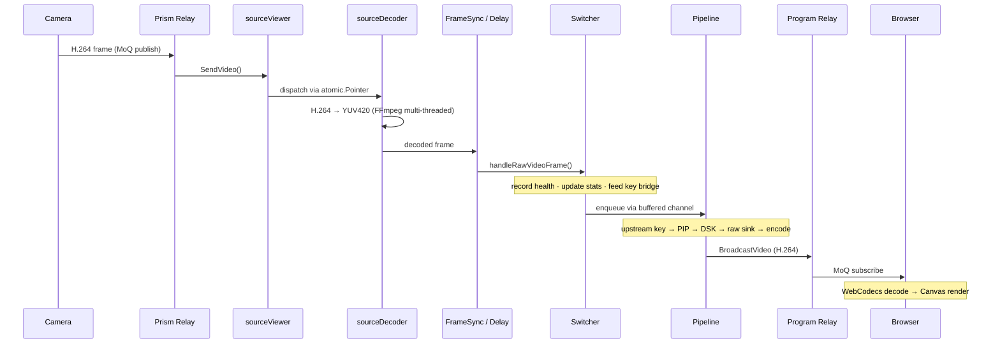
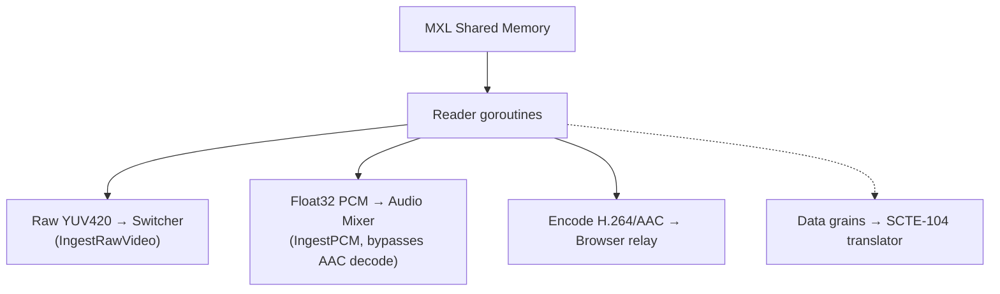

# SwitchFrame Architecture

## 1. System at a Glance

SwitchFrame is a server-authoritative live video switcher: all switching, mixing, compositing, and encoding happen on the server. Browsers connect over WebTransport as thin control surfaces -- they display source previews and send operator commands, but the server produces the definitive program output. Sources arrive via Prism MoQ ingest (H.264/AAC cameras over the internet) or MXL shared-memory transport (uncompressed V210 from local infrastructure).

```mermaid
flowchart LR
    subgraph ingest ["Source Ingest"]
        moq["MoQ Sources<br/>(H.264 / AAC)"]
        mxl["MXL Sources<br/>(V210 shared mem)"]

        moq --> relay["Per-Source<br/>Prism Relay"]
        relay --> sv["sourceViewer"]
        sv --> sd["sourceDecoder<br/>H.264 → YUV420"]

        mxl --> v210["V210 → YUV420"]

        sd --> yuv["Raw YUV420"]
        v210 --> yuv
    end

    subgraph switching ["Switching Engine"]
        fsync["Frame Sync<br/>(align mixed rates)"]
        delay["Delay Buffer<br/>(lip-sync)"]
        core["Switcher Core<br/>(cut / preview /<br/>frame routing)"]
        trans["Transition Engine<br/>(mix, dip, wipe,<br/>stinger, FTB)"]

        fsync --> delay --> core
        core --> trans
    end

    subgraph vidpipe ["Video Pipeline"]
        direction LR
        usk["Upstream<br/>Key"] --> pip["PIP /<br/>Layout"]
        pip --> dsk["DSK<br/>Graphics"]
        dsk --> raw["Raw Sink"]
        raw --> enc["H.264<br/>Encode"]
    end

    subgraph audpipe ["Audio Pipeline"]
        direction LR
        adec["AAC<br/>Decode"] --> trim["Trim"]
        trim --> eq["EQ"]
        eq --> comp["Compressor"]
        comp --> fader["Fader"]
        fader --> mix["Mix"]
        mix --> master["Master"]
        master --> lim["Limiter"]
        lim --> aenc["AAC<br/>Encode"]
    end

    subgraph output ["Output"]
        prog["Program Relay"]
        browsers["Browsers<br/>(WebTransport / MoQ)"]
        rec["Recording<br/>(MPEG-TS)"]
        srt["SRT<br/>Destinations"]
        mxlout["MXL Output<br/>(shared mem)"]

        prog --> browsers
        prog --> rec
        prog --> srt
        prog --> mxlout
    end

    subgraph control ["Control Plane"]
        rest["REST API<br/>(HTTP/3)"]
        mqctl["MoQ Control Track<br/>(state broadcast)"]
    end

    yuv --> fsync
    trans --> usk
    enc --> prog
    aenc --> prog

    rest -.->|"commands"| core
    mqctl -.->|"state updates"| browsers
```

The key architectural insight is that every source is continuously decoded to raw YUV420, regardless of how it arrives. All video processing -- transitions, upstream keying, PIP compositing, graphics overlay, scaling -- operates in BT.709 YUV420, the same colorspace hardware broadcast mixers use internally. This eliminates costly YUV-to-RGB round-trips and means cuts between sources are instant: there is no keyframe wait because every source always has a current decoded frame ready.

Audio follows a similar always-ready model. Each channel flows through a fixed processing chain before being mixed to a stereo master bus. A passthrough optimization bypasses the entire decode/process/encode chain when a single source is at unity gain with no processing enabled, dropping audio CPU to near zero in the common case.

## 2. A Frame's Journey

Following a single frame from camera to screen reveals how the pieces fit together. The path differs slightly for MoQ (H.264) and MXL (uncompressed V210) sources, but both converge on the same raw YUV420 processing pipeline.

### MoQ Source Path

### MXL Source Path

MXL sources bypass the sourceViewer and sourceDecoder entirely -- the V210-to-YUV420 conversion happens in the reader goroutine, and raw frames are injected directly into the switcher. Audio arrives as float32 PCM and skips AAC decoding. A third fan-out encodes to H.264/AAC for browser preview, since browsers cannot consume raw YUV over MoQ.

### Always-Decode Architecture

Every source gets a dedicated decoder goroutine that continuously produces YUV420 frames. This is the key enabling decision -- it eliminates GOP caches, pending-IDR flags, and keyframe gating. When the operator cuts to a new source, the next decoded frame flows through immediately. The tradeoff is CPU cost (N decoders always running), offset by FFmpeg's multi-threaded software decode.

### Frame Memory Management

YUV420 buffers are managed by a FramePool -- a mutex-guarded LIFO free list of pre-allocated buffers. This achieves >99% hit rate vs ~19% with Go's sync.Pool, because LIFO ordering keeps hot buffers in L1/L2 cache. Frames are returned to the pool after encode, and the pool pre-allocates 32 buffers at the pipeline resolution.

### Pipeline Architecture

The video pipeline is a chain of immutable processing nodes, built once and atomically swapped for reconfiguration. When something changes (compositor on/off, upstream key added, graphics layer toggled), a new pipeline is built and swapped in via atomic pointer. The old pipeline drains in-flight frames in a background goroutine. Zero frames are dropped during reconfiguration.

### Timing

The hot path holds locks for under 1us per frame. The async handoff between the switcher and pipeline uses an 8-frame buffered channel (~267ms at 30fps), decoupling source delivery jitter from encode latency. Always-on re-encode ensures consistent SPS/PPS across transition boundaries, so downstream decoders never need reconfiguration.
