# SwitchFrame Architecture

## 1. System Overview

SwitchFrame is a browser-based live video switcher built on
[Prism](https://github.com/zsiec/prism), an MoQ (Media over QUIC) media
distribution server. It replaces traditional hardware video switchers
(ATEM, Ross) with a Go server and a Svelte 5 SPA, connected over
WebTransport using the MoQ draft-15 protocol.

Sources publish H.264+AAC streams to Prism via MoQ. The SwitchFrame
server receives all source frames, routes the selected program source to
a "program" relay, mixes audio, composites graphics overlays, and
manages dissolve transitions -- all server-side. Browsers subscribe to
each source stream for multiview monitoring and to the program stream for
the authoritative output. Operator commands (cut, preview, transition)
flow as REST POST requests over HTTP/3.

### Server Data Flow

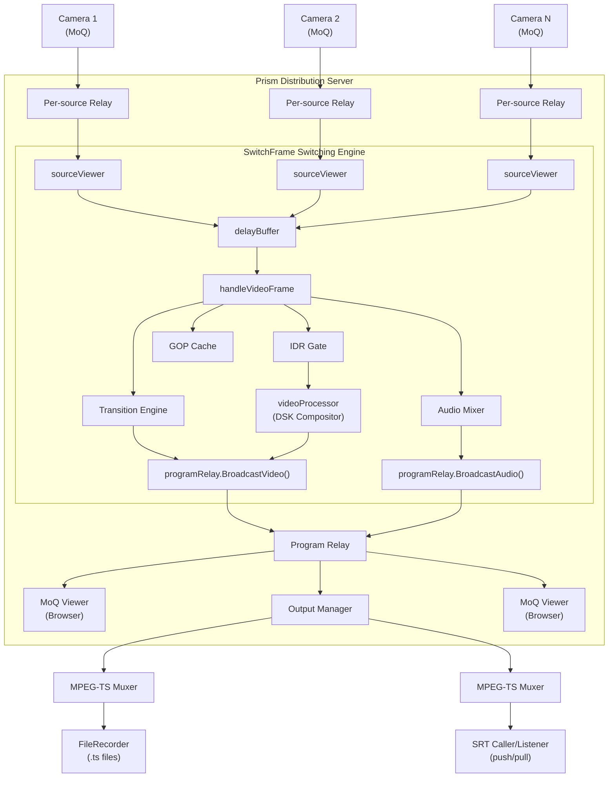

### Browser Architecture

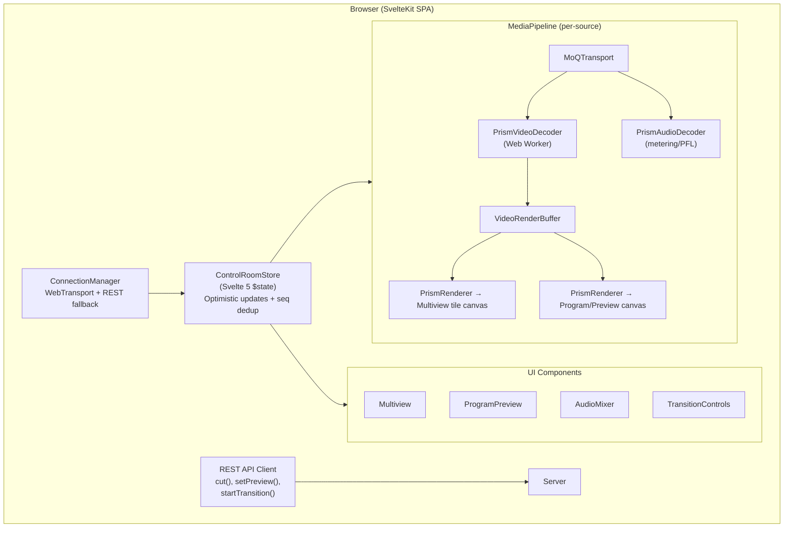


## 2. Server Architecture

### 2.1 Prism Integration

SwitchFrame embeds Prism as a Go library (`github.com/zsiec/prism`).
Prism provides:

- **WebTransport/QUIC server** on `:8080` (HTTP/3)
- **MoQ draft-15 protocol** for media distribution
- **`distribution.Relay`** -- per-stream fan-out to N viewers
- **`distribution.Viewer`** -- interface for receiving frames
- **`ServerConfig.ExtraRoutes`** -- hook for mounting SwitchFrame's REST API

At startup, `main.go` creates a `distribution.Server` with two key hooks:

```
ServerConfig{
    ExtraRoutes:          mount /api/ routes + embedded UI
    OnStreamRegistered:   streamCallbackRouter -> Switcher + Mixer
    OnStreamUnregistered: streamCallbackRouter -> Switcher + Mixer
    ControlCh:            channelPublisher.Ch() (MoQ control track)
}
```

The **program relay** is registered as `server.RegisterStream("program")`.
Browsers subscribe to it via MoQ to view the authoritative program
output. The `streamCallbackRouter` skips the "program" key to avoid
treating it as a source.

A separate **HTTP/TCP server on `:8081`** mirrors the REST API for the
Vite dev proxy and tools that cannot speak QUIC.


### 2.2 Switching Engine (`switcher/`)

The switcher is an explicit state machine with five states:

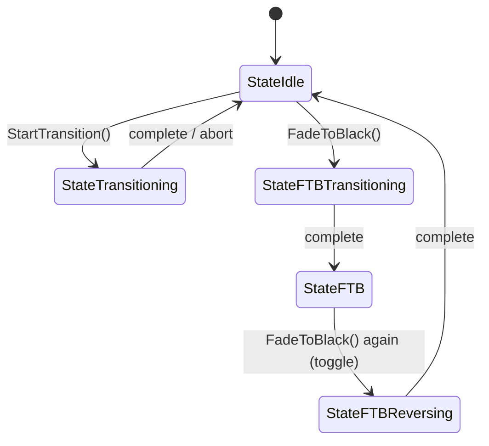

**Source registration.** When Prism detects a new MoQ publisher, the
callback router calls `sw.RegisterSource(key, relay)`. This creates a
`sourceViewer` and attaches it to the source's relay via
`relay.AddViewer(viewer)`. The sourceViewer implements
`distribution.Viewer` and tags every incoming frame with the source key
before forwarding to the switcher's central `handleVideoFrame` /
`handleAudioFrame` methods.

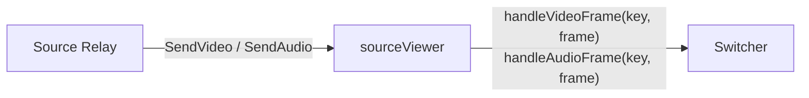

**Frame routing in `handleVideoFrame`.** On every video frame:

1. Record frame in health monitor (for stale/offline detection).
2. Update rolling frame statistics (EMA of frame size, FPS from PTS
   deltas) used to configure the transition encoder.
3. Record frame in GOP cache (for instant keyframe on cut).
4. If a transition is active, convert AVC1 to Annex B and feed to the
   transition engine. Sync audio crossfade position.
5. Otherwise, check if this is the program source:
   - If `pendingIDR` is false (steady state), broadcast immediately
     via `broadcastVideo()`. Uses RLock for maximum concurrency.
   - If `pendingIDR` is true (just after a cut), drop non-keyframes.
     When the first keyframe arrives, clear the flag under write lock
     and broadcast.

**`broadcastVideo`** passes the frame through the optional video
processor (DSK compositor), then calls `programRelay.BroadcastVideo()`.

**Cut operation.** `Cut(sourceKey)`:
1. Under write lock: set `programSource`, set `pendingIDR = true` on the
   new source, swap old program to preview, increment `seq`.
2. Outside lock: notify audio mixer (`OnCut` for crossfade,
   `OnProgramChange` for AFV), fire state callbacks.

**Keyframe gating.** The `pendingIDR` flag prevents forwarding frames
from the new source until its first IDR (keyframe) arrives. This avoids
decoder artifacts from starting mid-GOP. Audio is gated the same way.
The GOP cache stores recent keyframes so the gate clears quickly.

**Delay buffer.** Per-source configurable delay (0-500ms) for lip-sync
correction. Frames pass through the delay buffer before reaching the
switcher's handle methods.


### 2.3 Audio Pipeline (`audio/`)

The audio mixer runs server-side, mixing all active sources into a
single AAC program output. It has two operating modes:

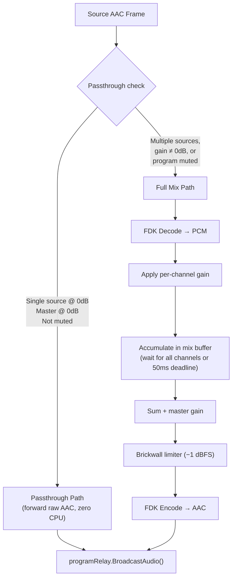

**Passthrough optimization.** When only one source is active at 0 dB
gain with master at 0 dB and no program mute, the mixer forwards raw AAC
frames without decode/encode. This is the common case (single camera
live) and consumes zero CPU for audio processing. Even in passthrough,
the mixer decodes for peak metering so VU meters remain active.

**Mix cycle.** When multiple channels are active, each source's AAC
frame is decoded to float32 PCM via FDK-AAC, gain is applied, and the
samples are accumulated in a `mixBuffer` map. The cycle flushes when all
active unmuted channels have contributed or a 50ms deadline expires
(prevents deadlock if a source stops sending). The summed PCM is then:

1. Multiplied by master gain
2. Passed through the brickwall limiter (-1 dBFS ceiling)
3. Program-muted if FTB is held (zeroed)
4. Peak-metered (L/R)
5. Encoded back to AAC via FDK-AAC

**Crossfade on cut.** When a cut occurs, the switcher calls
`mixer.OnCut(oldSource, newSource)`. The mixer collects one frame from
each source and applies an equal-power crossfade (cos/sin ramp) over
~23ms (one AAC frame). A 50ms timeout ensures completion even if the
outgoing source stops sending.

**Transition crossfade.** During dissolve/dip transitions, the mixer
tracks a continuous position (0.0 to 1.0) synchronized with the video
engine. Per-sample gain interpolation between `prevPos` and `currentPos`
eliminates zipper noise. Four modes:

| Mode | Old source gain | New source gain |
|---|---|---|
| `AudioCrossfade` | `cos(pos)` | `sin(pos)` (equal-power A→B) |
| `AudioDipToSilence` | cos then sin over two halves | (A→silence→B) |
| `AudioFadeOut` | `cos(pos)` | 0 (FTB) |
| `AudioFadeIn` | `sin(pos)` | 0 (FTB reverse) |

**AFV (Audio Follows Video).** Channels default to AFV mode. When the
program source changes, `OnProgramChange` activates the new source's
channel and deactivates all other AFV channels. Non-AFV channels are
unaffected.


### 2.4 Transition Engine (`transition/`)

The transition engine handles server-side dissolve/dip/wipe/FTB
transitions. A new engine is created per transition and destroyed on
completion or abort -- no persistent codec resources between transitions.

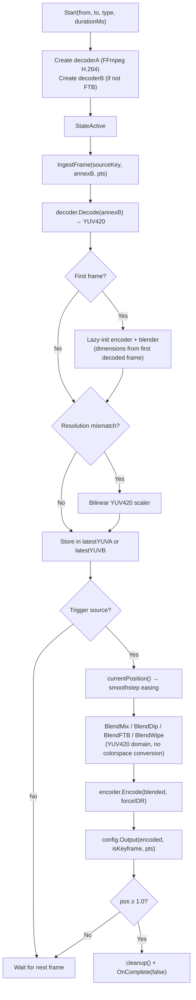

**Wall-clock frame pairing.** The engine stores the latest decoded YUV
frame from each source. Output is driven by the incoming source's frame
rate -- each time a frame arrives from the "to" source (or "from" for
FTB), it triggers a blend with whatever the other source's latest frame
is. This avoids buffering and keeps latency minimal.

**Smoothstep easing.** Position is calculated as `t*t*(3-2t)` where `t`
is the linear elapsed fraction. This produces zero-derivative endpoints
for a perceptually smooth transition -- no abrupt start/stop.

**YUV420 blending.** Blend operations happen directly in YUV420 (BT.709)
space, matching hardware broadcast mixers. This avoids the costly
YUV->RGB->YUV round-trip that software switchers typically perform. The
`FrameBlender` pre-allocates its output buffer and reuses it across
frames.

**Resolution mismatch.** A pure Go bilinear scaler normalizes
mismatched sources to the program resolution (set by the first decoded
frame) during transitions. No additional cgo dependencies.

**Encoder configuration.** Bitrate and FPS are derived from rolling
statistics of the program source's recent frames (exponential moving
average of frame size and PTS deltas), so the transition encoder matches
source quality. Falls back to 4 Mbps / 30fps if stats are unavailable.

**T-bar manual control.** `SetPosition(pos)` overrides automatic timing
for manual T-bar operation. Throttled to 50ms/20Hz from the browser.
Pulling back to 0.0 aborts; pushing to 1.0 completes.

**Watchdog.** A background goroutine monitors for frame starvation. If
no frames arrive within 10 seconds, the transition is aborted to prevent
stuck state.


### 2.5 Output Pipeline (`output/`)

The output pipeline provides recording and SRT streaming of the program
output. It is completely dormant when no outputs are active.

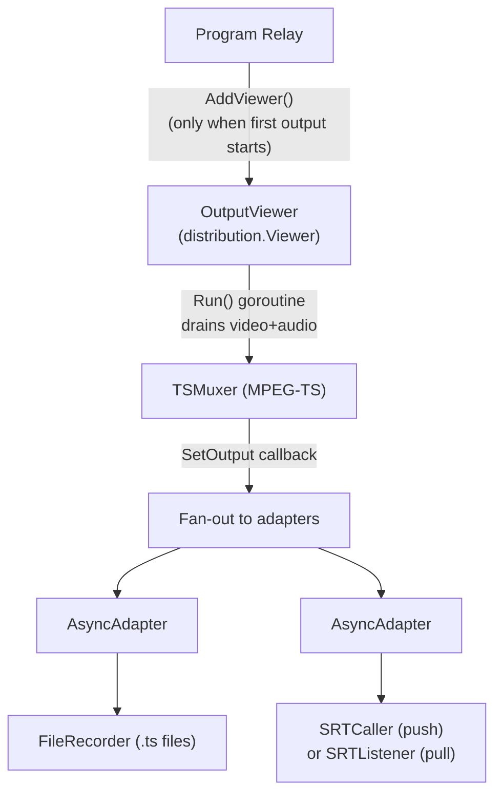

**Lazy viewer lifecycle.** `OutputManager.ensureMuxerLocked()` creates
the `OutputViewer`, `TSMuxer`, and registers the viewer on the program
relay only when the first output adapter starts. When the last adapter
stops, `stopMuxerIfNoAdaptersLocked()` tears everything down. This
ensures zero overhead when recording and SRT are both inactive.

**MPEG-TS muxing.** The TSMuxer uses `go-astits` to mux H.264 video and
AAC audio into MPEG-TS format. This format is crash-resilient (no moov
atom needed) and is shared by both recording and SRT output.

**AsyncAdapter.** Each output adapter is wrapped in an `AsyncAdapter`
with a buffered channel (256 slots, ~8 seconds at 30fps). Writes from
the muxer callback are non-blocking -- if the channel fills, the adapter
handles backpressure internally. This prevents slow outputs (e.g. a
stalled SRT connection) from blocking the muxer and other adapters.

**FileRecorder.** Writes `.ts` files with rotation:
- Time-based: default 1 hour per file
- Size-based: configurable maximum file size
- Sequential naming: `program_YYYYMMDD_HHMMSS_NNN.ts`

**SRT modes.** Two modes using `zsiec/srtgo` (pure Go, no cgo):
- **Caller** (push): connects to a remote SRT endpoint (e.g. streaming
  platform). Exponential backoff reconnection (1s to 30s). 4MB ring
  buffer preserves data during reconnects; overflows trigger a
  `onReconnect(overflowed)` callback and resume from keyframe.
- **Listener** (pull): binds a port and accepts up to 8 incoming SRT
  connections.


### 2.6 Graphics Compositor (`graphics/`)

The DSK (Downstream Keyer) compositor overlays RGBA graphics onto the
program output. It is wired into the switcher as a `videoProcessor`
hook, called on every program frame in `broadcastVideo()`.

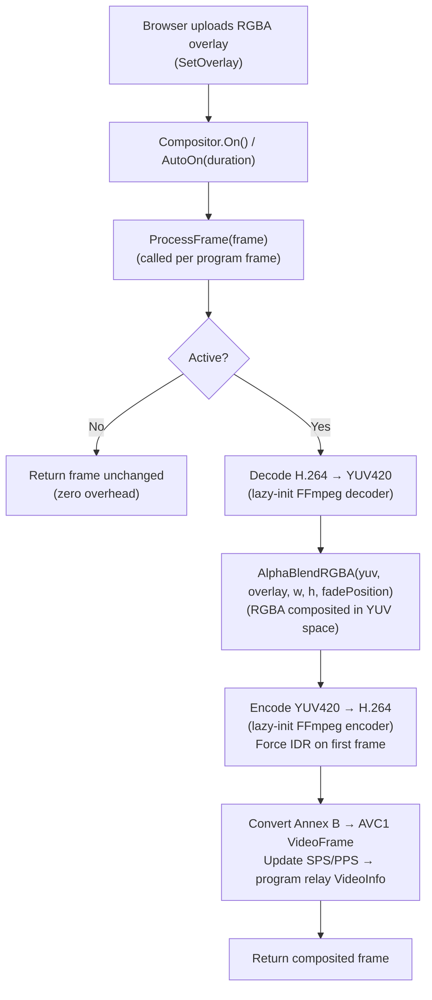

**Fade transitions.** `AutoOn` and `AutoOff` drive a fade from 0.0 to
1.0 (or reverse) over a configurable duration at ~60fps. The
`fadePosition` scales the overlay alpha during compositing. `On` / `Off`
provide instant cut transitions.

**Codec lifecycle.** The decoder and encoder are created lazily on the
first active keyframe and destroyed on deactivation. When inactive,
`ProcessFrame` returns the frame unchanged with zero overhead.

**VideoInfo propagation.** When the compositor produces its first
keyframe (with new SPS/PPS from re-encoding), it notifies the program
relay via `onVideoInfoChange` so new MoQ subscribers receive the correct
avcC decoder configuration in the catalog.


### 2.7 State Broadcast

State is broadcast to browsers via two mechanisms:

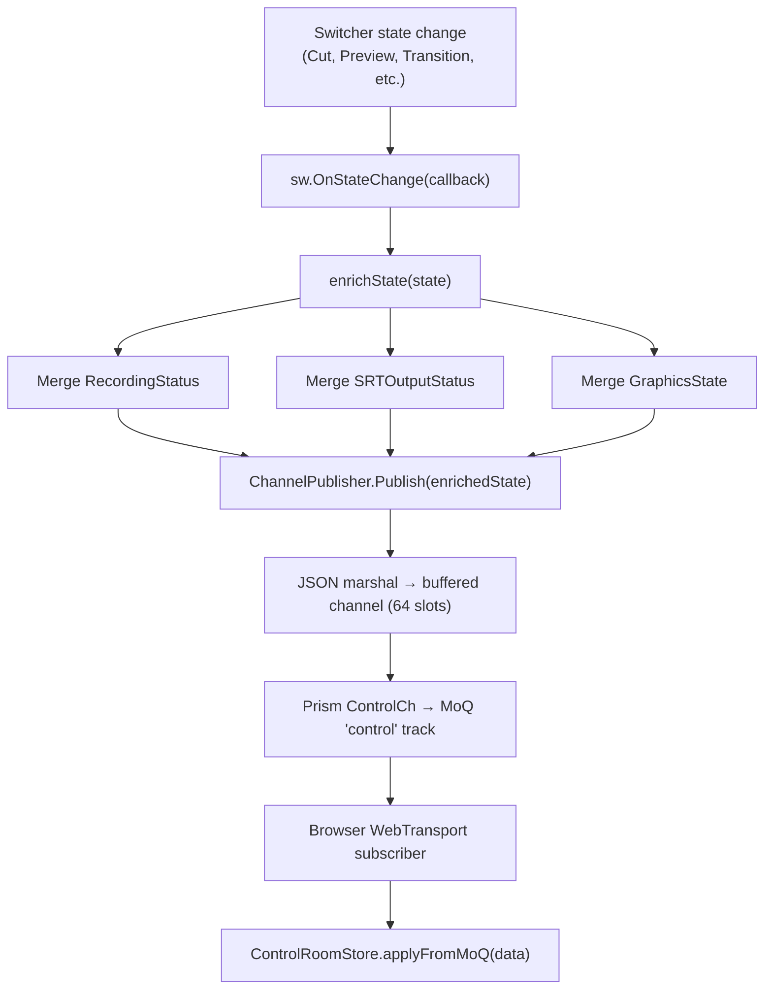

**Full snapshot per group.** Every state broadcast is a complete
`ControlRoomState` JSON snapshot (not a delta). This enables late-join
-- a browser connecting mid-session receives the full current state in
the first MoQ group.

**Multiple producers.** Three subsystems trigger state broadcasts:
1. **Switcher** -- cut, preview, transition start/complete, health
2. **OutputManager** -- recording start/stop, SRT connect/disconnect,
   ring buffer overflow
3. **Compositor** -- graphics on/off, fade position

The `ChannelPublisher` handles channel-full backpressure by dropping the
oldest message. This is safe because every message is a full snapshot.

**Sequence deduplication.** Each state has a monotonic `seq` number. The
browser's `ControlRoomStore.applyUpdate` ignores updates with
`seq <= current`, preventing stale REST poll responses from overwriting
newer MoQ-delivered state.

**State enrichment pipeline.** The `enrichState` function in `main.go`
patches the base switcher state with recording, SRT, and graphics status
from their respective managers before broadcast. The compositor uses a
`gfxOverride` parameter to avoid calling `compositor.Status()` from
within its own lock (which would deadlock).


## 3. Frontend Architecture

### 3.1 SvelteKit SPA with Svelte 5 Runes

The frontend is a SvelteKit application using the static adapter for
embedding into the Go binary. It uses Svelte 5 runes (`$state`,
`$derived`, `$effect`) for reactive state management.

Two layout modes are supported:
- **Traditional** -- full control surface (multiview, audio mixer,
  preview/program buses, transition controls, graphics panel)
- **Simple** -- volunteer-friendly layout with just preview/program
  windows, source buttons, and CUT/DISSOLVE

Layout mode is detected from URL param (`?mode=simple`) > localStorage >
default 'traditional'. Changing modes auto-persists to localStorage.


### 3.2 Media Pipeline

The media pipeline manages per-source video and audio decode:

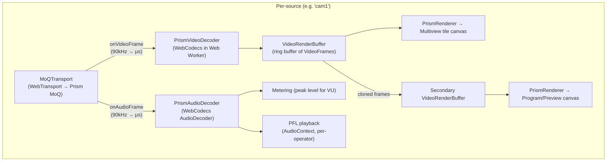

**One MoQTransport per source.** Each source stream in Prism is a
separate MoQ subscription. The "program" stream is also subscribed so
the program canvas shows the authoritative server output (including
transition blends and graphics overlays).

**WebCodecs decode.** The `PrismVideoDecoder` wraps the browser's
WebCodecs API. It is configured lazily on the first keyframe that
carries an avcC description record. The decoded `VideoFrame` objects are
pushed into a `VideoRenderBuffer`.

**Multi-canvas rendering.** A source can render to multiple canvases
simultaneously (e.g. multiview tile + preview/program window). The first
renderer uses the primary `VideoRenderBuffer`; additional renderers get
secondary buffers that receive cloned `VideoFrame` objects from the
decoder's clone callback.

**Audio metering.** The `PrismAudioDecoder` decodes AAC audio and
enables peak metering for VU display. Audio is muted by default for
source tiles; the "program" stream is unmuted for monitoring.

**PFL (Pre-Fade Listen).** A per-operator client-side feature. The
`PFLManager` creates a separate `AudioContext` per source for
headphone-only solo monitoring without affecting the server mix.


### 3.3 State Management

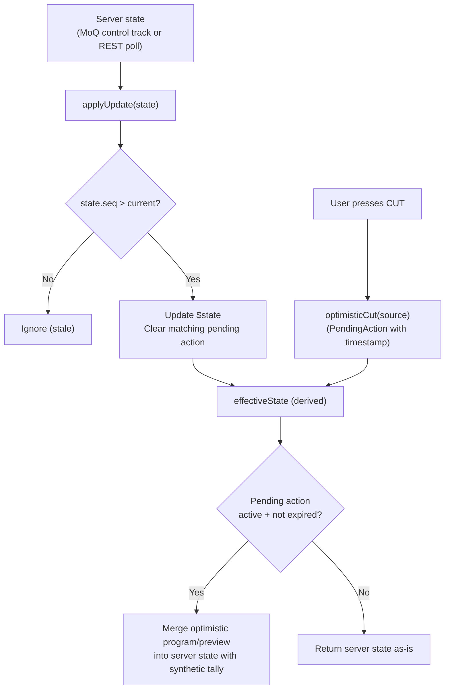

**Optimistic updates.** When the operator presses CUT, the store
immediately applies the expected state change locally
(`optimisticCut`). This makes the UI feel instant. The pending action
is cleared when the server confirms (matching `programSource` in the
next state update) or expires after 2 seconds.


### 3.4 Connection Management

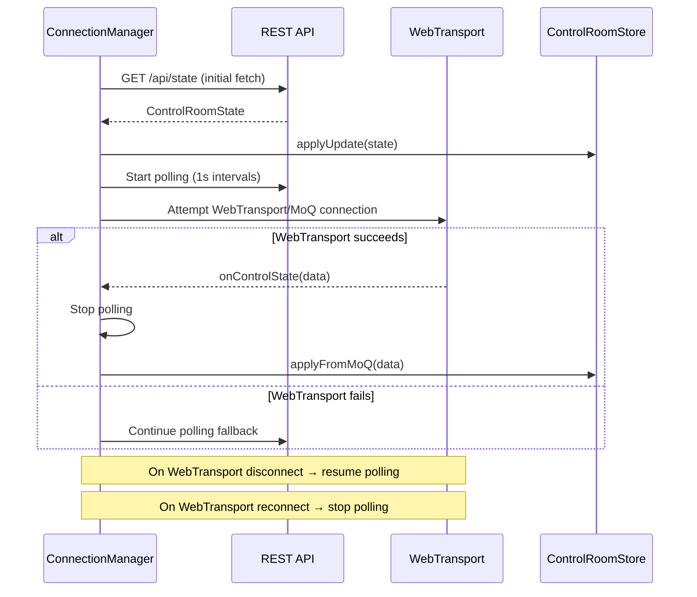

The `ConnectionManager` provides resilient state synchronization:
1. Initial state fetch via REST (with retry)
2. Start REST polling as immediate fallback
3. Attempt WebTransport/MoQ connection
4. On WebTransport success: stop polling, use MoQ control track
5. On WebTransport failure: fall back to REST polling
6. On WebTransport reconnect: switch back to MoQ

The connection state (`webtransport` | `polling` | `disconnected`) is
displayed in the UI header as a connection status banner.


### 3.5 Keyboard Shortcuts

The `KeyboardHandler` uses capture-phase `keydown` with `event.code` for
layout-independent shortcuts:

| Key | Action |
|---|---|
| `1`-`9` | Set preview source (by position) |
| `Shift+1`-`9` | Hot-punch (direct cut to source) |
| `Space` | CUT (preview → program) |
| `Enter` | AUTO transition (dissolve/dip) |
| `F1` | Fade to black (toggle) |
| `F2` | Toggle DSK graphics |
| `` ` `` | Toggle fullscreen |
| `?` | Toggle keyboard overlay |


## 4. Data Flow Diagrams

### 4.1 Source Ingestion to Program Output

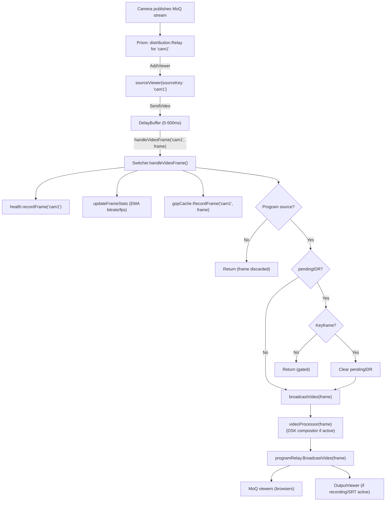

### 4.2 Cut Operation

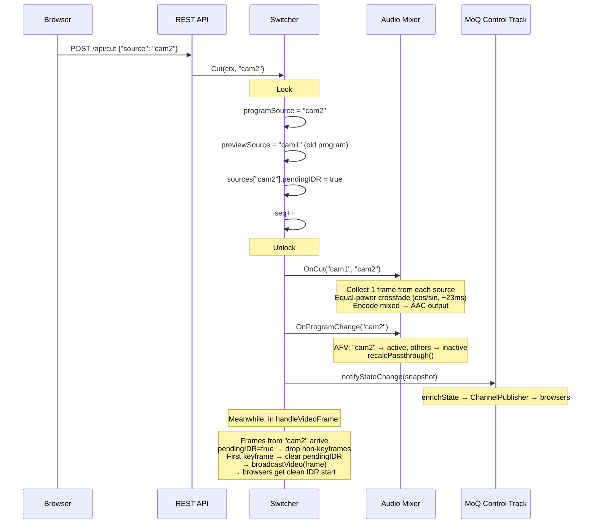

### 4.3 Dissolve Transition

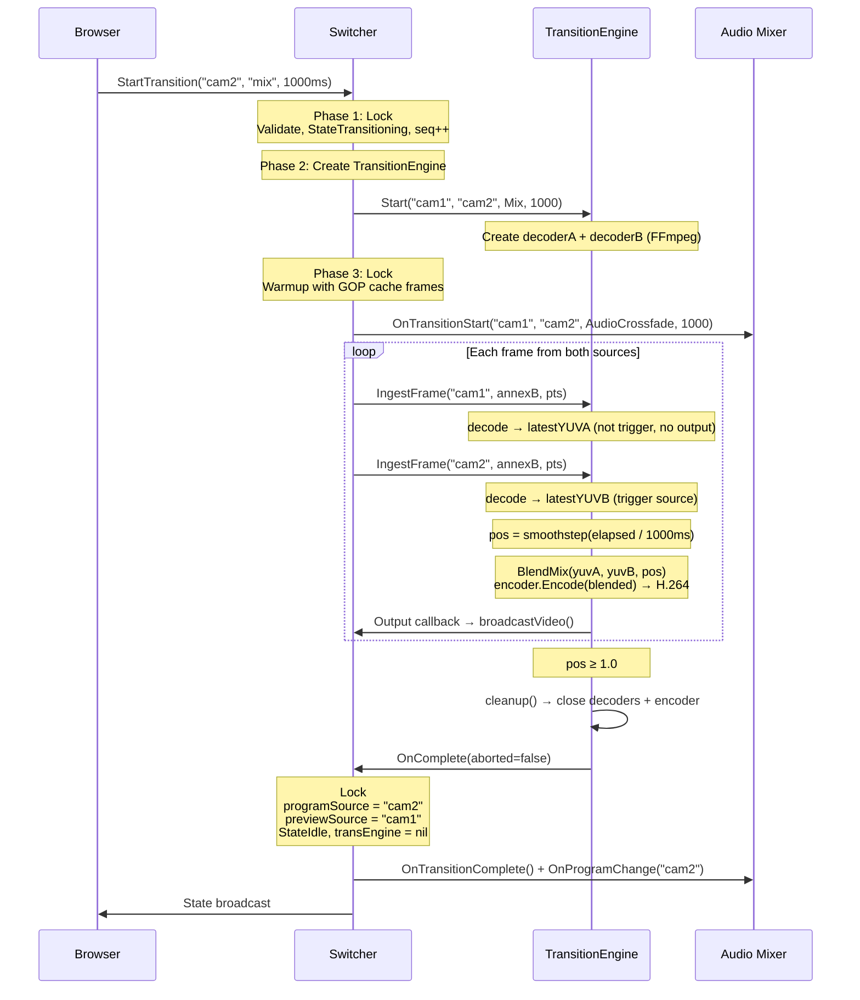

### 4.4 State Sync (Server to Browser)

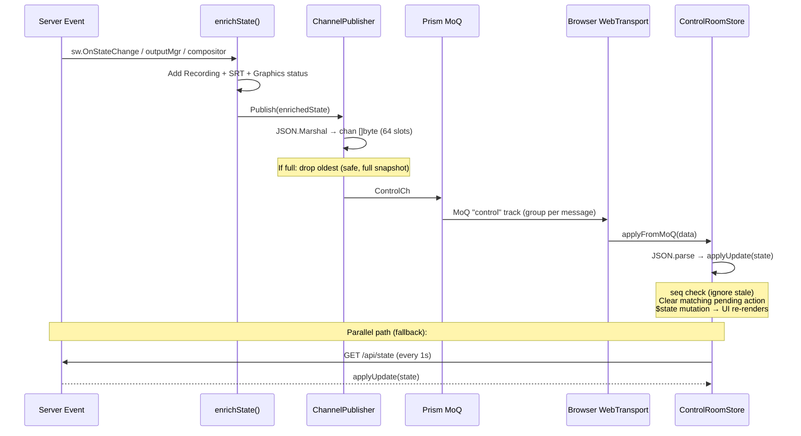


## 5. Key Design Decisions

### Server-Side Switching

All switching decisions and frame routing happen on the server, not in
the browser. The browser is a thin viewer that displays what the server
produces. This ensures:
- A single authoritative program output (critical for recording and SRT)
- Transition quality is independent of client hardware
- Multiple operators see identical state
- Recording captures exactly what viewers see

### YUV420 Blending (BT.709)

Dissolve blending operates directly in YUV420 space, matching the
approach of hardware broadcast mixers (Blackmagic ATEM, Ross). This
avoids the expensive YUV->RGB->YUV round-trip that software
implementations typically perform. The visual difference is
imperceptible for the dissolve/dip/FTB operations used in live
production.

### Passthrough Optimization

The audio mixer detects the common case of a single active source at
unity gain and bypasses decode/mix/encode entirely, forwarding raw AAC
frames. This reduces audio CPU to near zero during normal operation.
The mixer recalculates passthrough eligibility on every state change
(cut, mute toggle, gain change).

### Keyframe Gating

After a cut, the switcher gates all frames from the new source until its
first IDR keyframe arrives. This prevents decoder artifacts from
mid-GOP starts. Combined with the GOP cache (which stores recent
keyframes per source), the gate typically clears within one GOP interval
(~1-2 seconds at most, often faster).

### REST Commands over HTTP/3

Control commands use REST POST requests rather than MoQ custom messages.
The MoQ specification states that unknown message types cause a
PROTOCOL_VIOLATION error, making custom messages fragile. REST over
HTTP/3 uses the same QUIC connection, adds negligible latency, and is
compatible with standard tooling (curl, browsers, proxies).

### MoQ Control Track for State

Switcher state is broadcast via a MoQ "control" track using full JSON
snapshots. Full snapshots (not deltas) enable late-join -- a browser
connecting mid-session receives complete state immediately. The
monotonic `seq` field enables dedup of stale responses from REST
polling.

### Transition Engine Lifecycle

Each transition creates a fresh `TransitionEngine` with its own decoders
and encoder, which are destroyed on completion/abort. This avoids
persistent codec state between transitions (no resource leaks, no stale
encoder state). Between transitions, no video decode or encode occurs --
just raw frame forwarding.

### Encoder Auto-Detection

At startup, `codec.ProbeEncoders()` tests available hardware encoders in
priority order: NVENC -> VA-API -> VideoToolbox -> libx264 -> OpenH264.
The first successful probe is cached for the process lifetime. This
allows the same binary to run on GPU-accelerated servers and
CPU-only machines without configuration.

### SRT Connection Resilience

The SRT caller uses exponential backoff (1s to 30s) for reconnection
and a 4MB ring buffer to preserve data during disconnections. If the
ring buffer overflows, the caller resumes from the next keyframe and
fires an `onReconnect(overflowed=true)` callback so the OutputManager
can log a warning and broadcast updated state.

### Optimistic UI Updates

The browser applies cut/preview changes immediately via `optimisticCut`
/ `optimisticPreview` before the server confirms. This eliminates
perceived latency for the operator. Pending actions expire after 2
seconds if unconfirmed, reverting to server state.

### WebTransport with REST Polling Fallback

The `ConnectionManager` attempts WebTransport/MoQ first, with REST
polling as an immediate fallback. If WebTransport connects, polling
stops. If WebTransport drops, polling resumes. This ensures the UI
works even in environments that do not support WebTransport (proxies,
older browsers).


## 6. Technology Stack

| Layer | Technology | Purpose |
|---|---|---|
| Media transport | MoQ draft-15 / WebTransport | Low-latency media distribution |
| Server runtime | Go 1.25+ | Server binary, all switching logic |
| Media server | Prism (Go library) | MoQ protocol, relay fan-out, stream management |
| Video codec | FFmpeg libavcodec (cgo) | H.264 decode/encode for transitions/DSK |
| Video fallback | OpenH264 (cgo, build tag) | Fallback encoder when FFmpeg unavailable |
| Audio codec | FDK-AAC (cgo) | AAC decode/encode for audio mixing |
| SRT transport | zsiec/srtgo (pure Go) | SRT caller and listener output |
| TS muxing | go-astits | MPEG-TS container for recording/SRT |
| Frontend | Svelte 5 + SvelteKit | Reactive SPA with static adapter |
| State management | Svelte 5 runes ($state) | Fine-grained reactive state |
| Video decode | WebCodecs API | Hardware-accelerated H.264 in browser |
| Video render | Canvas 2D / WebGPU (future) | Frame rendering, tally borders |
| Audio decode | WebCodecs AudioDecoder | Client-side metering and PFL |
| Observability | Prometheus | Metrics (cuts, IDR gates, mix cycles) |
| Build | Makefile + Docker | Build chain, multi-stage container |
| CI | GitHub Actions | Lint, test (Go + Vitest + Playwright) |
| TLS | Auto-generated self-signed | 14-day WebTransport certificates |

### Build Tags

| Tag | Effect |
|---|---|
| `embed_ui` | Embed built UI into Go binary (production) |
| `!embed_ui` | No-op UI handler (development, Vite serves UI) |
| `cgo && !noffmpeg` | Enable FFmpeg-based video codec |
| `cgo && openh264` | Enable OpenH264 fallback codec |
| (no cgo) | Stub codecs -- passthrough only, no transitions |

### Ports

| Port | Protocol | Purpose |
|---|---|---|
| `:8080` | QUIC/UDP | Prism server (WebTransport + MoQ + API) |
| `:8081` | TCP/HTTP | REST API mirror (dev proxy, curl) |
| `:9090` | TCP/HTTP | Admin (Prometheus /metrics, pprof) |
| `:9000` | UDP | SRT listener (configurable) |
