# SwitchFrame Architecture

## 1. System Overview

SwitchFrame is a browser-based live video switcher built on
[Prism](https://github.com/zsiec/prism), an MoQ (Media over QUIC) media
distribution server. It replaces traditional hardware video switchers
(ATEM, Ross) with a Go server and a Svelte 5 SPA, connected over
WebTransport using the MoQ draft-15 protocol.

Sources publish H.264+AAC streams to Prism via MoQ, or provide raw
V210 video and float32 audio via MXL shared memory. The SwitchFrame
server receives all source frames, routes the selected program source to
a "program" relay, mixes audio, composites graphics overlays, and
manages dissolve transitions -- all server-side. Program output can also
be published back to MXL shared memory for downstream consumers.
Browsers subscribe to each source stream for multiview monitoring and to
the program stream for the authoritative output. Operator commands (cut,
preview, transition) flow as REST POST requests over HTTP/3.

### Server Data Flow

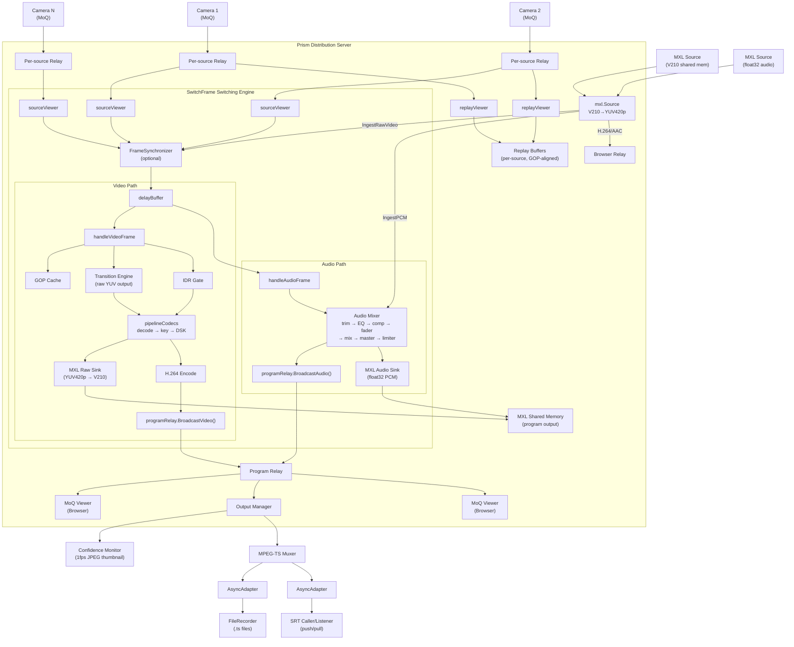
```mermaid
graph TD
    cam1["Camera 1<br/>(MoQ)"] --> relay1["Per-source Relay"]
    cam2["Camera 2<br/>(MoQ)"] --> relay2["Per-source Relay"]
    camN["Camera N<br/>(MoQ)"] --> relayN["Per-source Relay"]
    mxl1["MXL Source<br/>(V210 shared mem)"] --> mxlSrc["mxl.Source<br/>V210→YUV420p"]
    mxl2["MXL Source<br/>(float32 audio)"] --> mxlSrc

    subgraph prism["Prism Distribution Server"]
        mxlSrc -->|"IngestRawVideo"| fs
        mxlSrc -->|"IngestPCM"| am
        mxlSrc -->|"H.264/AAC"| mxlRelay["Browser Relay"]
        relay1 --> sv1["sourceViewer"]
        relay2 --> sv2["sourceViewer"]
        relayN --> svN["sourceViewer"]
        relay1 --> rv1["replayViewer"]
        relay2 --> rv2["replayViewer"]
        rv1 --> rb["Replay Buffers<br/>(per-source, GOP-aligned)"]
        rv2 --> rb

        subgraph engine["SwitchFrame Switching Engine"]
            sv1 --> fs["FrameSynchronizer<br/>(optional)"]
            sv2 --> fs
            svN --> fs
            fs --> delay["delayBuffer"]

            subgraph video["Video Path"]
                delay --> hvf["handleVideoFrame"]
                hvf --> gc["GOP Cache"]
                hvf --> te["Transition Engine<br/>(raw YUV output)"]
                hvf --> idr["IDR Gate"]
                te --> pipeline["pipelineCodecs<br/>decode → key → DSK"]
                idr --> pipeline
                pipeline --> mxlOut["MXL Raw Sink<br/>(YUV420p → V210)"]
                pipeline --> enc["H.264 Encode"]
                enc --> bv["programRelay.BroadcastVideo()"]
            end

            subgraph audio["Audio Path"]
                delay --> haf["handleAudioFrame"]
                haf --> am["Audio Mixer<br/>trim → EQ → comp → fader<br/>→ mix → master → limiter"]
                am --> ba["programRelay.BroadcastAudio()"]
                am --> mxlAudioOut["MXL Audio Sink<br/>(float32 PCM)"]
            end
        end

        bv --> pr["Program Relay"]
        ba --> pr

        mxlOut --> mxlShm["MXL Shared Memory<br/>(program output)"]
        mxlAudioOut --> mxlShm

        pr --> browser1["MoQ Viewer<br/>(Browser)"]
        pr --> om["Output Manager"]
        pr --> browser2["MoQ Viewer<br/>(Browser)"]
    end

    om --> conf["Confidence Monitor<br/>(1fps JPEG thumbnail)"]
    om --> mux["MPEG-TS Muxer"]
    mux --> aa1["AsyncAdapter"] --> rec["FileRecorder<br/>(.ts files)"]
    mux --> aa2["AsyncAdapter"] --> srt["SRT Caller/Listener<br/>(push/pull)"]
```

### Browser Architecture

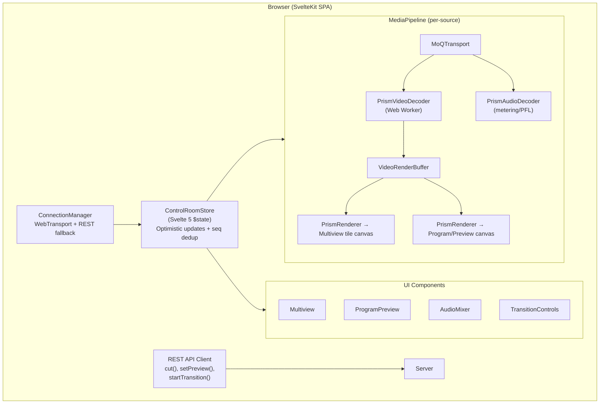
```mermaid
graph TD
    subgraph browser["Browser (SvelteKit SPA)"]
        cm["ConnectionManager<br/>WebTransport + REST fallback"] --> store["ControlRoomStore<br/>(Svelte 5 $state)<br/>Optimistic updates + seq dedup"]
        api["REST API Client<br/>cut(), setPreview(),<br/>startTransition()"] --> server["Server"]

        store --> mp
        subgraph mp["MediaPipeline (per-source)"]
            moq["MoQTransport"] --> vd["PrismVideoDecoder<br/>(Web Worker)"]
            vd --> vrb["VideoRenderBuffer"]
            vrb --> r1["PrismRenderer → Multiview tile canvas"]
            vrb --> r2["PrismRenderer → Program/Preview canvas"]
            moq --> ad["PrismAudioDecoder<br/>(metering/PFL)"]
        end

        store --> ui
        subgraph ui["UI Components"]
            mv["Multiview"]
            pp["ProgramPreview"]
            amx["AudioMixer"]
            tc["TransitionControls"]
        end
    end
```


## 2. Server Architecture

### 2.1 Prism Integration

SwitchFrame embeds Prism as a Go library (`github.com/zsiec/prism`).
Prism provides:

- **WebTransport/QUIC server** on `:8080` (HTTP/3)
- **MoQ draft-15 protocol** for media distribution
- **`distribution.Relay`** -- per-stream fan-out to N viewers
- **`distribution.Viewer`** -- interface for receiving frames
- **`ServerConfig.ExtraRoutes`** -- hook for mounting SwitchFrame's REST API

At startup, `main.go` creates a `distribution.Server` with two key hooks:

```
ServerConfig{
    ExtraRoutes:          mount /api/ routes + embedded UI
    OnStreamRegistered:   streamCallbackRouter -> Switcher + Mixer
    OnStreamUnregistered: streamCallbackRouter -> Switcher + Mixer
    ControlCh:            channelPublisher.Ch() (MoQ control track)
}
```

The **program relay** is registered as `server.RegisterStream("program")`.
Browsers subscribe to it via MoQ to view the authoritative program
output. The `streamCallbackRouter` skips the "program" key to avoid
treating it as a source.

A separate **HTTP/TCP server on `:8081`** mirrors the REST API for the
Vite dev proxy and tools that cannot speak QUIC.


### 2.2 Switching Engine (`switcher/`)

The switcher is an explicit state machine with five states:

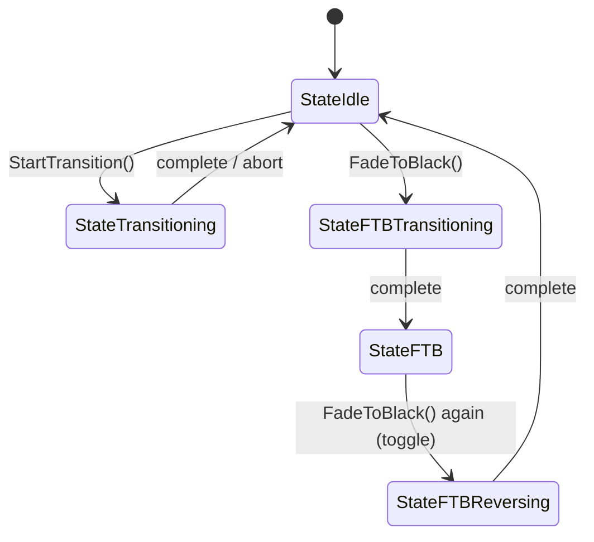
```mermaid
stateDiagram-v2
    [*] --> StateIdle
    StateIdle --> StateTransitioning : StartTransition()
    StateTransitioning --> StateIdle : complete / abort
    StateIdle --> StateFTBTransitioning : FadeToBlack()
    StateFTBTransitioning --> StateFTB : complete
    StateFTB --> StateFTBReversing : FadeToBlack() again (toggle)
    StateFTBReversing --> StateIdle : complete
```

**Source registration.** When Prism detects a new MoQ publisher, the
callback router calls `sw.RegisterSource(key, relay)`. This creates a
`sourceViewer` and attaches it to the source's relay via
`relay.AddViewer(viewer)`. The sourceViewer implements
`distribution.Viewer` and tags every incoming frame with the source key
before forwarding to the switcher's central `handleVideoFrame` /
`handleAudioFrame` methods.

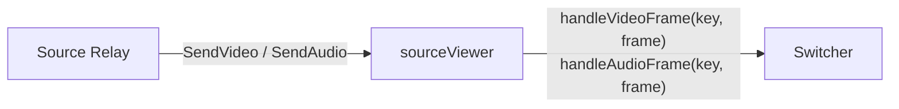
```mermaid
flowchart LR
    relay["Source Relay"] -->|SendVideo / SendAudio| sv["sourceViewer"]
    sv -->|"handleVideoFrame(key, frame)<br/>handleAudioFrame(key, frame)"| sw["Switcher"]
```

**Frame routing in `handleVideoFrame`.** On every video frame:

1. Record frame in health monitor (for stale/offline detection).
2. Update rolling frame statistics (EMA of frame size, FPS from PTS
   deltas) used to configure the transition encoder.
3. Record frame in GOP cache (for instant keyframe on cut).
4. If a transition is active, convert AVC1 to Annex B and feed to the
   transition engine. Sync audio crossfade position.
5. Otherwise, check if this is the program source:
   - If `pendingIDR` is false (steady state), broadcast immediately
     via `broadcastVideo()`. Uses RLock for maximum concurrency.
   - If `pendingIDR` is true (just after a cut), drop non-keyframes.
     When the first keyframe arrives, clear the flag under write lock
     and broadcast.

**`broadcastVideo`** passes the frame through the optional video
processor (DSK compositor), then calls `programRelay.BroadcastVideo()`.

**Cut operation.** `Cut(sourceKey)`:
1. Under write lock: set `programSource`, set `pendingIDR = true` on the
   new source, swap old program to preview, increment `seq`.
2. Outside lock: replay the new source's cached GOP to warm the pipeline
   decoder (`replayGOP`), feed delta frames that arrived during replay
   (`feedDeltaFrames`), clear `pendingIDR`, notify audio mixer (`OnCut`
   for crossfade, `OnProgramChange` for AFV), fire state callbacks.

**GOP replay on cut.** The GOP cache stores the most recent GOP for each
source. On cut, `replayGOP` feeds these frames to a pre-warmed decoder
from the pool, then pointer-swaps it into the pipeline. This eliminates
the keyframe wait entirely. `feedDeltaFrames` then feeds any frames that
arrived during the replay window (~10-35ms) to maintain the decoder's
reference chain. The `pendingIDR` flag is only used as a fallback when
no GOP replay is available.

**Delay buffer.** Per-source configurable delay (0-500ms) for lip-sync
correction. Frames pass through the delay buffer before reaching the
switcher's handle methods.


### 2.3 Audio Pipeline (`audio/`)

The audio mixer runs server-side, mixing all active sources into a
single AAC program output. It has two operating modes:

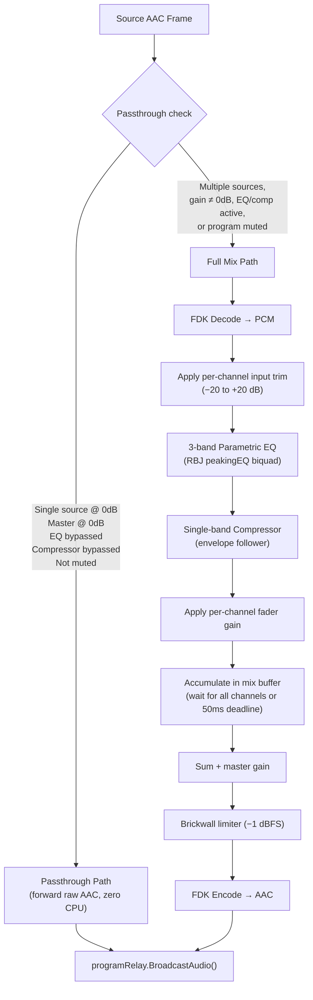
```mermaid
flowchart TD
    input["Source AAC Frame"] --> check{"Passthrough check"}

    check -->|"Single source @ 0dB<br/>Master @ 0dB<br/>EQ bypassed<br/>Compressor bypassed<br/>Not muted"| pass["Passthrough Path<br/>(forward raw AAC, zero CPU)"]
    check -->|"Multiple sources,<br/>gain ≠ 0dB, EQ/comp active,<br/>or program muted"| mix["Full Mix Path"]

    pass --> broadcast["programRelay.BroadcastAudio()"]

    mix --> decode["FDK Decode → PCM"]
    decode --> trim["Apply per-channel input trim<br/>(−20 to +20 dB)"]
    trim --> eq["3-band Parametric EQ<br/>(RBJ peakingEQ biquad)"]
    eq --> comp["Single-band Compressor<br/>(envelope follower)"]
    comp --> fader["Apply per-channel fader gain"]
    fader --> accum["Accumulate in mix buffer<br/>(wait for all channels or 50ms deadline)"]
    accum --> sum["Sum + master gain"]
    sum --> limiter["Brickwall limiter (−1 dBFS)"]
    limiter --> encode["FDK Encode → AAC"]
    encode --> broadcast
```

**Passthrough optimization.** When only one source is active at 0 dB
gain with master at 0 dB and no program mute, the mixer forwards raw AAC
frames without decode/encode. This is the common case (single camera
live) and consumes zero CPU for audio processing. Even in passthrough,
the mixer decodes for peak metering so VU meters remain active.

**Mix cycle.** When multiple channels are active, each source's AAC
frame is decoded to float32 PCM via FDK-AAC, gain is applied, and the
samples are accumulated in a `mixBuffer` map. The cycle flushes when all
active unmuted channels have contributed or a 50ms deadline expires
(prevents deadlock if a source stops sending). The summed PCM is then:

1. Multiplied by master gain
2. Passed through the brickwall limiter (-1 dBFS ceiling)
3. Program-muted if FTB is held (zeroed)
4. Peak-metered (L/R)
5. Encoded back to AAC via FDK-AAC

**Crossfade on cut.** When a cut occurs, the switcher calls
`mixer.OnCut(oldSource, newSource)`. The mixer collects one frame from
each source and applies an equal-power crossfade (cos/sin ramp) over
~23ms (one AAC frame). A 50ms timeout ensures completion even if the
outgoing source stops sending.

**Transition crossfade.** During dissolve/dip transitions, the mixer
tracks a continuous position (0.0 to 1.0) synchronized with the video
engine. Per-sample gain interpolation between `prevPos` and `currentPos`
eliminates zipper noise. Four modes:

| Mode | Old source gain | New source gain |
|---|---|---|
| `AudioCrossfade` | `cos(pos)` | `sin(pos)` (equal-power A→B) |
| `AudioDipToSilence` | cos then sin over two halves | (A→silence→B) |
| `AudioFadeOut` | `cos(pos)` | 0 (FTB) |
| `AudioFadeIn` | `sin(pos)` | 0 (FTB reverse) |

**AFV (Audio Follows Video).** Channels default to AFV mode. When the
program source changes, `OnProgramChange` activates the new source's
channel and deactivates all other AFV channels. Non-AFV channels are
unaffected.


### 2.4 Transition Engine (`transition/`)

The transition engine handles server-side dissolve/dip/wipe/FTB
transitions. A new engine is created per transition and destroyed on
completion or abort -- no persistent codec resources between transitions.

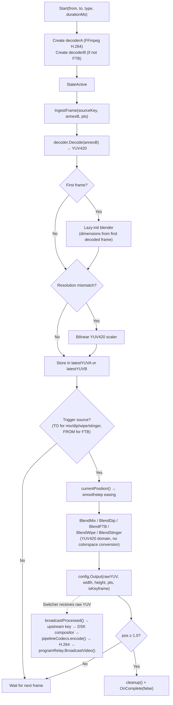
```mermaid
flowchart TD
    start["Start(from, to, type, durationMs)"] --> create["Create decoderA (FFmpeg H.264)<br/>Create decoderB (if not FTB)"]
    create --> active["StateActive"]
    active --> ingest["IngestFrame(sourceKey, annexB, pts)"]
    ingest --> decode["decoder.Decode(annexB) → YUV420"]
    decode --> init{"First frame?"}
    init -->|Yes| lazy["Lazy-init blender<br/>(dimensions from first decoded frame)"]
    init -->|No| scale
    lazy --> scale{"Resolution mismatch?"}
    scale -->|Yes| scaler["Bilinear YUV420 scaler"]
    scale -->|No| store["Store in latestYUVA or latestYUVB"]
    scaler --> store

    store --> trigger{"Trigger source?<br/>(TO for mix/dip/wipe/stinger,<br/>FROM for FTB)"}
    trigger -->|No| wait["Wait for next frame"]
    trigger -->|Yes| pos["currentPosition() → smoothstep easing"]
    pos --> blend["BlendMix / BlendDip / BlendFTB /<br/>BlendWipe / BlendStinger<br/>(YUV420 domain, no colorspace conversion)"]
    blend --> out["config.Output(rawYUV, width, height, pts, isKeyframe)"]
    out --> done{"pos ≥ 1.0?"}
    done -->|No| wait
    done -->|Yes| cleanup["cleanup() + OnComplete(false)"]

    out -.->|"Switcher receives raw YUV"| proc["broadcastProcessed() →<br/>upstream key → DSK compositor →<br/>pipelineCodecs.encode() → H.264 →<br/>programRelay.BroadcastVideo()"]
```

**Wall-clock frame pairing.** The engine stores the latest decoded YUV
frame from each source. Output is driven by the incoming source's frame
rate -- each time a frame arrives from the "to" source (or "from" for
FTB), it triggers a blend with whatever the other source's latest frame
is. This avoids buffering and keeps latency minimal.

**Smoothstep easing.** Position is calculated as `t*t*(3-2t)` where `t`
is the linear elapsed fraction. This produces zero-derivative endpoints
for a perceptually smooth transition -- no abrupt start/stop.

**YUV420 blending.** Blend operations happen directly in YUV420 (BT.709)
space, matching hardware broadcast mixers. This avoids the costly
YUV->RGB->YUV round-trip that software switchers typically perform. The
`FrameBlender` pre-allocates its output buffer and reuses it across
frames.

**Resolution mismatch.** A pure Go bilinear scaler normalizes
mismatched sources to the program resolution (set by the first decoded
frame) during transitions. No additional cgo dependencies.

**Raw YUV output.** The transition engine does not encode. It outputs
raw YUV420 via `config.Output()` to the switcher's `broadcastProcessed`
callback, which runs YUV processors (upstream keyer, DSK compositor)
and enqueues the frame for encoding in the shared `pipelineCodecs`
encoder. This ensures consistent SPS/PPS across normal and transition
frames.

**T-bar manual control.** `SetPosition(pos)` overrides automatic timing
for manual T-bar operation. Throttled to 50ms/20Hz from the browser.
Pulling back to 0.0 aborts; pushing to 1.0 completes.

**Watchdog.** A background goroutine monitors for frame starvation. If
no frames arrive within 10 seconds, the transition is aborted to prevent
stuck state.


### 2.5 Output Pipeline (`output/`)

The output pipeline provides recording and SRT streaming of the program
output. It is completely dormant when no outputs are active.

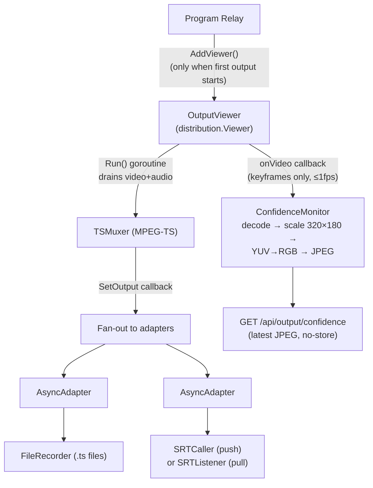
```mermaid
flowchart TD
    pr["Program Relay"] -->|"AddViewer()<br/>(only when first output starts)"| ov["OutputViewer<br/>(distribution.Viewer)"]
    ov -->|"Run() goroutine<br/>drains video+audio"| mux["TSMuxer (MPEG-TS)"]
    ov -->|"onVideo callback<br/>(keyframes only, ≤1fps)"| conf["ConfidenceMonitor<br/>decode → scale 320×180 →<br/>YUV→RGB → JPEG"]
    mux -->|"SetOutput callback"| fanout["Fan-out to adapters"]
    fanout --> aa1["AsyncAdapter"] --> rec["FileRecorder (.ts files)"]
    fanout --> aa2["AsyncAdapter"] --> srt["SRTCaller (push)<br/>or SRTListener (pull)"]
    conf --> thumb["GET /api/output/confidence<br/>(latest JPEG, no-store)"]
```

**Lazy viewer lifecycle.** `OutputManager.ensureMuxerLocked()` creates
the `OutputViewer`, `TSMuxer`, and registers the viewer on the program
relay only when the first output adapter starts. When the last adapter
stops, `stopMuxerIfNoAdaptersLocked()` tears everything down. This
ensures zero overhead when recording and SRT are both inactive.

**Confidence monitor.** The `ConfidenceMonitor` is wired as a parallel
`onVideo` callback on the `OutputViewer`, not as an adapter in the mux
chain. It receives raw `VideoFrame` objects (not TS packets), decodes
keyframes only at ≤1fps, scales to 320x180, and stores the latest JPEG
behind an `RWMutex`. Exposed via `GET /api/output/confidence` with
`no-store` cache header.

**MPEG-TS muxing.** The TSMuxer uses `go-astits` to mux H.264 video and
AAC audio into MPEG-TS format. This format is crash-resilient (no moov
atom needed) and is shared by both recording and SRT output.

**AsyncAdapter.** Each output adapter is wrapped in an `AsyncAdapter`
with a buffered channel (256 slots, ~8 seconds at 30fps). Writes from
the muxer callback are non-blocking -- if the channel fills, the adapter
handles backpressure internally. This prevents slow outputs (e.g. a
stalled SRT connection) from blocking the muxer and other adapters.

**FileRecorder.** Writes `.ts` files with rotation:
- Time-based: default 1 hour per file
- Size-based: configurable maximum file size
- Sequential naming: `program_YYYYMMDD_HHMMSS_NNN.ts`

**SRT modes.** Two modes using `zsiec/srtgo` (pure Go, no cgo):
- **Caller** (push): connects to a remote SRT endpoint (e.g. streaming
  platform). Exponential backoff reconnection (1s to 30s). 4MB ring
  buffer preserves data during reconnects; overflows trigger a
  `onReconnect(overflowed)` callback and resume from keyframe.
- **Listener** (pull): binds a port and accepts up to 8 incoming SRT
  connections.


### 2.6 Graphics Compositor (`graphics/`)

The DSK (Downstream Keyer) compositor overlays RGBA graphics onto the
program output. It is wired into the switcher as a `videoProcessor`
hook, called on every program frame in `broadcastVideo()`.

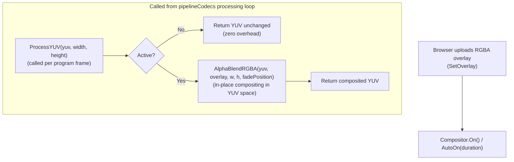
```mermaid
flowchart TD
    upload["Browser uploads RGBA overlay<br/>(SetOverlay)"] --> activate["Compositor.On() / AutoOn(duration)"]

    subgraph pipeline["Called from pipelineCodecs processing loop"]
        yuvin["ProcessYUV(yuv, width, height)<br/>(called per program frame)"] --> check{"Active?"}
        check -->|No| pass["Return YUV unchanged<br/>(zero overhead)"]
        check -->|Yes| blend["AlphaBlendRGBA(yuv, overlay, w, h, fadePosition)<br/>(in-place compositing in YUV space)"]
        blend --> ret["Return composited YUV"]
    end
```

**Raw YUV processing.** The compositor no longer has its own
decoder/encoder. It operates on raw YUV420 buffers passed from the
shared `pipelineCodecs` processing loop. Decoding and encoding are
handled by `pipelineCodecs` — the compositor just performs in-place
alpha blending on the YUV buffer between decode and encode.

**Fade transitions.** `AutoOn` and `AutoOff` drive a fade from 0.0 to
1.0 (or reverse) over a configurable duration at ~60fps. The
`fadePosition` scales the overlay alpha during compositing. `On` / `Off`
provide instant cut transitions. When inactive, `ProcessYUV` returns
the YUV buffer unchanged with zero overhead.


### 2.7 State Broadcast

State is broadcast to browsers via two mechanisms:

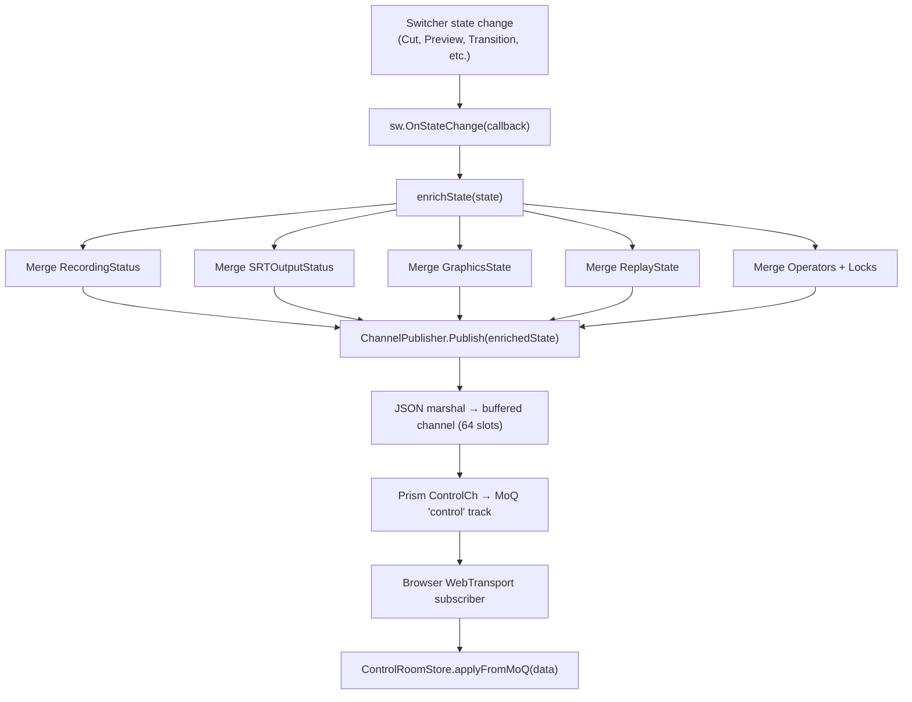
```mermaid
flowchart TD
    event["Switcher state change<br/>(Cut, Preview, Transition, etc.)"] --> cb["sw.OnStateChange(callback)"]
    cb --> enrich["enrichState(state)"]
    enrich --> rec["Merge RecordingStatus"]
    enrich --> srt["Merge SRTOutputStatus"]
    enrich --> gfx["Merge GraphicsState"]
    enrich --> rpl["Merge ReplayState"]
    enrich --> ops["Merge Operators + Locks"]
    rec --> pub["ChannelPublisher.Publish(enrichedState)"]
    srt --> pub
    gfx --> pub
    rpl --> pub
    ops --> pub
    pub --> json["JSON marshal → buffered channel (64 slots)"]
    json --> prism["Prism ControlCh → MoQ 'control' track"]
    prism --> wt["Browser WebTransport subscriber"]
    wt --> store["ControlRoomStore.applyFromMoQ(data)"]
```

**Full snapshot per group.** Every state broadcast is a complete
`ControlRoomState` JSON snapshot (not a delta). This enables late-join
-- a browser connecting mid-session receives the full current state in
the first MoQ group.

**Multiple producers.** Five subsystems trigger state broadcasts:
1. **Switcher** -- cut, preview, transition start/complete, health
2. **OutputManager** -- recording start/stop, SRT connect/disconnect,
   ring buffer overflow
3. **Compositor** -- graphics on/off, fade position
4. **ReplayManager** -- mark-in/out, playback start/stop, progress
5. **SessionManager** -- operator connect/disconnect, lock acquire/release

The `ChannelPublisher` handles channel-full backpressure by dropping the
oldest message. This is safe because every message is a full snapshot.

**Sequence deduplication.** Each state has a monotonic `seq` number. The
browser's `ControlRoomStore.applyUpdate` ignores updates with
`seq <= current`, preventing stale REST poll responses from overwriting
newer MoQ-delivered state.

**State enrichment pipeline.** The `enrichState` function in `main.go`
patches the base switcher state with recording, SRT, graphics, replay,
and operator/lock status from their respective managers before broadcast.
The compositor uses a `gfxOverride` parameter to avoid calling
`compositor.Status()` from within its own lock (which would deadlock).
Operator state includes a list of registered operators with connection
status, plus a map of active subsystem locks (holder ID, holder name,
acquired timestamp). Replay state includes player state, mark points,
playback progress, and per-source buffer statistics.


### 2.8 Stinger Transitions (`stinger/`)

Stinger transitions overlay an animated graphic sequence (e.g. a logo
wipe) on top of the source transition. The stinger store manages
pre-decoded PNG sequences on disk, and the transition engine composites
them with per-pixel alpha at blend time.

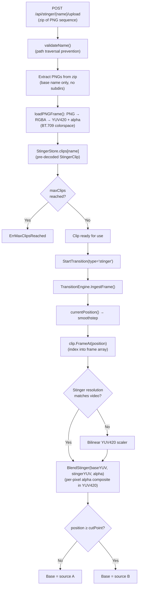
```mermaid
flowchart TD
    upload["POST /api/stinger/{name}/upload<br/>(zip of PNG sequence)"] --> validate["validateName()<br/>(path traversal prevention)"]
    validate --> extract["Extract PNGs from zip<br/>(base name only, no subdirs)"]
    extract --> decode["loadPNGFrame(): PNG → RGBA → YUV420 + alpha<br/>(BT.709 colorspace)"]
    decode --> store["StingerStore.clips[name]<br/>(pre-decoded StingerClip)"]
    store --> limit{"maxClips<br/>reached?"}
    limit -->|Yes| reject["ErrMaxClipsReached"]
    limit -->|No| ready["Clip ready for use"]

    ready --> play["StartTransition(type='stinger')"]
    play --> engine["TransitionEngine.IngestFrame()"]
    engine --> pos["currentPosition() → smoothstep"]
    pos --> frame["clip.FrameAt(position)<br/>(index into frame array)"]
    frame --> scale{"Stinger resolution<br/>matches video?"}
    scale -->|No| resize["Bilinear YUV420 scaler"]
    scale -->|Yes| blend
    resize --> blend["BlendStinger(baseYUV, stingerYUV, alpha)<br/>(per-pixel alpha composite in YUV420)"]
    blend --> cut{"position ≥ cutPoint?"}
    cut -->|No| base["Base = source A"]
    cut -->|Yes| base2["Base = source B"]
```

**Pre-decoded storage.** Each PNG frame is converted at upload time to a
`StingerFrame` containing YUV420 planar data (BT.709) and a per-luma-pixel
alpha map (`[]byte`, 0-255). This avoids per-frame RGBA-to-YUV conversion
during live transitions.

**Per-pixel alpha compositing.** `BlendStinger` composites the stinger
overlay onto the base source in YUV420 domain. Each luma pixel is blended
as `out = base*(1-a/255) + stinger*(a/255)`. Chroma planes are blended
using the average alpha of the corresponding 2x2 luma block.

**Cut point.** The configurable cut point (0.0-1.0, default 0.5)
determines when the base source switches from A to B. Before the cut
point, source A is the background; after, source B appears under the
stinger overlay.

**Path traversal prevention.** `validateName()` rejects empty strings,
`.`, `..`, paths containing `/` or `\`, and any name where
`filepath.Base(name) != name`. Zip extraction uses only the base name of
each entry, ignoring directory components.

**Memory limit.** The `maxClips` parameter (default 16) caps the number
of loaded clips. A 1080p 30-frame stinger clip uses approximately 156 MB
of memory (YUV420 + alpha planes).


### 2.9 Frame Synchronizer (`switcher/frame_sync.go`)

The optional `FrameSynchronizer` aligns frames from multiple sources to a
common tick boundary, ensuring consistent timing in the program output.
Without it, sources arrive at their own cadence and may drift relative to
each other.

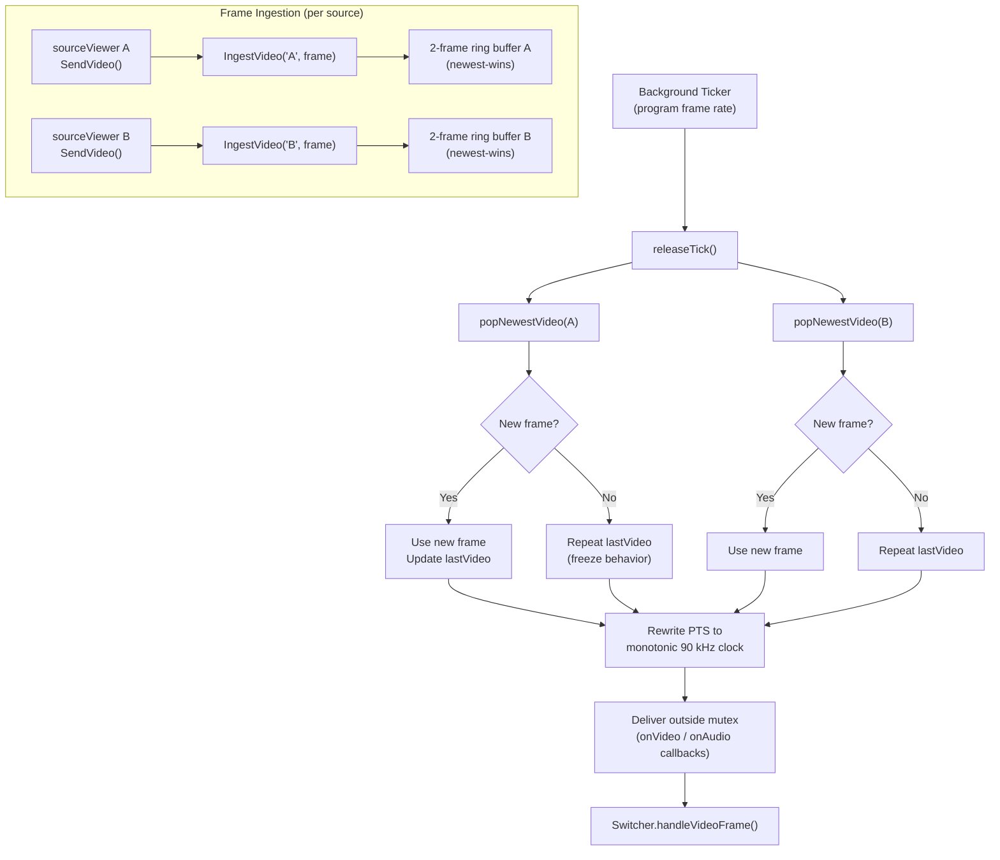
```mermaid
flowchart TD
    subgraph ingest["Frame Ingestion (per source)"]
        sv1["sourceViewer A<br/>SendVideo()"] --> iv1["IngestVideo('A', frame)"]
        sv2["sourceViewer B<br/>SendVideo()"] --> iv2["IngestVideo('B', frame)"]
        iv1 --> ring1["2-frame ring buffer A<br/>(newest-wins)"]
        iv2 --> ring2["2-frame ring buffer B<br/>(newest-wins)"]
    end

    ticker["Background Ticker<br/>(program frame rate)"] --> tick["releaseTick()"]
    tick --> pop1["popNewestVideo(A)"]
    tick --> pop2["popNewestVideo(B)"]

    pop1 --> check1{"New frame?"}
    check1 -->|Yes| use1["Use new frame<br/>Update lastVideo"]
    check1 -->|No| freeze1["Repeat lastVideo<br/>(freeze behavior)"]

    pop2 --> check2{"New frame?"}
    check2 -->|Yes| use2["Use new frame"]
    check2 -->|No| freeze2["Repeat lastVideo"]

    use1 --> rewrite["Rewrite PTS to<br/>monotonic 90 kHz clock"]
    freeze1 --> rewrite
    use2 --> rewrite
    freeze2 --> rewrite

    rewrite --> deliver["Deliver outside mutex<br/>(onVideo / onAudio callbacks)"]
    deliver --> sw["Switcher.handleVideoFrame()"]
```

**Freerun sync.** The synchronizer runs as a freewheel ticker at the
program frame rate. On each tick, it pops the newest buffered frame from
each source's 2-slot ring buffer. If no new frame arrived since the last
tick, the previous frame is repeated (freeze behavior).

**PTS rewriting.** Frame PTS values are overwritten with a monotonic
timestamp derived from the tick counter and tick rate, converted to 90 kHz
MPEG-TS clock units: `tickNum * tickRate * 90000 / 1e9`. This ensures all
sources share a common timebase in the output.

**Audio freeze limit.** Repeating encoded AAC frames produces an audible
stutter. After 2 consecutive ticks with no new audio frame from a source,
the synchronizer stops emitting audio for that source and lets downstream
handle silence. This prevents an AAC glitch loop that sounds worse than
a brief dropout.

**Lock-free delivery.** Frame releases are collected under the mutex, but
the actual `onVideo`/`onAudio` callbacks are invoked after the mutex is
released. This prevents deadlocks when downstream handlers (the switcher)
acquire their own locks.

**Activation.** The synchronizer is enabled via the `--frame-sync` flag
at startup. When disabled, source frames flow directly from sourceViewers
to the switcher without buffering or PTS rewriting.


### 2.10 Advanced Audio Processing (`audio/eq.go`, `audio/compressor.go`)

The audio pipeline includes per-channel parametric EQ and compression,
inserted between the input trim and the fader in the processing chain:

```
Trim (−20 to +20 dB) → EQ (3-band) → Compressor → Fader → Mix → Master → Limiter → Encode
```

**3-band parametric EQ.** Each channel has three independent EQ bands
(Low, Mid, High) implemented as RBJ Audio EQ Cookbook peakingEQ biquad
filters, processed using Direct Form II Transposed for numerical
stability.

| Band | Frequency Range | Default Center | Gain | Q |
|---|---|---|---|---|
| Low | 80-1000 Hz | 250 Hz | +/-12 dB | 0.5-4.0 |
| Mid | 200-8000 Hz | 1000 Hz | +/-12 dB | 0.5-4.0 |
| High | 1000-16000 Hz | 4000 Hz | +/-12 dB | 0.5-4.0 |

Biquad coefficients are recalculated only when EQ parameters change (via
`SetBand`), not on every audio frame. Each band can be individually
enabled/disabled. The `IsBypassed()` method returns true when all bands
are at 0 dB gain, allowing the passthrough optimization to remain active.

**Single-band compressor.** Each channel has a compressor with an
exponential envelope follower (same pattern as `limiter.go`). Parameters:

| Parameter | Range | Default |
|---|---|---|
| Threshold | -40 to 0 dBFS | 0 dBFS (off) |
| Ratio | 1:1 to 20:1 | 1:1 (bypass) |
| Attack | 0.1 to 100 ms | 5 ms |
| Release | 10 to 1000 ms | 100 ms |
| Makeup Gain | 0 to 24 dB | 0 dB |

`GainReduction()` is exported for UI metering display. `IsBypassed()`
returns true when ratio is 1:1 and makeup gain is 0 dB.

**Passthrough preservation.** The passthrough optimization (zero-CPU
audio when a single source is at unity gain) requires all channels to
have EQ bypassed and compressor bypassed in addition to the existing 0 dB
gain / unmuted checks.


### 2.11 Instant Replay (`replay/`)

The instant replay system maintains per-source circular buffers of
encoded H.264 frames and can play back marked clips at configurable
speeds (0.25x-1.0x) with frame duplication for slow motion.


```mermaid
flowchart TD
    subgraph capture["Capture (per source)"]
        relay1["Source Relay 'cam1'"] -->|AddViewer| rv1["replayViewer<br/>(distribution.Viewer)"]
        relay2["Source Relay 'cam2'"] -->|AddViewer| rv2["replayViewer"]
        rv1 -->|"SendVideo → deep copy"| buf1["replayBuffer<br/>(circular, GOP-aligned)"]
        rv2 -->|"SendVideo → deep copy"| buf2["replayBuffer"]
    end

    subgraph playback["Playback"]
        mark["POST /api/replay/mark-in<br/>POST /api/replay/mark-out"] --> extract["buf.ExtractClip(inTime, outTime)<br/>(GOP-aligned, deep copy)"]
        extract --> play["POST /api/replay/play<br/>{source, speed, loop}"]
        play --> player["replayPlayer"]

        subgraph pipeline["Player Pipeline"]
            player --> decode["Decode all clip frames<br/>(FFmpeg H.264 → YUV420)"]
            decode --> sort["Sort by PTS<br/>(B-frame reorder)"]
            sort --> fps["Estimate source FPS<br/>(from PTS span)"]
            fps --> enc["Create encoder<br/>(bitrate from resolution)"]
            enc --> dup["Output with frame duplication<br/>(dupCount = ceil(1/speed))"]
            dup --> pace["Pace at source FPS<br/>(time.NewTimer per frame)"]
        end

        pace --> relay["Replay Relay<br/>(BroadcastVideo)"]
        relay --> browser["Browser subscribes<br/>to 'replay' stream"]
    end
```

**Per-source circular buffers.** Each source registered for replay gets a
`replayBuffer` with configurable duration (1-300 seconds, default 60,
set via `--replay-buffer-secs`). The buffer stores deep copies of encoded
video frames (AVC1 wire data + SPS/PPS for keyframes).

**GOP-aligned storage.** Keyframes start new `gopDescriptor` entries.
When the buffer exceeds its maximum duration, the oldest complete GOP is
removed. At least one GOP is always retained. After trimming, frame and
GOP slices are compacted to release old backing array memory.

**Wall-clock mark points.** Mark-in and mark-out use `time.Now()`, not
source PTS values. This simplifies the operator workflow -- the operator
presses mark-in/out based on real time, and `ExtractClip` finds the
GOP-aligned frame range that spans the requested interval.

**Player pipeline.** The `replayPlayer` is created per-Play and destroyed
on completion. It:
1. Decodes all clip frames via FFmpeg (full decode pass).
2. Sorts decoded frames by PTS for display order (handles B-frame
   reordering).
3. Estimates source FPS from PTS span, clamped to 10-120 fps.
4. Creates an encoder with resolution-appropriate bitrate (2/4/8 Mbps).
5. Outputs frames with duplication for slow motion: `dupCount =
   ceil(1/speed)`. At 0.5x, each frame is emitted twice; at 0.25x, four
   times.
6. Paces output at the source frame rate using a reusable `time.Timer`.

**Replay relay.** The replay output is published to a dedicated relay
registered as `server.RegisterStream("replay")`. Browsers subscribe to
this MoQ stream to display the replay in the preview or program window.

**Audio.** Audio is muted in v1. The `replayViewer.SendAudio` is a no-op
that counts dropped frames for stats reporting.

**Loop support.** When `loop` is true, the player restarts from the
beginning of the clip after completing playback, continuing until
`Stop()` is called.


### 2.12 Multi-Operator System (`operator/`)

The multi-operator system provides role-based access control and
subsystem locking for environments with multiple operators (e.g. a
director, audio engineer, and graphics operator working simultaneously).

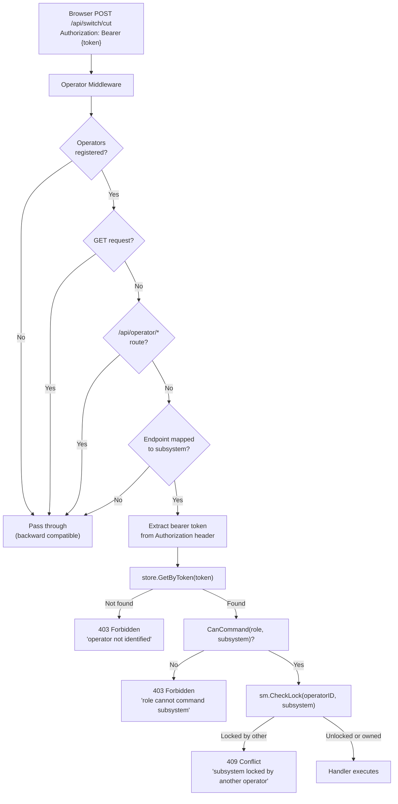
```mermaid
flowchart TD
    browser["Browser POST /api/switch/cut<br/>Authorization: Bearer {token}"] --> mw["Operator Middleware"]

    mw --> check1{"Operators<br/>registered?"}
    check1 -->|No| pass["Pass through<br/>(backward compatible)"]

    check1 -->|Yes| check2{"GET request?"}
    check2 -->|Yes| pass

    check2 -->|No| check3{"/api/operator/*<br/>route?"}
    check3 -->|Yes| pass

    check3 -->|No| check4{"Endpoint mapped<br/>to subsystem?"}
    check4 -->|No| pass

    check4 -->|Yes| token["Extract bearer token<br/>from Authorization header"]
    token --> identify["store.GetByToken(token)"]
    identify -->|Not found| deny403["403 Forbidden<br/>'operator not identified'"]
    identify -->|Found| role["CanCommand(role, subsystem)?"]
    role -->|No| deny403b["403 Forbidden<br/>'role cannot command subsystem'"]
    role -->|Yes| lock["sm.CheckLock(operatorID, subsystem)"]
    lock -->|Locked by other| deny409["409 Conflict<br/>'subsystem locked by another operator'"]
    lock -->|Unlocked or owned| handler["Handler executes"]
```

**Four roles.** Each operator is assigned a role at registration:

| Role | Permitted Subsystems |
|---|---|
| Director | switching, audio, graphics, replay, output |
| Audio | audio |
| Graphics | graphics |
| Viewer | (none -- read-only) |

**Five lockable subsystems.** Operators can lock subsystems to prevent
conflicting commands from other operators:

| Subsystem | Affected Endpoints |
|---|---|
| `switching` | cut, preview, transition, FTB, macros, source config |
| `audio` | level, mute, AFV, trim, EQ, compressor, master |
| `graphics` | on, off, auto-on, auto-off, frame upload |
| `replay` | mark-in, mark-out, play, stop |
| `output` | recording start/stop, SRT start/stop |

Locks are acquired via `POST /api/operator/{id}/lock` and released via
`DELETE`. A director can force-release any operator's lock.

**Per-operator bearer tokens.** Registration (`POST /api/operator/register`)
generates a 64-character hex token (32 random bytes). Tokens are persisted
in `~/.switchframe/operators.json` using the atomic temp-file + rename
pattern (matching `macro/store.go` and `preset/store.go`).

**Session management.** The `SessionManager` tracks active operator
connections with heartbeats. Sessions become stale after 60 seconds
without a heartbeat and are cleaned up every 15 seconds. When a session
is removed (disconnect or stale timeout), all locks held by that
operator are automatically released.

**Backward compatibility.** When no operators are registered
(`store.Count() == 0`), the middleware passes all requests through
without any checks. This means the operator system is fully opt-in --
existing single-operator deployments work unchanged.


### 2.13 Macro System (`macro/`)

The macro system automates sequences of switcher operations. Macros are
stored on disk and executed sequentially with cancellation support.

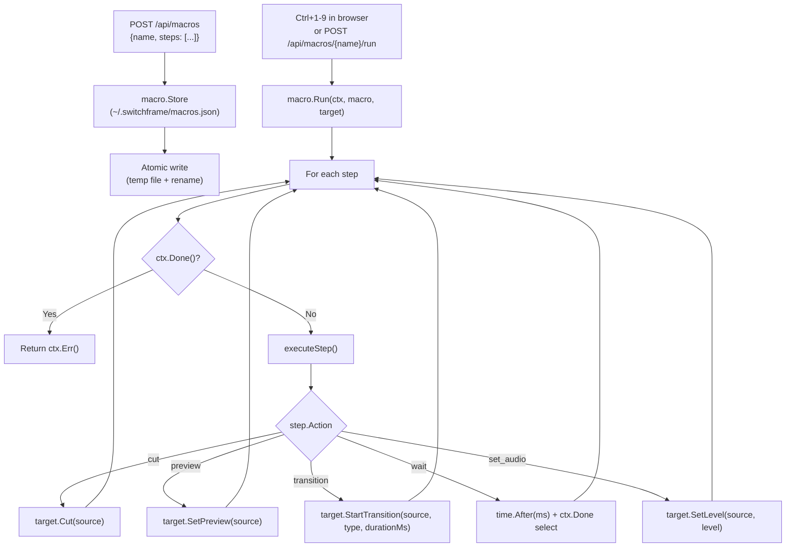
```mermaid
flowchart TD
    create["POST /api/macros<br/>{name, steps: [...]}"] --> store["macro.Store<br/>(~/.switchframe/macros.json)"]
    store --> persist["Atomic write<br/>(temp file + rename)"]

    trigger["Ctrl+1-9 in browser<br/>or POST /api/macros/{name}/run"] --> runner["macro.Run(ctx, macro, target)"]

    runner --> loop["For each step"]
    loop --> ctxcheck{"ctx.Done()?"}
    ctxcheck -->|Yes| abort["Return ctx.Err()"]
    ctxcheck -->|No| exec["executeStep()"]

    exec --> action{"step.Action"}
    action -->|cut| cut["target.Cut(source)"]
    action -->|preview| preview["target.SetPreview(source)"]
    action -->|transition| trans["target.StartTransition(source, type, durationMs)"]
    action -->|wait| wait["time.After(ms) + ctx.Done select"]
    action -->|set_audio| audio["target.SetLevel(source, level)"]

    cut --> loop
    preview --> loop
    trans --> loop
    wait --> loop
    audio --> loop
```

**File-based storage.** Macros are persisted at
`~/.switchframe/macros.json` using the same pattern as `preset/store.go`:
RWMutex for concurrency, atomic temp-file + rename for crash safety.

**MacroTarget interface.** The `MacroTarget` interface abstracts the
switcher and mixer for testability:

```go
type MacroTarget interface {
    Cut(ctx context.Context, source string) error
    SetPreview(ctx context.Context, source string) error
    StartTransition(ctx context.Context, source string, transType string, durationMs int) error
    SetLevel(ctx context.Context, source string, level float64) error
}
```

**Five action types:**
- `cut` -- switch program to a source
- `preview` -- set preview source
- `transition` -- start a mix/dip/wipe transition (default 1000ms)
- `wait` -- pause for N milliseconds (cancelable via context)
- `set_audio` -- set audio level for a source channel

**Sequential execution.** Steps run in order. The `wait` action uses
`time.After` combined with a `ctx.Done` select, allowing cancellation
to abort mid-wait. If any step returns an error, execution halts with
the step index and error.

**Keyboard triggers.** In the browser, `Ctrl+1` through `Ctrl+9` trigger
macros by position via the `KeyboardHandler`. The REST API also supports
`POST /api/macros/{name}/run` for programmatic invocation.


### 2.14 Raw YUV Pipeline (`switcher/pipeline_codecs.go`)

The video processing chain operates on raw YUV420 with a single decode
at ingest and a single encode at output. This eliminates multi-encode
generation loss and ensures consistent SPS/PPS across all program
frames (normal, transition, and DSK).

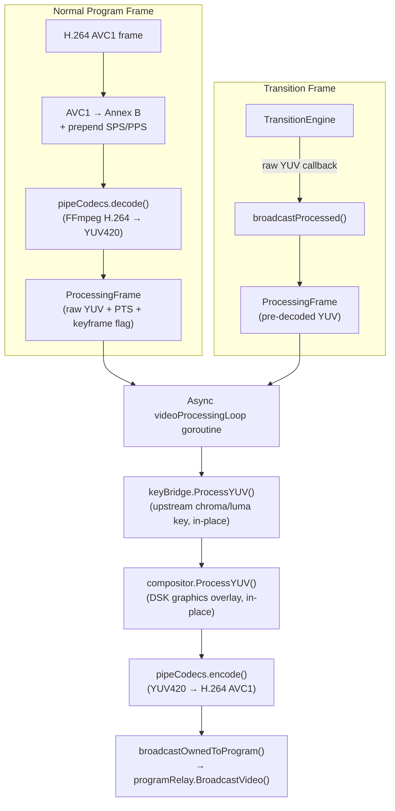
```mermaid
flowchart TD
    subgraph normal["Normal Program Frame"]
        frame["H.264 AVC1 frame"] --> avc["AVC1 → Annex B<br/>+ prepend SPS/PPS"]
        avc --> dec["pipeCodecs.decode()<br/>(FFmpeg H.264 → YUV420)"]
        dec --> pf["ProcessingFrame<br/>(raw YUV + PTS + keyframe flag)"]
    end

    subgraph transition["Transition Frame"]
        te["TransitionEngine"] -->|"raw YUV callback"| bp["broadcastProcessed()"]
        bp --> pf2["ProcessingFrame<br/>(pre-decoded YUV)"]
    end

    pf --> proc["Async videoProcessingLoop goroutine"]
    pf2 --> proc

    proc --> key["keyBridge.ProcessYUV()<br/>(upstream chroma/luma key, in-place)"]
    key --> dsk["compositor.ProcessYUV()<br/>(DSK graphics overlay, in-place)"]
    dsk --> enc["pipeCodecs.encode()<br/>(YUV420 → H.264 AVC1)"]
    enc --> out["broadcastOwnedToProgram()<br/>→ programRelay.BroadcastVideo()"]
```

**Always-on re-encode.** Every program frame flows through
decode→process→encode, even when no transition or graphics are active.
This guarantees consistent SPS/PPS parameters in the output stream,
eliminating browser `VideoDecoder` reconfigurations at transition
boundaries that would otherwise cause visual glitches.

**Shared codec pool.** The `pipelineCodecs` struct holds one decoder and
one encoder, lazily initialized on the first keyframe. The encoder's
bitrate and FPS are derived from rolling statistics of the program
source's recent frames (exponential moving average). Falls back to
4 Mbps / 30fps if stats are unavailable.

**Async processing.** Video frames are enqueued into a buffered
`videoProcCh` channel and processed in a dedicated
`videoProcessingLoop` goroutine. This prevents the source delivery
goroutine from blocking on 30-100ms decode/encode overhead. If the
queue is full, the oldest work item is dropped (newest-wins policy)
to prevent runaway latency.

**B-frame handling.** The decoder may return `EAGAIN` for B-frames
(reorder buffering). The pipeline drops these frames gracefully —
the next reference frame will flush the decoder and produce output.
Transition output during B-frame gaps uses black-frame substitution
to maintain smooth blending.

**Force-IDR propagation.** When the source frame is a keyframe or the
`forceNextIDR` flag is set (after a cut or transition start), the
encoder forces an IDR. The resulting frame gets a new monotonic
`GroupID`, and if the SPS/PPS changed, an `onVideoInfoChange` callback
fires to update the program relay's MoQ catalog.


## 3. Frontend Architecture

### 3.1 SvelteKit SPA with Svelte 5 Runes

The frontend is a SvelteKit application using the static adapter for
embedding into the Go binary. It uses Svelte 5 runes (`$state`,
`$derived`, `$effect`) for reactive state management.

Two layout modes are supported:
- **Traditional** -- full control surface (multiview, audio mixer,
  preview/program buses, transition controls, graphics panel)
- **Simple** -- volunteer-friendly layout with just preview/program
  windows, source buttons, and CUT/DISSOLVE

Layout mode is detected from URL param (`?mode=simple`) > localStorage >
default 'traditional'. Changing modes auto-persists to localStorage.


### 3.2 Media Pipeline

The media pipeline manages per-source video and audio decode:

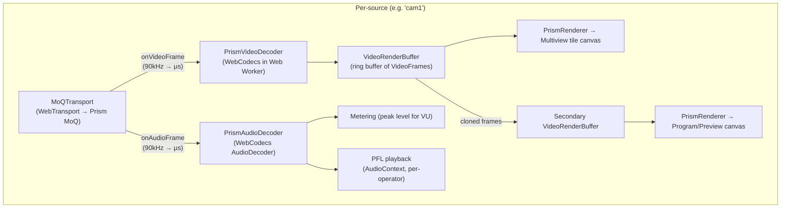
```mermaid
flowchart TD
    subgraph source["Per-source (e.g. 'cam1')"]
        moq["MoQTransport<br/>(WebTransport → Prism MoQ)"]

        moq -->|"onVideoFrame<br/>(90kHz → μs)"| vd["PrismVideoDecoder<br/>(WebCodecs in Web Worker)"]
        vd --> vrb["VideoRenderBuffer<br/>(ring buffer of VideoFrames)"]
        vrb --> r1["PrismRenderer → Multiview tile canvas"]
        vrb -->|"cloned frames"| vrb2["Secondary VideoRenderBuffer"]
        vrb2 --> r2["PrismRenderer → Program/Preview canvas"]

        moq -->|"onAudioFrame<br/>(90kHz → μs)"| ad["PrismAudioDecoder<br/>(WebCodecs AudioDecoder)"]
        ad --> meter["Metering (peak level for VU)"]
        ad --> pfl["PFL playback<br/>(AudioContext, per-operator)"]
    end
```

**One MoQTransport per source.** Each source stream in Prism is a
separate MoQ subscription. The "program" stream is also subscribed so
the program canvas shows the authoritative server output (including
transition blends and graphics overlays).

**WebCodecs decode.** The `PrismVideoDecoder` wraps the browser's
WebCodecs API. It is configured lazily on the first keyframe that
carries an avcC description record. The decoded `VideoFrame` objects are
pushed into a `VideoRenderBuffer`.

**Multi-canvas rendering.** A source can render to multiple canvases
simultaneously (e.g. multiview tile + preview/program window). The first
renderer uses the primary `VideoRenderBuffer`; additional renderers get
secondary buffers that receive cloned `VideoFrame` objects from the
decoder's clone callback.

**Audio metering.** The `PrismAudioDecoder` decodes AAC audio and
enables peak metering for VU display. Audio is muted by default for
source tiles; the "program" stream is unmuted for monitoring.

**PFL (Pre-Fade Listen).** A per-operator client-side feature. The
`PFLManager` creates a separate `AudioContext` per source for
headphone-only solo monitoring without affecting the server mix.


### 3.3 State Management

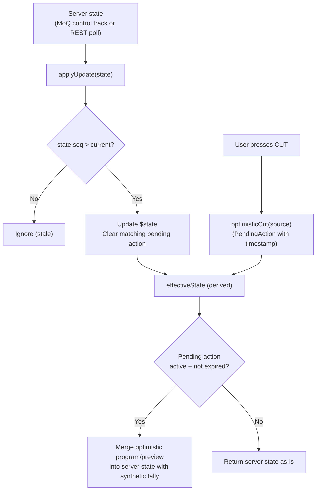
```mermaid
flowchart TD
    server["Server state<br/>(MoQ control track or REST poll)"] --> apply["applyUpdate(state)"]
    apply --> seqcheck{"state.seq > current?"}
    seqcheck -->|No| ignore["Ignore (stale)"]
    seqcheck -->|Yes| update["Update $state<br/>Clear matching pending action"]

    cut["User presses CUT"] --> opt["optimisticCut(source)<br/>(PendingAction with timestamp)"]

    update --> eff["effectiveState (derived)"]
    opt --> eff
    eff --> check{"Pending action<br/>active + not expired?"}
    check -->|Yes| merge["Merge optimistic program/preview<br/>into server state with synthetic tally"]
    check -->|No| raw["Return server state as-is"]
```

**Optimistic updates.** When the operator presses CUT, the store
immediately applies the expected state change locally
(`optimisticCut`). This makes the UI feel instant. The pending action
is cleared when the server confirms (matching `programSource` in the
next state update) or expires after 2 seconds.


### 3.4 Connection Management

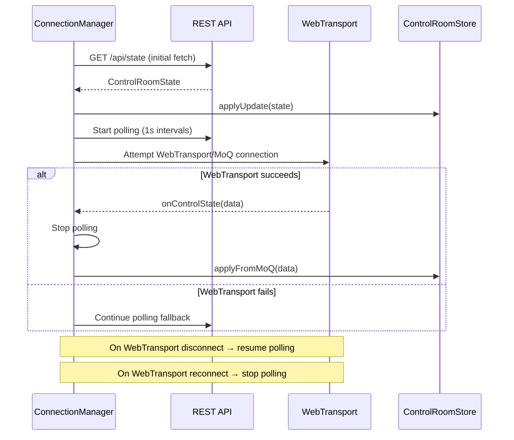
```mermaid
sequenceDiagram
    participant CM as ConnectionManager
    participant REST as REST API
    participant WT as WebTransport
    participant Store as ControlRoomStore

    CM->>REST: GET /api/state (initial fetch)
    REST-->>CM: ControlRoomState
    CM->>Store: applyUpdate(state)

    CM->>REST: Start polling (1s intervals)

    CM->>WT: Attempt WebTransport/MoQ connection
    alt WebTransport succeeds
        WT-->>CM: onControlState(data)
        CM->>CM: Stop polling
        CM->>Store: applyFromMoQ(data)
    else WebTransport fails
        CM->>REST: Continue polling fallback
    end

    Note over CM,WT: On WebTransport disconnect → resume polling
    Note over CM,WT: On WebTransport reconnect → stop polling
```

The `ConnectionManager` provides resilient state synchronization:
1. Initial state fetch via REST (with retry)
2. Start REST polling as immediate fallback
3. Attempt WebTransport/MoQ connection
4. On WebTransport success: stop polling, use MoQ control track
5. On WebTransport failure: fall back to REST polling
6. On WebTransport reconnect: switch back to MoQ

The connection state (`webtransport` | `polling` | `disconnected`) is
displayed in the UI header as a connection status banner.


### 3.5 Keyboard Shortcuts

The `KeyboardHandler` uses capture-phase `keydown` with `event.code` for
layout-independent shortcuts:

| Key | Action |
|---|---|
| `1`-`9` | Set preview source (by position) |
| `Shift+1`-`9` | Hot-punch (direct cut to source) |
| `Ctrl+1`-`9` | Run macro (by position) |
| `Space` | CUT (preview → program) |
| `Enter` | AUTO transition (dissolve/dip) |
| `F1` | Fade to black (toggle) |
| `F2` | Toggle DSK graphics |
| `Alt+1` | Set transition type to mix |
| `Alt+2` | Set transition type to dip |
| `` ` `` | Toggle fullscreen |
| `?` | Toggle keyboard overlay |
| `Ctrl+Shift+1`–`6` | Switch bottom panel tab (Audio/Graphics/Macros/Keys/Replay/Presets) |


## 4. Data Flow Diagrams

### 4.1 Source Ingestion to Program Output

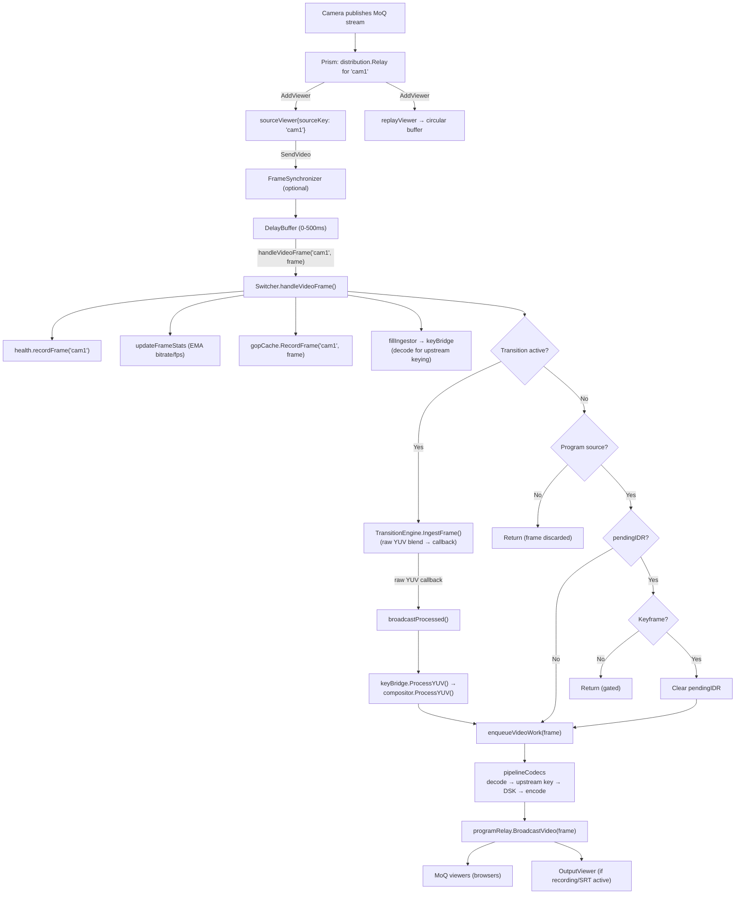
```mermaid
flowchart TD
    pub["Camera publishes MoQ stream"] --> relay["Prism: distribution.Relay for 'cam1'"]
    relay -->|AddViewer| sv["sourceViewer{sourceKey: 'cam1'}"]
    relay -->|AddViewer| rv["replayViewer → circular buffer"]
    sv -->|SendVideo| fs["FrameSynchronizer (optional)"]
    fs --> delay["DelayBuffer (0-500ms)"]
    delay -->|"handleVideoFrame('cam1', frame)"| hvf["Switcher.handleVideoFrame()"]

    hvf --> health["health.recordFrame('cam1')"]
    hvf --> stats["updateFrameStats (EMA bitrate/fps)"]
    hvf --> gop["gopCache.RecordFrame('cam1', frame)"]
    hvf --> fill["fillIngestor → keyBridge<br/>(decode for upstream keying)"]

    hvf --> trans{"Transition active?"}
    trans -->|Yes| te["TransitionEngine.IngestFrame()<br/>(raw YUV blend → callback)"]
    trans -->|No| pgm{"Program source?"}
    pgm -->|No| discard["Return (frame discarded)"]
    pgm -->|Yes| idr{"pendingIDR?"}
    idr -->|No| bv["enqueueVideoWork(frame)"]
    idr -->|Yes| kf{"Keyframe?"}
    kf -->|No| gate["Return (gated)"]
    kf -->|Yes| clear["Clear pendingIDR"] --> bv

    te -->|"raw YUV callback"| proc["broadcastProcessed()"]
    proc --> keycomp["keyBridge.ProcessYUV() →<br/>compositor.ProcessYUV()"]
    keycomp --> bv

    bv --> pipeline["pipelineCodecs<br/>decode → upstream key → DSK → encode"]
    pipeline --> broadcast["programRelay.BroadcastVideo(frame)"]
    broadcast --> browsers["MoQ viewers (browsers)"]
    broadcast --> output["OutputViewer (if recording/SRT active)"]
```

### 4.2 Cut Operation

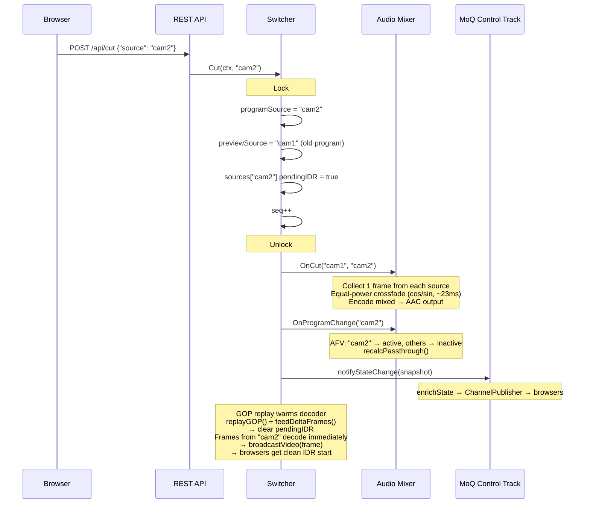
```mermaid
sequenceDiagram
    participant Browser
    participant API as REST API
    participant SW as Switcher
    participant Mixer as Audio Mixer
    participant MoQ as MoQ Control Track

    Browser->>API: POST /api/cut {"source": "cam2"}
    API->>SW: Cut(ctx, "cam2")

    Note over SW: Lock
    SW->>SW: programSource = "cam2"
    SW->>SW: previewSource = "cam1" (old program)
    SW->>SW: sources["cam2"].pendingIDR = true
    SW->>SW: seq++
    Note over SW: Unlock

    SW->>Mixer: OnCut("cam1", "cam2")
    Note over Mixer: Collect 1 frame from each source<br/>Equal-power crossfade (cos/sin, ~23ms)<br/>Encode mixed → AAC output

    SW->>Mixer: OnProgramChange("cam2")
    Note over Mixer: AFV: "cam2" → active, others → inactive<br/>recalcPassthrough()

    SW->>MoQ: notifyStateChange(snapshot)
    Note over MoQ: enrichState → ChannelPublisher → browsers

    Note over SW: GOP replay warms decoder<br/>replayGOP() + feedDeltaFrames()<br/>→ clear pendingIDR<br/>Frames from "cam2" decode immediately<br/>→ broadcastVideo(frame)<br/>→ browsers get clean IDR start
```

### 4.3 Dissolve Transition

```mermaid
sequenceDiagram
    participant Browser
    participant SW as Switcher
    participant TE as TransitionEngine
    participant PC as pipelineCodecs
    participant Mixer as Audio Mixer

    Browser->>SW: StartTransition("cam2", "mix", 1000ms)

    Note over SW: Phase 1: Lock<br/>Validate, StateTransitioning, seq++

    Note over SW: Phase 2: Create + Warm TransitionEngine
    SW->>TE: Start("cam1", "cam2", Mix, 1000)
    Note over TE: Create decoderA + decoderB (FFmpeg)
    Note over SW: Warmup: feed GOP cache frames to both decoders<br/>Feed delta frames from warmup window<br/>WarmupComplete()

    Note over SW: Phase 3: Lock, publish engine
    SW->>Mixer: OnTransitionStart("cam1", "cam2", AudioCrossfade, 1000)

    loop Each frame from both sources
        SW->>TE: IngestFrame("cam1", annexB, pts)
        Note over TE: decode → latestYUVA (not trigger, no output)

        SW->>TE: IngestFrame("cam2", annexB, pts)
        Note over TE: decode → latestYUVB (trigger source)
        Note over TE: pos = smoothstep(elapsed / 1000ms)
        Note over TE: BlendMix(yuvA, yuvB, pos) → raw YUV
        TE->>SW: Output callback(rawYUV, w, h, pts)
        Note over SW: broadcastProcessed():<br/>upstream key → DSK compositor
        SW->>PC: enqueue → encode(yuv) → H.264
        PC->>SW: broadcastOwnedToProgram(frame)
    end

    Note over TE: pos ≥ 1.0
    TE->>TE: cleanup() → close decoders (no encoder)
    TE->>SW: OnComplete(aborted=false)

    Note over SW: Lock<br/>programSource = "cam2"<br/>previewSource = "cam1"<br/>StateIdle, transEngine = nil
    SW->>Mixer: OnTransitionComplete() + OnProgramChange("cam2")
    SW->>Browser: State broadcast
```

### 4.4 State Sync (Server to Browser)

```mermaid
sequenceDiagram
    participant Event as Server Event
    participant Enrich as enrichState()
    participant Pub as ChannelPublisher
    participant Prism as Prism MoQ
    participant WT as Browser WebTransport
    participant Store as ControlRoomStore

    Event->>Enrich: sw.OnStateChange / outputMgr / compositor
    Enrich->>Enrich: Add Recording + SRT + Graphics status
    Enrich->>Pub: Publish(enrichedState)
    Pub->>Pub: JSON.Marshal → chan []byte (64 slots)
    Note over Pub: If full: drop oldest (safe, full snapshot)
    Pub->>Prism: ControlCh
    Prism->>WT: MoQ "control" track (group per message)
    WT->>Store: applyFromMoQ(data)
    Store->>Store: JSON.parse → applyUpdate(state)
    Note over Store: seq check (ignore stale)<br/>Clear matching pending action<br/>$state mutation → UI re-renders

    Note over Event,Store: Parallel path (fallback):
    Store->>Event: GET /api/state (every 1s)
    Event-->>Store: applyUpdate(state)
```


## 5. MXL Integration

MXL (Media eXchange Layer) is the EBU/Linux Foundation open-source SDK
for zero-copy, real-time media exchange between software processes via
shared memory. SwitchFrame integrates MXL as an alternative I/O path
alongside the standard MoQ/WebTransport pipeline.

### What MXL Provides

- **V210 video**: Uncompressed 10-bit YCbCr 4:2:2 packed in shared-memory ring buffers
- **Float32 audio**: De-interleaved floating-point PCM in continuous ring buffers
- **NMOS IS-04 discovery**: Flow definitions as JSON files in the domain directory
- **Zero-copy transport**: POSIX shared memory on the same host (no network, no codec)

### MXL Source Path

```
MXL Shared Memory (V210 + float32 PCM)
         │
    [flow.go: cgo bindings]
    DiscreteReader / ContinuousReader
         │
    [reader.go: Reader goroutines]
    videoLoop (discrete grains, error recovery)
    audioLoop (5ms timeout, ring buffer head start)
         │
    [source.go: Source — triple fan-out]
         │
    ├── OnRawVideo ──→ sw.IngestRawVideo()      (raw YUV420p to switcher)
    ├── OnRawAudio ──→ mixer.IngestPCM()         (float32 PCM to mixer)
    └── Encode     ──→ relay.BroadcastVideo()    (H.264/AAC to browsers)
```

MXL sources bypass the normal Prism viewer path. `RegisterMXLSource()`
creates a `sourceState` with nil relay/viewer. Frames arrive via
`IngestRawVideo()` instead of the relay callback. This eliminates one
H.264 decode cycle on the ingest path — the V210→YUV420p conversion is
a simple pixel format transform, not a codec operation.

Audio also bypasses AAC decode — MXL provides raw float32 PCM, which
feeds directly into the mixer via `IngestPCM()`. The `mxl:` key prefix
excludes MXL sources from Prism's stream registration callback.

### MXL Output Path

```
Switcher program output (raw YUV420p ProcessingFrame)
         │
    sw.SetRawVideoSink() → Output.Writer().WriteVideo()
         │
    [writer.go: steady-rate ticker model]
    YUV420p → V210 conversion, write at source frame rate
         │
    DiscreteWriter.WriteGrain() → MXL shared memory

Mixer program output (raw float32 PCM)
         │
    mixer.SetRawAudioSink() → Output.Writer().WriteAudio()
         │
    [writer.go: wall-clock index with monotonic enforcement]
    Interleaved → de-interleaved, write at sample rate
         │
    ContinuousWriter.WriteSamples() → MXL shared memory
```

The writer uses a **steady-rate ticker model** for video: `WriteVideo()`
stores the latest V210 frame atomically, and a background ticker writes
at the configured grain rate. This decouples output timing from the
pipeline callback rate, preventing gaps during keyframe waits and bursts
during transitions.

### V210 Pixel Format

V210 packs 10-bit 4:2:2 YCbCr samples into 32-bit words. Each 128-bit
group encodes 6 pixels:

```
[Cb0:10][Y0:10][Cr0:10][xx:2]  [Y1:10][Cb2:10][Y2:10][xx:2]  ...
```

`V210ToYUV420p()` extracts and down-converts to 8-bit 4:2:0 planar
(matching the switcher's internal format). The reverse conversion
(`YUV420pToV210`) upsamples chroma for output. Line stride is 128-byte
aligned per the V210 specification.

### Build Configuration

MXL support is opt-in via build tags: `cgo && mxl`. Without the `mxl`
tag, the stub implementation (`stub.go`) returns `ErrMXLNotAvailable`
for all operations. The stub provides a monotonic-clock `CurrentIndex`
approximation so test code can reference timing without the SDK.

The real implementation uses `pkg-config: libmxl` for cgo flags,
resolved from `MXL_ROOT/lib/pkgconfig`. A 30-second GC goroutine
calls `mxlGarbageCollectFlows()` to clean up stale flows from crashed
writers.

### Error Recovery

- **Video reader**: Consecutive error counter (max 50 before stopping).
  Timeout/too-early errors trigger brief 1ms backoff. Invalid grains
  (flagged `MXL_GRAIN_FLAG_INVALID`) are skipped. Timestamp
  discontinuities are logged but frames are still delivered.
- **Audio reader**: "Too late" errors trigger re-sync to ring buffer
  write head. The 5ms read timeout prevents MXL SDK thread starvation
  (the SDK can hold cgo threads for the full timeout duration).
- **Writer**: Write failures are logged but do not stop the writer.
  Resolution mismatches silently drop frames.

## 6. Key Design Decisions

### Server-Side Switching

All switching decisions and frame routing happen on the server, not in
the browser. The browser is a thin viewer that displays what the server
produces. This ensures:
- A single authoritative program output (critical for recording and SRT)
- Transition quality is independent of client hardware
- Multiple operators see identical state
- Recording captures exactly what viewers see

### YUV420 Blending (BT.709)

Dissolve blending operates directly in YUV420 space, matching the
approach of hardware broadcast mixers (Blackmagic ATEM, Ross). This
avoids the expensive YUV->RGB->YUV round-trip that software
implementations typically perform. The visual difference is
imperceptible for the dissolve/dip/FTB operations used in live
production.

### Passthrough Optimization

The audio mixer detects the common case of a single active source at
unity gain and bypasses decode/mix/encode entirely, forwarding raw AAC
frames. This reduces audio CPU to near zero during normal operation.
The mixer recalculates passthrough eligibility on every state change
(cut, mute toggle, gain change).

### GOP Replay and IDR Gating

On cuts and transition completions, the switcher replays the new source's
cached GOP to warm the pipeline decoder, avoiding a keyframe wait. The
`replayGOP` method feeds GOP frames to a pre-warmed decoder from the pool,
then pointer-swaps it into the pipeline. `feedDeltaFrames` closes the
timing window by feeding frames that arrived during replay (~10-35ms).

For transitions, the engine's decoders are warmed with GOP frames before
publication, and delta frames from the warmup window are fed to maintain
reference chain continuity. Live frames decode immediately — no keyframe
gate.

The `pendingIDR` fallback is only used when no GOP replay is available
(e.g., no cached GOP for the source). In that case, non-keyframes are
dropped until the first IDR arrives.

### REST Commands over HTTP/3

Control commands use REST POST requests rather than MoQ custom messages.
The MoQ specification states that unknown message types cause a
PROTOCOL_VIOLATION error, making custom messages fragile. REST over
HTTP/3 uses the same QUIC connection, adds negligible latency, and is
compatible with standard tooling (curl, browsers, proxies).

### MoQ Control Track for State

Switcher state is broadcast via a MoQ "control" track using full JSON
snapshots. Full snapshots (not deltas) enable late-join -- a browser
connecting mid-session receives complete state immediately. The
monotonic `seq` field enables dedup of stale responses from REST
polling.

### Transition Engine Lifecycle

Each transition creates a fresh `TransitionEngine` with its own decoders
and encoder, which are destroyed on completion/abort. This avoids
persistent codec state between transitions (no resource leaks, no stale
encoder state). Between transitions, no video decode or encode occurs --
just raw frame forwarding.

### Encoder Auto-Detection

At startup, `codec.ProbeEncoders()` tests available hardware encoders in
priority order: NVENC -> VA-API -> VideoToolbox -> libx264 -> OpenH264.
The first successful probe is cached for the process lifetime. This
allows the same binary to run on GPU-accelerated servers and
CPU-only machines without configuration.

### SRT Connection Resilience

The SRT caller uses exponential backoff (1s to 30s) for reconnection
and a 4MB ring buffer to preserve data during disconnections. If the
ring buffer overflows, the caller resumes from the next keyframe and
fires an `onReconnect(overflowed=true)` callback so the OutputManager
can log a warning and broadcast updated state.

### Optimistic UI Updates

The browser applies cut/preview changes immediately via `optimisticCut`
/ `optimisticPreview` before the server confirms. This eliminates
perceived latency for the operator. Pending actions expire after 2
seconds if unconfirmed, reverting to server state.

### WebTransport with REST Polling Fallback

The `ConnectionManager` attempts WebTransport/MoQ first, with REST
polling as an immediate fallback. If WebTransport connects, polling
stops. If WebTransport drops, polling resumes. This ensures the UI
works even in environments that do not support WebTransport (proxies,
older browsers).


## 7. Technology Stack

| Layer | Technology | Purpose |
|---|---|---|
| Media transport | MoQ draft-15 / WebTransport | Low-latency media distribution |
| Server runtime | Go 1.25+ | Server binary, all switching logic |
| Media server | Prism (Go library) | MoQ protocol, relay fan-out, stream management |
| Video codec | FFmpeg libavcodec (cgo) | H.264 decode/encode for transitions/DSK |
| Video fallback | OpenH264 (cgo, build tag) | Fallback encoder when FFmpeg unavailable |
| Shared-memory I/O | MXL SDK (cgo, optional) | V210 video + float32 audio via shared memory |
| Audio codec | FDK-AAC (cgo) | AAC decode/encode for audio mixing |
| SRT transport | zsiec/srtgo (pure Go) | SRT caller and listener output |
| TS muxing | go-astits | MPEG-TS container for recording/SRT |
| Frontend | Svelte 5 + SvelteKit | Reactive SPA with static adapter |
| State management | Svelte 5 runes ($state) | Fine-grained reactive state |
| Video decode | WebCodecs API | Hardware-accelerated H.264 in browser |
| Video render | Canvas 2D / WebGPU (future) | Frame rendering, tally borders |
| Audio decode | WebCodecs AudioDecoder | Client-side metering and PFL |
| Observability | Prometheus | Metrics (cuts, IDR gates, mix cycles) |
| Build | Makefile + Docker | Build chain, multi-stage container |
| CI | GitHub Actions | Lint, test (Go + Vitest + Playwright) |
| TLS | Auto-generated self-signed | 14-day WebTransport certificates |

### Build Tags

| Tag | Effect |
|---|---|
| `embed_ui` | Embed built UI into Go binary (production) |
| `!embed_ui` | No-op UI handler (development, Vite serves UI) |
| `cgo && !noffmpeg` | Enable FFmpeg-based video codec |
| `cgo && openh264` | Enable OpenH264 fallback codec |
| `cgo && mxl` | Enable MXL shared-memory transport |
| `!cgo \|\| !mxl` | Stub MXL -- returns `ErrMXLNotAvailable` |
| (no cgo) | Stub codecs -- passthrough only, no transitions |

### Ports

| Port | Protocol | Purpose |
|---|---|---|
| `:8080` | QUIC/UDP | Prism server (WebTransport + MoQ + API) |
| `:8081` | TCP/HTTP | REST API mirror (dev proxy, curl) |
| `:9090` | TCP/HTTP | Admin (Prometheus /metrics, pprof) |
| `:9000` | UDP | SRT listener (configurable) |
