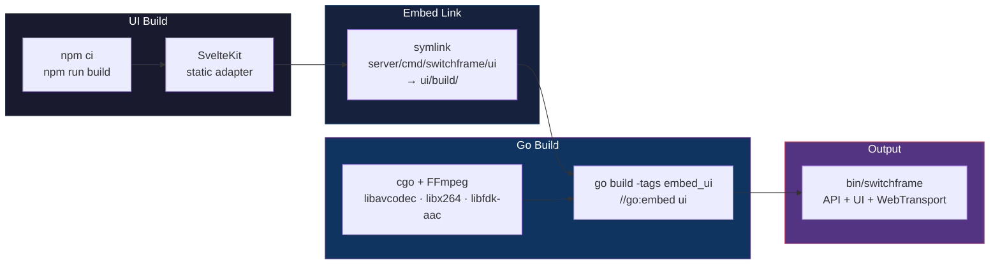
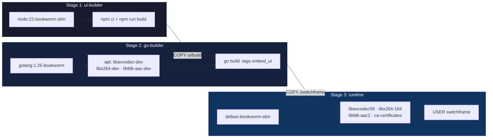
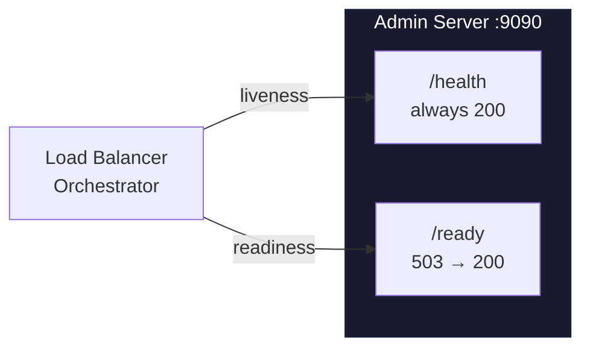
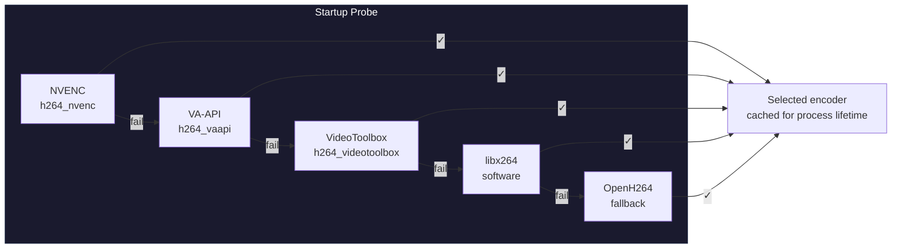
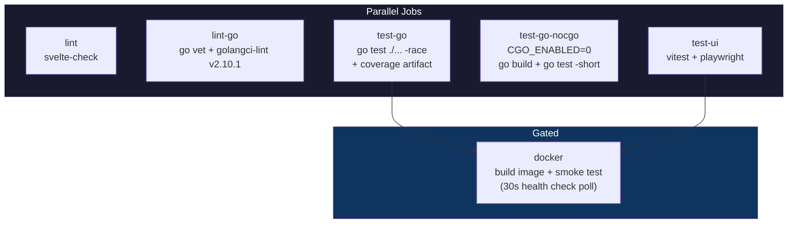

# Deployment

Production deployment guide covering build, configuration, networking, monitoring, and security.

**Contents:** [Building](#1-building) · [Docker](#2-docker) · [Configuration](#3-configuration) · [Network & Ports](#4-network--ports) · [TLS](#5-tls) · [Authentication](#6-authentication) · [Monitoring](#7-monitoring) · [Hardware Acceleration](#8-hardware-acceleration) · [Output](#9-output) · [Reverse Proxy](#10-reverse-proxy) · [Logging](#11-logging) · [Security](#12-security) · [Production Checklist](#13-production-checklist)

---

## 1. Building

### Single Binary (Recommended)

```bash
make build
# Output: bin/switchframe
```



The resulting binary serves the entire application — REST API, embedded UI, WebTransport/MoQ, and QUIC — with zero external file dependencies.

### Build Tags

| Tag | Effect |
|-----|--------|
| `embed_ui` | Embeds the SvelteKit build via `//go:embed`. Without it, `uiHandler()` returns nil (no static files served). |
| `noffmpeg` | Disables FFmpeg cgo bindings. Codec probing and hardware acceleration become no-ops. |
| `openh264` | Enables OpenH264 fallback encoder/decoder (requires the OpenH264 shared library at runtime). |
| `mxl` | Enables MXL shared-memory transport (requires MXL SDK at `MXL_ROOT`). Without it, MXL functions return `ErrMXLNotAvailable`. |

### C Dependencies

The Go build requires cgo and these libraries:

| Library | Purpose |
|---------|---------|
| `libavcodec` + `libavutil` | FFmpeg video encode/decode (H.264 HW + SW) |
| `libx264` | H.264 software encoding |
| `libfdk-aac` | AAC audio encode/decode |
| `pkg-config` | cgo flag resolution |

**Debian/Ubuntu:**
```bash
# fdk-aac is in non-free
sed -i 's/Components: main/Components: main non-free/' /etc/apt/sources.list.d/debian.sources
apt-get update && apt-get install -y libavcodec-dev libavutil-dev libx264-dev libfdk-aac-dev pkg-config
```

**macOS (Homebrew):**
```bash
brew install ffmpeg fdk-aac pkg-config
```

### Dev Build (No UI Embed)

For development with the Vite dev server proxying to Go:

```bash
make build-server       # API only, no embedded UI
make dev                # Builds + runs Go server + Vite dev server concurrently
```

### MXL Build

For shared-memory video/audio I/O via the MXL SDK:

```bash
export MXL_ROOT=$HOME/dev/mxl/install/Linux-GCC-Release
make build-server-mxl
```

Adds `-tags "cgo mxl"` and sets `PKG_CONFIG_PATH` to resolve `libmxl`.

---

## 2. Docker

### Three-Stage Build



```bash
make docker
# or: docker build -t switchframe .
```

The runtime image contains only shared libraries and the binary — no compilers, no Node.js, no source code.

### Docker Run

```bash
docker run -d \
  --name switchframe \
  -p 8080:8080/udp \
  -p 8080:8080/tcp \
  -p 9090:9090/tcp \
  -p 9000:9000/udp \
  -e SWITCHFRAME_API_TOKEN=your-secret-token \
  -e APP_ENV=production \
  -v /data/recordings:/recordings \
  -v switchframe-data:/home/switchframe/.switchframe \
  switchframe \
    --log-level info \
    --http-fallback
```

### Docker Compose

```yaml
services:
  switchframe:
    image: switchframe:latest
    build: .
    ports:
      - "8080:8080/udp"    # QUIC / WebTransport / MoQ
      - "8080:8080/tcp"    # HTTP/3 Alt-Svc
      - "8081:8081/tcp"    # Plain HTTP API (--http-fallback)
      - "9090:9090/tcp"    # Admin (metrics, health, pprof)
      - "9000:9000/udp"    # SRT listener
    environment:
      SWITCHFRAME_API_TOKEN: "${SWITCHFRAME_API_TOKEN}"
      APP_ENV: production
    volumes:
      - recordings:/recordings
      - config:/home/switchframe/.switchframe
    healthcheck:
      test: ["CMD", "curl", "-f", "http://localhost:9090/health"]
      interval: 30s
      timeout: 5s
      retries: 3
    restart: unless-stopped
    # NVIDIA GPU passthrough for NVENC:
    # deploy:
    #   resources:
    #     reservations:
    #       devices:
    #         - driver: nvidia
    #           count: 1
    #           capabilities: [gpu]

volumes:
  recordings:
  config:
```

---

## 3. Configuration

### CLI Flags

#### Core

| Flag | Default | Description |
|------|---------|-------------|
| `--demo` | `false` | Start with 4 simulated H.264 cameras + 2 raw MXL sources. Disables auth. |
| `--demo-video <dir>` | — | Directory of MPEG-TS clips for realistic demo video (requires `--demo`) |
| `--log-level` | `info` | `debug` · `info` · `warn` · `error` |
| `--admin-addr` | `:9090` | Admin/metrics server listen address |
| `--api-token` | auto | Bearer token for API auth (see [Authentication](#6-authentication)) |
| `--http-fallback` | `false` | Start plain HTTP/1.1 API on TCP `:8081` for curl/scripts |
| `--tls-cert <path>` | — | TLS certificate PEM (e.g., from mkcert or Let's Encrypt) |
| `--tls-key <path>` | — | TLS private key PEM |

#### Video Pipeline

| Flag | Default | Description |
|------|---------|-------------|
| `--format` | `1080p29.97` | Video standard preset (see [Format Presets](#format-presets) below) |
| `--frame-sync` | `false` | Enable freerun frame synchronizer (aligns sources to common tick) |
| `--frc-quality` | `none` | Frame rate conversion: `none` · `nearest` · `blend` · `mcfi` |
| `--decode-all-sources` | `false` | Always-on per-source H.264→YUV420 decoders (instant cuts, no IDR gating) |
| `--raw-program-monitor` | `false` | Enable raw YUV420 program monitor on `program-raw` MoQ track |
| `--raw-monitor-scale` | native | Downscale raw monitor: `720p` · `480p` · `360p` |
| `--replay-buffer-secs` | `60` | Per-source replay buffer in seconds (0 = disabled, max 300) |
| `--captions` | `false` | Enable CEA-608/708 closed captioning |

#### SCTE-35 / SCTE-104

| Flag | Default | Description |
|------|---------|-------------|
| `--scte35` | `false` | Enable SCTE-35 splice_insert / time_signal injection into MPEG-TS |
| `--scte35-pid` | `258` (0x102) | MPEG-TS PID for SCTE-35 data |
| `--scte35-preroll` | `4000` | Default pre-roll in milliseconds |
| `--scte35-heartbeat` | `5000` | splice_null heartbeat interval in ms (0 = disabled) |
| `--scte35-verify` | `true` | Round-trip encode verification of SCTE-35 messages |
| `--scte35-webhook` | — | URL for async HTTP POST notifications on SCTE-35 events |
| `--scte104` | `false` | Enable SCTE-104 on MXL data flows (requires `--scte35` + MXL build) |

#### MXL Shared Memory

| Flag | Default | Description |
|------|---------|-------------|
| `--mxl-sources` | — | Comma-separated source specs: `videoUUID[:audioUUID[:dataUUID]]` |
| `--mxl-output` | — | MXL flow name for program output |
| `--mxl-output-video-def` | — | NMOS IS-04 video flow definition JSON path |
| `--mxl-output-audio-def` | — | NMOS IS-04 audio flow definition JSON path |
| `--mxl-domain` | `/dev/shm/mxl` | MXL shared memory domain directory |
| `--mxl-discover` | `false` | List available MXL flows and exit |

### Environment Variables

| Variable | Description |
|----------|-------------|
| `SWITCHFRAME_API_TOKEN` | API token. Overridden by `--api-token` if both set. |
| `SWITCHFRAME_MXL_SOURCES` | MXL source specs. Overridden by `--mxl-sources` if both set. |
| `APP_ENV` | Set to `production` for JSON-formatted structured logs. |
| `GOGC` | Go GC target percentage. Switchframe defaults to `400` if unset. |
| `GOMEMLIMIT` | Go memory limit. Switchframe defaults to `2GB` if unset. |

### Format Presets

The `--format` flag accepts any of these standard broadcast presets:

| 2160p (4K) | 1080p | 720p |
|------------|-------|------|
| `2160p60` · `2160p59.94` | `1080p60` · `1080p59.94` | `720p60` · `720p59.94` |
| `2160p50` | `1080p50` | `720p50` |
| `2160p30` · `2160p29.97` | `1080p30` · **`1080p29.97`** (default) | `720p30` · `720p29.97` |
| `2160p25` | `1080p25` | `720p25` |
| — | `1080p24` · `1080p23.976` | — |

Frame rates use rational numbers for broadcast correctness (e.g., 30000/1001 for 29.97fps NTSC). The format can also be changed at runtime via `PUT /api/format`.

### Token Resolution

```
--api-token flag  →  SWITCHFRAME_API_TOKEN env  →  auto-generated (printed to stdout)
    (highest)              (middle)                       (lowest)
```

Auto-generated tokens are 32 random bytes (64 hex characters) via `crypto/rand`.

### Fixed Addresses

| Address | Purpose |
|---------|---------|
| `:8080` | Main server — QUIC/HTTP3 + WebTransport + MoQ + REST API + embedded UI |
| `:8081` | Plain HTTP/1.1 API mirror (opt-in via `--http-fallback`) |

These listen addresses are not currently configurable via flags.

---

## 4. Network & Ports

### Port Summary

| Port | Protocol | Direction | Purpose |
|------|----------|-----------|---------|
| **8080** | UDP | Inbound | QUIC/HTTP3, WebTransport, MoQ subscriptions, REST API, embedded UI |
| **8080** | TCP | Inbound | HTTP/3 Alt-Svc advertisement (browsers discover QUIC via TCP first) |
| **8081** | TCP | Inbound | Plain HTTP REST API (opt-in via `--http-fallback`) |
| **9090** | TCP | Inbound | Admin: `/metrics` · `/health` · `/ready` · `/api/cert-hash` · `/debug/pprof/*` |
| **9000** | UDP | Inbound | SRT listener mode (pull connections from downstream) |
| *Ephemeral* | UDP | Outbound | SRT caller mode (push to platform — no inbound rule needed) |

### Firewall Rules

```bash
# Required: WebTransport / MoQ (browser clients)
iptables -A INPUT -p udp --dport 8080 -j ACCEPT
iptables -A INPUT -p tcp --dport 8080 -j ACCEPT

# Optional: Plain HTTP API (only if --http-fallback)
iptables -A INPUT -p tcp --dport 8081 -j ACCEPT

# Restrict: Admin (monitoring network only — exposes pprof)
iptables -A INPUT -p tcp --dport 9090 -s 10.0.0.0/8 -j ACCEPT

# Optional: SRT listener
iptables -A INPUT -p udp --dport 9000 -j ACCEPT
```

---

## 5. TLS

### Self-Signed Certificates (Default)

At startup, Switchframe generates a self-signed TLS certificate via Prism's `certs.Generate()`:

- **Validity:** 14 days (WebTransport requires short-lived self-signed certs)
- **Fingerprint:** Logged at startup and available unauthenticated at `/api/cert-hash`

```bash
curl http://localhost:9090/api/cert-hash
# {"hash":"abc123...","addr":":8080","trusted":false}
```

Browsers use the fingerprint in `serverCertificateHashes` to trust the self-signed cert for WebTransport.

### Trusted Certificates with mkcert

[mkcert](https://github.com/FiloSottile/mkcert) generates locally-trusted certificates, enabling direct HTTP/3 without fingerprint pinning:

```bash
make setup-mkcert                 # one-time: install CA + generate cert
./bin/switchframe \
  --tls-cert ~/.switchframe/cert.pem \
  --tls-key ~/.switchframe/key.pem
```

When a trusted cert is used, `/api/cert-hash` returns `"trusted": true` and browsers skip `serverCertificateHashes` — connecting over HTTP/3 directly.

### Production TLS

**Option 1 — Direct:** Provide CA-signed certificates via `--tls-cert` / `--tls-key`. Browsers connect over HTTP/3 without fingerprint pinning.

**Option 2 — Reverse proxy:** Terminate TLS at the proxy (Caddy, nginx) and forward REST API traffic to `:8081` (requires `--http-fallback`). WebTransport/QUIC still requires direct UDP access to `:8080`.

### Certificate Renewal

Self-signed certs regenerate on every server restart. For long-running deployments, restart at least every 14 days. With `--tls-cert`/`--tls-key`, renewal is your responsibility — restart after updating cert files.

---

## 6. Authentication

### Bearer Token

All `/api/*` endpoints (except exempt paths) require a Bearer token:

```bash
curl -H "Authorization: Bearer $TOKEN" https://localhost:8080/api/switch/state
```

Validation uses `crypto/subtle.ConstantTimeCompare` (timing-safe against side-channel attacks). Invalid tokens receive `401` with `WWW-Authenticate: Bearer realm="switchframe"`.

### Exempt Paths

| Path | Server | Purpose |
|------|--------|---------|
| `/api/cert-hash` | Admin (9090) + Main (8080) | WebTransport bootstrapping |
| `/health` | Admin (9090) | Liveness probe |
| `/metrics` | Admin (9090) | Prometheus scraping |
| `/ready` | Admin (9090) | Readiness probe |

### Token Generation

**Auto-generate** (default): start without `--api-token`. The token prints to **stdout** (not stderr) so it doesn't leak into log files:

```bash
switchframe 2>/var/log/switchframe.log | head -5
#   API Token: a1b2c3d4e5f6...
```

**Pre-generate:**
```bash
export SWITCHFRAME_API_TOKEN=$(openssl rand -hex 32)
switchframe
```

### Demo Mode

`--demo` disables authentication entirely. All requests pass through without a token. Never use `--demo` in production.

---

## 7. Monitoring

### Prometheus Metrics

Scraped at `http://localhost:9090/metrics` on the admin server.

#### HTTP

| Metric | Type | Labels |
|--------|------|--------|
| `switchframe_http_requests_total` | Counter | `method`, `pattern`, `status` |
| `switchframe_http_request_duration_seconds` | Histogram | `method`, `pattern` |

#### Switcher

| Metric | Type | Labels |
|--------|------|--------|
| `switchframe_cuts_total` | Counter | — |
| `switchframe_transitions_completed_total` | Counter | `type` (mix, dip, ftb, wipe, stinger) |
| `switchframe_idr_gate_events_total` | Counter | — |
| `switchframe_idr_gate_duration_seconds` | Histogram | — |

#### Audio Mixer

| Metric | Type | Labels |
|--------|------|--------|
| `switchframe_mixer_frames_mixed_total` | Counter | — |
| `switchframe_mixer_encode_errors_total` | Counter | — |
| `switchframe_mixer_passthrough_bypass_total` | Counter | — |

#### Output

| Metric | Type | Labels |
|--------|------|--------|
| `switchframe_output_ringbuf_overflows_total` | Counter | — |
| `switchframe_output_srt_reconnects_total` | Counter | — |
| `switchframe_output_recording_bytes_total` | Counter | — |
| `switchframe_output_srt_bytes_total` | Counter | — |

#### Pipeline

| Metric | Type | Labels |
|--------|------|--------|
| `switchframe_pipeline_decode_errors_total` | Counter | — |
| `switchframe_pipeline_encode_errors_total` | Counter | — |
| `switchframe_pipeline_frames_processed_total` | Counter | — |
| `switchframe_pipeline_decode_duration_seconds` | Histogram | — |
| `switchframe_pipeline_encode_duration_seconds` | Histogram | — |
| `switchframe_pipeline_blend_duration_seconds` | Histogram | — |
| `switchframe_pipeline_node_duration_seconds` | Histogram | `node` |

#### Source Health

| Metric | Type | Labels |
|--------|------|--------|
| `switchframe_source_status_changes_total` | Counter | `source`, `from_status`, `to_status` |

Go runtime (`go_goroutines`, `go_memstats_*`, `go_gc_*`) and process (`process_cpu_seconds_total`, `process_resident_memory_bytes`, `process_open_fds`) collectors are included automatically.

### Prometheus Scrape Config

```yaml
scrape_configs:
  - job_name: switchframe
    scrape_interval: 15s
    static_configs:
      - targets: ["switchframe:9090"]
```

### Health Checks



**Liveness** — always 200 if the process is running:
```bash
curl http://localhost:9090/health
# {"status":"ok"}
```

**Readiness** — 503 during startup, 200 once all components are initialized:
```bash
curl http://localhost:9090/ready
# {"status":"ready"}    (200)
# {"status":"not_ready"} (503)
```

**Kubernetes probes:**
```yaml
livenessProbe:
  httpGet:
    path: /health
    port: 9090
  initialDelaySeconds: 5
readinessProbe:
  httpGet:
    path: /ready
    port: 9090
  initialDelaySeconds: 3
```

**Docker HEALTHCHECK** (built into the image):
```dockerfile
HEALTHCHECK --interval=30s --timeout=5s --retries=3 \
    CMD curl -f http://localhost:9090/health || exit 1
```

### pprof

Go profiling endpoints on the admin server:

```bash
go tool pprof http://localhost:9090/debug/pprof/profile?seconds=30  # CPU
go tool pprof http://localhost:9090/debug/pprof/heap                # Heap
curl http://localhost:9090/debug/pprof/goroutine?debug=2            # Goroutines
curl http://localhost:9090/debug/pprof/                             # All profiles
```

Mutex profiling samples at 20% (`runtime.SetMutexProfileFraction(5)`). Block profiling records events ≥ 1μs (`runtime.SetBlockProfileRate(1000)`).

### Debug Snapshot

Full system state dump (requires API auth):

```bash
curl -H "Authorization: Bearer $TOKEN" \
  https://localhost:8080/api/debug/snapshot
```

Returns JSON with subsystem state from all registered providers (switcher, mixer, output, etc.), plus a circular event log (100 entries) and uptime.

---

## 8. Hardware Acceleration

### Codec Auto-Detection

At startup, Switchframe probes H.264 encoder backends by creating a tiny 64×64 test encoder and verifying output:



The selected codec is logged at startup:
```
level=INFO msg="video codec selected" encoder=h264_videotoolbox decoder=h264
```

Hardware encoding is strongly recommended for 1080p+. Software-only (libx264) is marginal above 720p.

### NVIDIA GPU (NVENC)

1. Install [NVIDIA Container Toolkit](https://docs.nvidia.com/datacenter/cloud-native/container-toolkit/)
2. Run with GPU access:

```bash
docker run --gpus 1 -p 8080:8080/udp -p 8080:8080/tcp -p 9090:9090 switchframe
```

The runtime image may need `libnvidia-encode` — extend the Dockerfile or use an NVIDIA base image.

### Intel VA-API (Linux)

```bash
apt-get install -y vainfo libva2 intel-media-va-driver-non-free
vainfo  # verify
```

In Docker, pass the render device:
```bash
docker run --device /dev/dri/renderD128:/dev/dri/renderD128 switchframe
```

### macOS VideoToolbox

Automatically available on macOS (Intel and Apple Silicon). No setup needed for native builds.

---

## 9. Output

### SRT Caller (Push)

Pushes MPEG-TS to a remote SRT receiver. The server initiates the outbound UDP connection.

```bash
curl -X POST -H "Authorization: Bearer $TOKEN" \
  -d '{"mode":"caller","address":"ingest.example.com","port":9000,"latency":120}' \
  https://localhost:8080/api/output/srt/start
```

| Behavior | Detail |
|----------|--------|
| Reconnection | Exponential backoff: 1s → 30s max, ±20% jitter |
| Ring buffer | 4 MB during reconnection |
| Overflow | Buffer discarded, waits for next keyframe (IDR gating) |
| Callback | `onReconnect(overflowed bool)` triggers state broadcast |

### SRT Listener (Pull)

Accepts incoming SRT connections. Downstream clients pull the program stream.

```bash
curl -X POST -H "Authorization: Bearer $TOKEN" \
  -d '{"mode":"listener","port":9000,"latency":120}' \
  https://localhost:8080/api/output/srt/start
```

| Behavior | Detail |
|----------|--------|
| Max connections | 8 simultaneous |
| Channel buffer | 64 TS chunks per connection |
| Slow clients | Dropped (no backpressure to pipeline) |

### SRT Fields

| Field | Type | Default | Description |
|-------|------|---------|-------------|
| `mode` | string | *required* | `"caller"` or `"listener"` |
| `address` | string | *required* (caller) | Remote host |
| `port` | int | *required* | Remote (caller) or local listen (listener) port |
| `latency` | int | `120` | SRT latency in milliseconds |
| `streamID` | string | — | SRT stream ID (caller mode only) |

### Multi-Destination SRT

Add multiple independent SRT outputs with per-destination lifecycle:

```bash
# Add a destination
curl -X POST -H "Authorization: Bearer $TOKEN" \
  -d '{"name":"Platform A","mode":"caller","address":"ingest.example.com","port":9000}' \
  https://localhost:8080/api/output/destinations

# Start it
curl -X POST -H "Authorization: Bearer $TOKEN" \
  https://localhost:8080/api/output/destinations/{id}/start

# Stop it
curl -X POST -H "Authorization: Bearer $TOKEN" \
  https://localhost:8080/api/output/destinations/{id}/stop
```

Each destination gets its own `AsyncAdapter`, ring buffer, and reconnection logic.

### Recording

```bash
curl -X POST -H "Authorization: Bearer $TOKEN" \
  -d '{"outputDir":"/recordings","rotateAfterMins":60,"maxFileSizeMB":2048}' \
  https://localhost:8080/api/recording/start
```

| Field | Type | Default | Description |
|-------|------|---------|-------------|
| `outputDir` | string | OS temp dir | Absolute path for output files |
| `rotateAfterMins` | int | `0` (disabled) | Time-based file rotation |
| `maxFileSizeMB` | int | `0` (unlimited) | Size-based file rotation |

**File naming:** `program_YYYYMMDD_HHMMSS_NNN.ts` — timestamp fixed at start, index increments on rotation. Rotation is keyframe-gated (waits for next IDR before closing the file).

**Format:** MPEG-TS (`.ts`) — crash-resilient with no moov atom or file header. If the process crashes mid-recording, the file is playable up to the last written frame. `fsync()` called before close for data durability.

**Docker:** Mount a host directory or named volume at the recording path:
```bash
docker run -v /data/recordings:/recordings switchframe
```

### Confidence Monitor

When any output is active, a 320×180 JPEG thumbnail of the program output is generated at ≤1fps from keyframes:

```bash
curl -H "Authorization: Bearer $TOKEN" \
  https://localhost:8080/api/output/confidence > thumbnail.jpg
```

---

## 10. Reverse Proxy

### Architecture

WebTransport requires direct QUIC (UDP) access — most reverse proxies are TCP-only. The recommended architecture splits traffic:

```
Browser ──TCP 443──→ Reverse Proxy ──TCP──→ Switchframe :8081 (REST API + embedded UI)
Browser ──UDP 8080──────────────────────→ Switchframe :8080 (QUIC / WebTransport / MoQ)
```

Browsers fetch the cert fingerprint from the proxied REST API (`/api/cert-hash`), then establish WebTransport directly to `:8080`.

### Caddy

```caddyfile
switchframe.example.com {
    handle /api/* {
        reverse_proxy localhost:8081
    }
    handle {
        reverse_proxy localhost:8081
    }
}
```

### nginx

```nginx
server {
    listen 443 ssl;
    server_name switchframe.example.com;

    ssl_certificate     /etc/letsencrypt/live/switchframe.example.com/fullchain.pem;
    ssl_certificate_key /etc/letsencrypt/live/switchframe.example.com/privkey.pem;

    location /api/ {
        proxy_pass http://127.0.0.1:8081;
        proxy_set_header Host $host;
        proxy_set_header X-Real-IP $remote_addr;
    }

    location / {
        proxy_pass http://127.0.0.1:8081;
        proxy_set_header Host $host;
    }
}
```

nginx does not support HTTP/3 upstream proxying — QUIC must be accessed directly by clients.

### CORS

All `/api/*` endpoints include CORS headers via [`CORSMiddleware`](../server/control/cors.go):

```
Access-Control-Allow-Origin: *
Access-Control-Allow-Methods: GET, POST, PUT, DELETE, OPTIONS
Access-Control-Allow-Headers: Content-Type, Authorization
Access-Control-Max-Age: 86400
```

`OPTIONS` preflight requests return `204 No Content` immediately. In production behind a reverse proxy, the proxy's CORS configuration takes precedence.

---

## 11. Logging

### Structured JSON

Set `APP_ENV=production` for JSON-formatted logs on stderr:

```bash
APP_ENV=production switchframe --log-level info
```

```json
{"time":"2026-03-11T10:00:00Z","level":"INFO","msg":"switchframe starting","log_level":"info"}
{"time":"2026-03-11T10:00:00Z","level":"INFO","msg":"video codec selected","encoder":"h264_videotoolbox","decoder":"h264"}
```

Without `APP_ENV=production`, logs use human-readable text:
```
time=2026-03-11T10:00:00Z level=INFO msg="switchframe starting" log_level=info
```

### Log Levels

| Level | Content |
|-------|---------|
| `debug` | Every HTTP request (including polled endpoints), codec probe details |
| `info` | Startup, cuts, source registration, SRT connect/disconnect |
| `warn` | SRT write failures, ring buffer overflow, stream registered before init |
| `error` | Admin server bind failure, shutdown errors |

### Path Suppression

Frequently-polled paths are downgraded to `debug` automatically:
- `GET /api/switch/state` (browser REST fallback polling)
- `GET /metrics` (Prometheus scrape)

At `info` level, these do not appear in logs.

### Token Separation

The API token prints to **stdout**, logs go to **stderr**:

```bash
switchframe 2>/var/log/switchframe.log 1>/var/run/switchframe-token.txt
```

---

## 12. Security

### Docker

The image runs as a non-root `switchframe` system user (`--create-home`):

```bash
# Make recording directory writable by the container user
chown 999:999 /data/recordings
# or use a named Docker volume (permissions handled automatically)
```

### Network Isolation

| Concern | Recommendation |
|---------|---------------|
| **Admin port (9090)** | Restrict to monitoring network. Exposes pprof (heap contents, goroutine stacks). Never expose publicly. |
| **HTTP fallback (8081)** | Only active with `--http-fallback`. Always place behind TLS proxy if external. |
| **SRT ports** | Open only the specific port configured. Listener accepts up to 8 connections. |
| **QUIC (8080)** | Required for browser clients. Self-signed cert fingerprint protects against MITM. |

### Persistent Data

JSON files stored in `~/.switchframe/`:

| File | Contents |
|------|----------|
| `presets.json` | Saved switcher presets (program/preview/audio state) |
| `macros.json` | Macro definitions (sequential action lists) |
| `operators.json` | Registered operators (name, role, bearer token) |
| `scte35_rules.json` | SCTE-35 signal conditioning rules |
| `layout_presets.json` | PIP/multi-layout preset definitions |
| `stingers/` | Uploaded stinger transition clips (PNG sequences + WAV audio) |

In Docker, mount a volume at `/home/switchframe/.switchframe` to persist across restarts.

### Runtime Tuning

| Setting | Default | Purpose |
|---------|---------|---------|
| `GOGC=400` | Set in `init()` if unset | Reduces GC frequency (5× live heap trigger vs default 2×) |
| `GOMEMLIMIT=2GB` | Set in `init()` if unset | Soft memory limit for Go runtime |
| `RLIMIT_NOFILE` | Checked at startup | Warns if below 65536 file descriptors |

Override `GOGC` and `GOMEMLIMIT` via environment variables. For Linux, increase file descriptors:

```bash
ulimit -n 65536
```

---

## 13. Production Checklist

- [ ] Set `SWITCHFRAME_API_TOKEN` explicitly (do not rely on auto-generation)
- [ ] Set `APP_ENV=production` for structured JSON logging
- [ ] Set `--log-level info` (avoid `debug` in production)
- [ ] Use `--tls-cert` / `--tls-key` with CA-signed certs, or use a TLS reverse proxy with `--http-fallback`
- [ ] Restrict port 9090 to internal/monitoring networks
- [ ] Mount persistent storage for recordings and `~/.switchframe/` config data
- [ ] Verify hardware acceleration at startup (`"video codec selected"` log line)
- [ ] Configure Prometheus scraping on port 9090
- [ ] Set up alerts on `switchframe_output_ringbuf_overflows_total` and `switchframe_output_srt_reconnects_total`
- [ ] Test readiness probe (`/ready`) in your orchestrator
- [ ] Size replay buffer memory: `--replay-buffer-secs` × sources × ~bitrate
- [ ] Plan certificate renewal (restart every 14 days for self-signed, or use `--tls-cert`)
- [ ] Set `ulimit -n 65536` or higher on Linux hosts
- [ ] Review operator tokens if using multi-operator mode (persisted in `operators.json`)

---

## CI Pipeline



Triggered on push to `main` and all pull requests. The `setup-cgo-deps` custom action installs FFmpeg, libx264, and libfdk-aac for Go test and lint jobs. The Docker smoke test starts the image in `--demo` mode and polls `/health` for up to 30 seconds.

**Files:** [`.github/workflows/ci.yml`](../.github/workflows/ci.yml) · [`.github/actions/setup-cgo-deps/action.yml`](../.github/actions/setup-cgo-deps/action.yml)

---

## File Reference

| File | Purpose |
|------|---------|
| [`Dockerfile`](../Dockerfile) | 3-stage build: node → golang → debian runtime |
| [`Makefile`](../Makefile) | Build targets: `build`, `dev`, `demo`, `docker`, `setup-mkcert` |
| [`main.go`](../server/cmd/switchframe/main.go) | CLI flag definitions, GC/memory tuning defaults |
| [`app.go`](../server/cmd/switchframe/app.go) | Application init, subsystem wiring, `Run()` lifecycle |
| [`app_http.go`](../server/cmd/switchframe/app_http.go) | HTTP/1.1 fallback server on `:8081` |
| [`embed_prod.go`](../server/cmd/switchframe/embed_prod.go) | `//go:embed ui` with SPA fallback and immutable cache headers |
| [`embed_dev.go`](../server/cmd/switchframe/embed_dev.go) | No-op handler (dev mode, Vite serves UI) |
| [`admin.go`](../server/cmd/switchframe/admin.go) | Admin server: metrics, health, ready, pprof, cert-hash |
| [`auth.go`](../server/control/auth.go) | Bearer token auth middleware with timing-safe comparison |
| [`cors.go`](../server/control/cors.go) | CORS middleware for cross-origin API access |
| [`metrics.go`](../server/metrics/metrics.go) | Prometheus metric definitions and registry |
| [`collector.go`](../server/debug/collector.go) | Debug snapshot provider registry and event log |
| [`ci.yml`](../.github/workflows/ci.yml) | GitHub Actions: lint, test, Docker smoke test |
