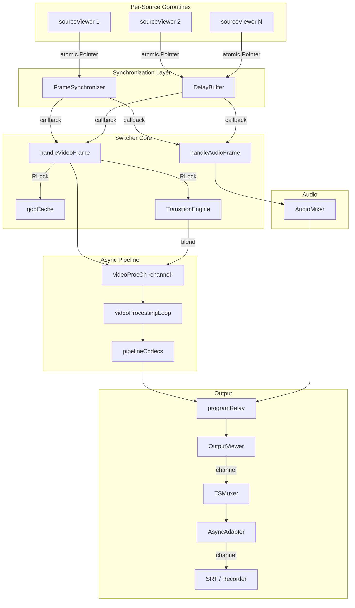
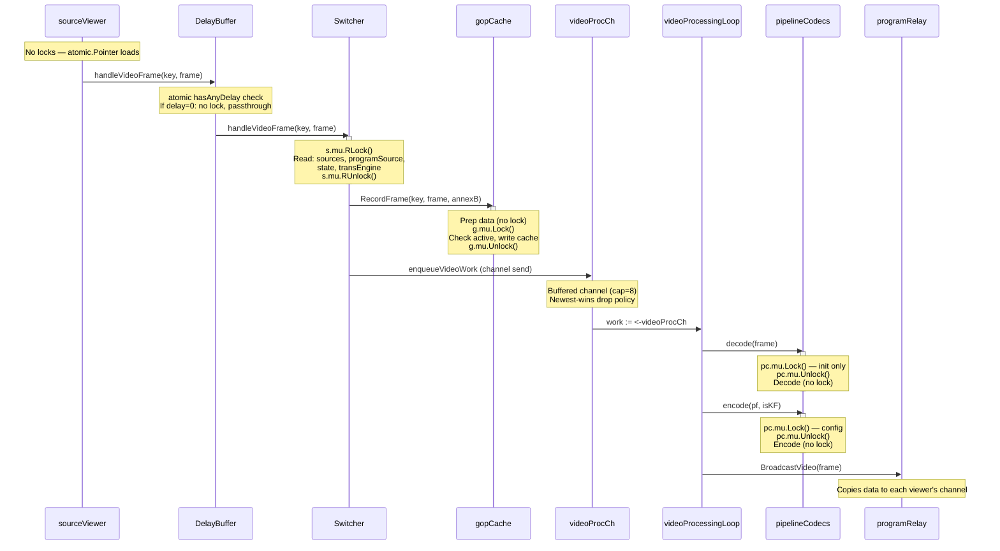
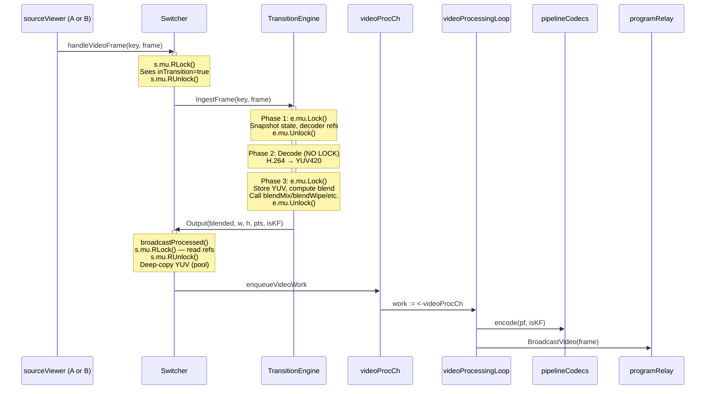
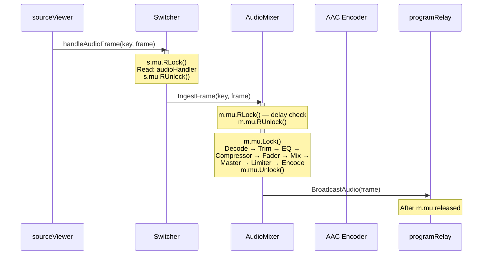
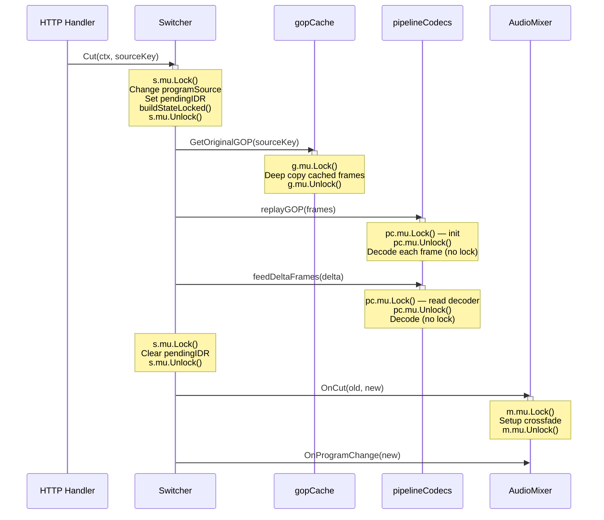
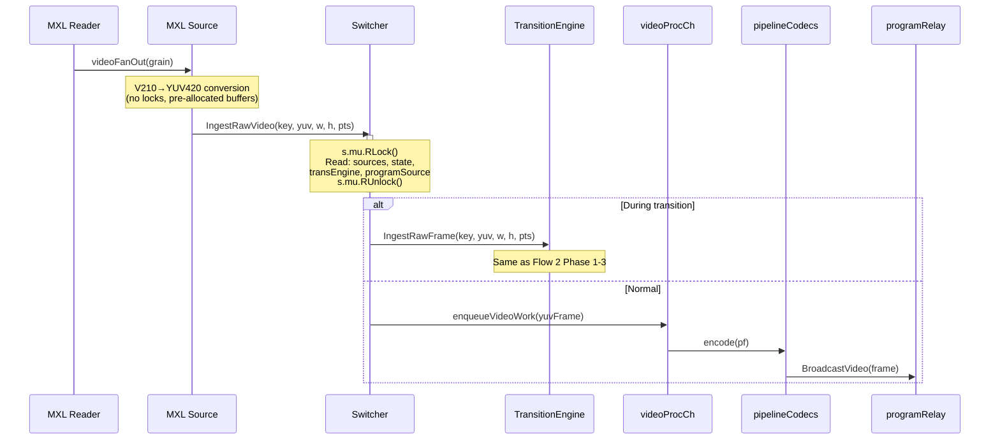
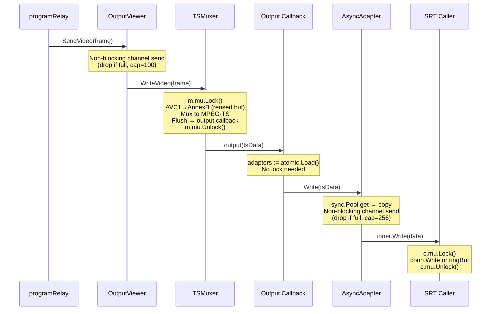
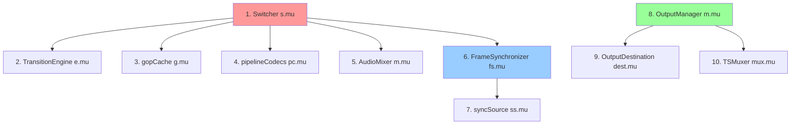

# Locking & Concurrency Model

> How Switchframe routes frames through the pipeline without dropping them,
> and the lock hierarchy that makes it safe.

---

## Architecture Overview

Switchframe processes video at 30–60 fps across multiple goroutines. The design
principle is: **locks protect state, channels transport frames, atomics track
metrics.** No lock is held while doing expensive work (decode, blend, encode).



---

## Lock Inventory

Every lock in the system, what it protects, and its characteristics:

| Component | Field | Type | Protects | Hot Path? |
|-----------|-------|------|----------|-----------|
| Switcher | `s.mu` | `RWMutex` | sources map, programSource, state, transEngine, pipeCodecs | Yes (RLock) |
| FrameSynchronizer | `fs.mu` | `Mutex` | sources map, tickRate, tickNum | Yes (brief) |
| syncSource | `ss.mu` | `Mutex` | per-source ring buffers (video/audio) | Yes (brief) |
| gopCache | `g.mu` | `Mutex` | caches map, activeSources | Yes |
| DelayBuffer | `db.mu` | `Mutex` | sources map | Conditional |
| pipelineCodecs | `pc.mu` | `Mutex` | decoder/encoder state, avc1Buf | Yes (brief) |
| TransitionEngine | `e.mu` | `RWMutex` | state, decoders, YUV buffers, blender | During transitions |
| AudioMixer | `m.mu` | `RWMutex` | channels, mix state, crossfade | Yes |
| TSMuxer | `m.mu` | `Mutex` | muxer, output buffer | Yes |
| OutputManager | `m.mu` | `Mutex` | viewer/muxer lifecycle, adapters | Config only |
| OutputDestination | `dest.mu` | `Mutex` | adapter, active state | Config only |
| ConfidenceMonitor | `cm.mu` | `RWMutex` | JPEG thumbnail, decoder | 1 fps |
| healthMonitor | `hm.mu` | `RWMutex` | source status map | Periodic |

### Lock-Free Components

| Component | Field | Type | Purpose |
|-----------|-------|------|---------|
| sourceViewer | `delayBuffer` | `atomic.Pointer` | Hot-swap delay buffer / frame sync |
| sourceViewer | `frameSync` | `atomic.Pointer` | Hot-swap frame synchronizer |
| sourceViewer | `videoSent` etc. | `atomic.Int64` | Per-source counters (cache-line padded) |
| DelayBuffer | `stopped` | `atomic.Bool` | Lock-free check in timer callbacks |
| sourceDelay | `generation` | `atomic.Uint64` | Invalidate in-flight timer callbacks |
| DelayBuffer | `hasAnyDelay` | `atomic.Bool` | Skip lock when no sources have delay |
| OutputManager | `adapters` | `atomic.Pointer` | Lock-free read in muxer callback |
| Switcher | 30+ fields | `atomic.Int64` etc. | Metrics counters (never locked) |
| pipelineCodecs | `replayGOP*` | `atomic.Int64` | Replay stats |

### Pools

| Pool | Location | Seed Size | Purpose |
|------|----------|-----------|---------|
| `yuvPool` | `processing_frame.go` | 1080p (3.1 MB) | YUV420 frame buffers |
| `avc1Pool` | `pipeline_codecs.go` | 64 KB | Encoded AVC1 output |
| `gopBufPool` | `gop_cache.go` | 64 KB | GOP cache deep-copy buffers |
| `tsPacketPool` | `async_adapter.go` | 64 KB | MPEG-TS packet batches |
| `lanczosIntermPool` | `scaler_lanczos.go` | 1080p (5.5 MB) | Lanczos horizontal pass float32 intermediates |

### Atomic Caches

| Cache | Location | Size | Purpose |
|-------|----------|------|---------|
| `kernelCache` | `scaler_lanczos.go` | 8 entries | Precomputed Lanczos-3 kernel weights (keyed by src/dst size) |

---

## Frame Flow Diagrams

### Flow 1: Normal Video Frame (No Transition)

The most common path — a single source is on program, frames flow straight through.



**Lock sequence:** `s.mu` RLock → release → `g.mu` Lock → release → `pc.mu` Lock → release (×2)

**Total locks on hot path:** 3 mutex acquisitions, all brief, none nested.

---

### Flow 2: Video Frame During Transition

Two sources feed the transition engine; blended output goes through the async pipeline.



**Lock sequence:** `s.mu` RLock → `e.mu` Lock → release → (decode) → `e.mu` Lock → release → `s.mu` RLock → release → `pc.mu` Lock → release

**Key insight:** The transition engine releases its lock between decode and blend, and before calling the Output callback. This prevents the engine lock from blocking other sources' ingestion.

---

### Flow 3: Audio Frame

Audio frames flow through the mixer, which has its own lock independent of the video path.



**Lock sequence:** `s.mu` RLock → release → `m.mu` RLock → release → `m.mu` Lock → release

**Note:** The full mix cycle (decode through encode) runs under `m.mu` Lock. This is acceptable because audio frames are small (~500 bytes AAC) and the cycle is fast (~0.5ms). The lock is released before broadcast.

---

### Flow 4: Cut Operation

A cut changes the program source and triggers GOP replay to warm the decoder.



**Lock sequence:** `s.mu` Lock → release → `g.mu` Lock → release → `pc.mu` Lock → release (×2) → `s.mu` Lock → release → `m.mu` Lock → release

**Key insight:** Each lock is acquired and released independently — no nesting. The Cut operation is sub-millisecond for the state change; the GOP replay runs without holding `s.mu`.

---

### Flow 5: MXL Raw Video Frame

MXL sources bypass the Prism relay and deliver raw YUV420 directly.



**Lock sequence:** `s.mu` RLock → release → (same as Flow 1 or 2 from here)

**Key insight:** MXL frames skip the GOP cache (no AVC1 data to cache) and skip the delay buffer / frame sync (raw YUV is already synchronized by MXL's shared memory clock).

---

### Flow 6: Output Path

From program relay through MPEG-TS muxing to SRT or file.



**Lock sequence:** `mux.mu` Lock → release → (atomic load) → `srt.mu` Lock → release

**Key insight:** The `AsyncAdapter` decouples the muxer from slow SRT writes. The adapters list uses `atomic.Pointer` so the muxer callback never needs the OutputManager lock.

---

## Lock Ordering Rules

These rules prevent deadlocks. Every lock acquisition follows this hierarchy — a goroutine holding a lower-numbered lock never acquires a higher-numbered one.



### Rules

1. **Switcher (`s.mu`) is always released** before acquiring any other lock.
   - `handleVideoFrame`: RLock → release → then call gopCache, transEngine, etc.
   - `Cut`: Lock → release → then call gopCache, pipelineCodecs, mixer.

2. **FrameSynchronizer uses two-level locking:** `fs.mu` (global) then `ss.mu` (per-source). Never reversed.

3. **OutputManager releases before viewer/muxer stop:** `stopMuxerLocked` releases `m.mu` before calling `viewer.Stop()` to avoid deadlock with the muxer output callback.

4. **No cross-subsystem lock nesting:** The video pipeline (Switcher → gopCache → pipelineCodecs) and the audio pipeline (Switcher → Mixer) never hold each other's locks simultaneously.

5. **Transition engine releases before callbacks:** `IngestFrame` releases `e.mu` before calling `Output`, preventing the engine lock from blocking the switcher's broadcast path.

---

## Concurrency Patterns

### Pattern 1: Read-Copy-Update (RCU) Style

The switcher hot path reads state under RLock, copies values to locals, releases the lock, then processes without any lock:

```
handleVideoFrame:
    s.mu.RLock()
    programSource := s.programSource     ← copy to local
    state := s.state                     ← copy to local
    engine := s.transEngine              ← copy pointer
    ss := s.sources[sourceKey]           ← copy pointer
    s.mu.RUnlock()
    ... process using locals (no lock) ...
```

This means writes (Cut, SetPreview) only block briefly to update fields.

### Pattern 2: Lock-Free Fast Path

The delay buffer checks `hasAnyDelay.Load()` before locking. When no source has delay (the common case), the frame passes through with zero lock acquisitions:

```
handleVideoFrame:
    if !db.hasAnyDelay.Load() {          ← atomic, no lock
        db.handler.handleVideoFrame(...)  ← direct call
        return
    }
    db.mu.Lock()                          ← only when delay is active
    ...
```

### Pattern 3: Prepare Outside, Commit Under Lock

The GOP cache does expensive work (AnnexB conversion, deep copy) without holding its lock, then acquires the lock only for the final map write:

```
RecordFrame:
    annexB := AVC1ToAnnexBInto(...)      ← no lock (expensive)
    orig := deepCopy(frame)               ← no lock (expensive)

    g.mu.Lock()                           ← brief
    if !active { putGOPBuf(annexB); return }
    g.caches[key] = append(cache, cf)
    g.mu.Unlock()
```

### Pattern 4: Atomic Pointer Swap

The OutputManager updates its adapter list under lock, but stores it in an `atomic.Pointer` so the muxer callback can read it lock-free:

```
rebuildAdaptersLocked:                    ← called under m.mu
    list := buildAdapterList()
    m.adapters.Store(&list)               ← atomic store

output callback:                          ← called from muxer (no m.mu)
    adapters := m.adapters.Load()         ← atomic load, no lock
    for _, a := range *adapters { ... }
```

### Pattern 5: Channel as Backpressure

The video processing channel (`videoProcCh`, cap=8) decouples frame ingestion from encoding. When the encoder falls behind, the newest-wins drop policy discards the oldest frame:

```
enqueueVideoWork:
    select {
    case s.videoProcCh <- work:           ← normal: enqueue
    default:
        <-s.videoProcCh                   ← drop oldest
        s.videoProcCh <- work             ← enqueue newest
    }
```

---

## Per-Frame Lock Budget

At 30 fps, each frame has a 33ms budget. Here's the lock overhead per frame:

| Lock | Acquisitions/frame | Hold time | Total |
|------|--------------------|-----------|-------|
| `s.mu` RLock | 2–3 | ~100ns each | ~300ns |
| `g.mu` Lock | 1 | ~200ns | ~200ns |
| `pc.mu` Lock | 2 (decode + encode) | ~100ns each | ~200ns |
| `mux.mu` Lock | 1 | ~500ns | ~500ns |
| **Total lock overhead** | | | **~1.2µs** |
| **Frame budget** | | | **33,000µs** |
| **Lock overhead %** | | | **0.004%** |

The actual expensive work (decode: ~2ms, blend: ~1ms, encode: ~5ms) runs entirely without locks.

---

## Deadlock-Free Guarantees

The system is deadlock-free because:

1. **No circular dependencies:** Lock ordering is a strict DAG (diagram above).
2. **No lock held during expensive operations:** Decode, blend, encode run outside all locks.
3. **No lock held across goroutine boundaries:** Every lock is acquired and released within the same function call (or deferred).
4. **Channels never block producers on the hot path:** All channel sends use `select` with `default` for non-blocking behavior.
5. **OutputManager releases lock before waiting:** `stopMuxerLocked` explicitly releases `m.mu` before `viewerWg.Wait()`.
