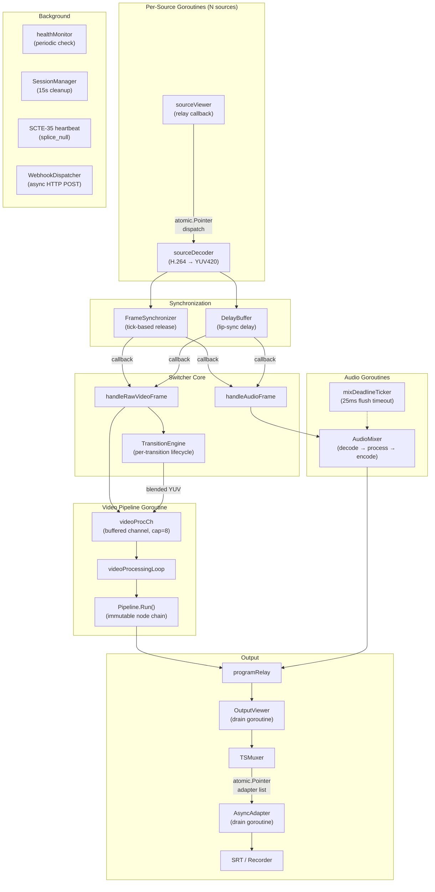
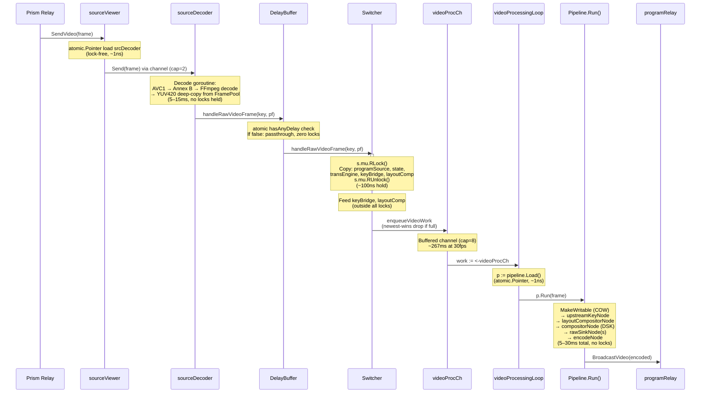
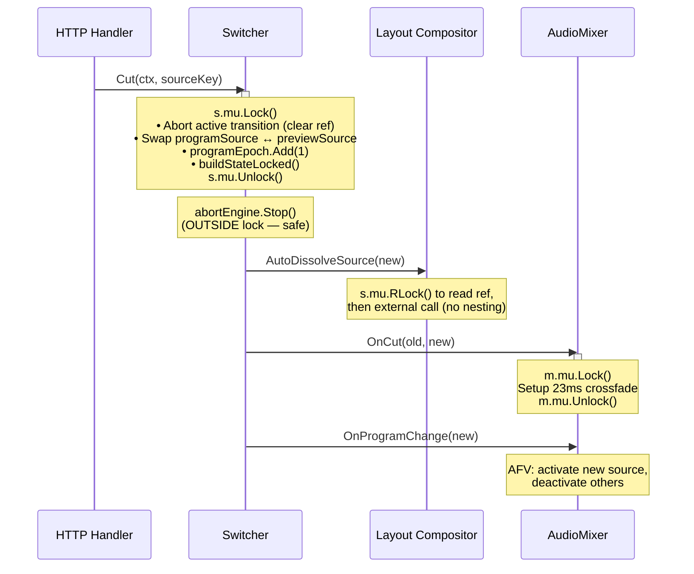
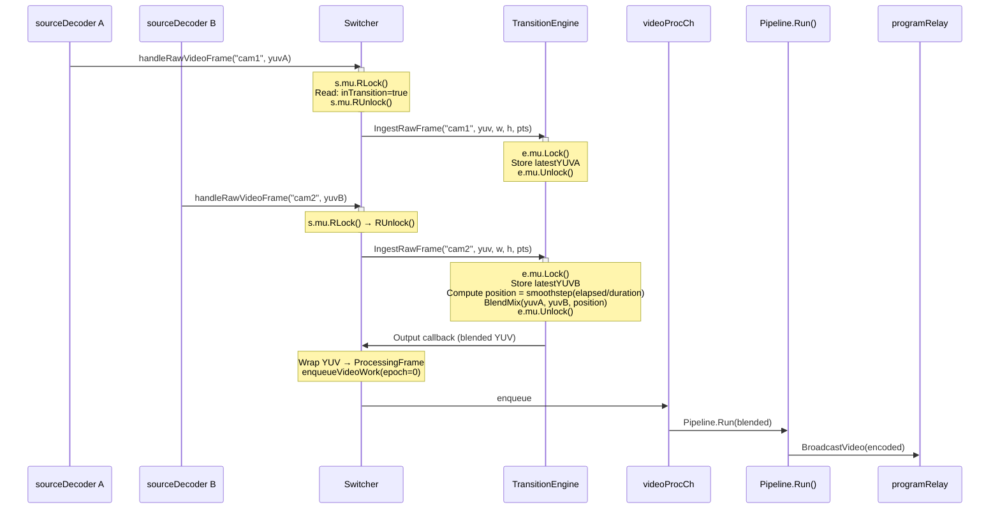
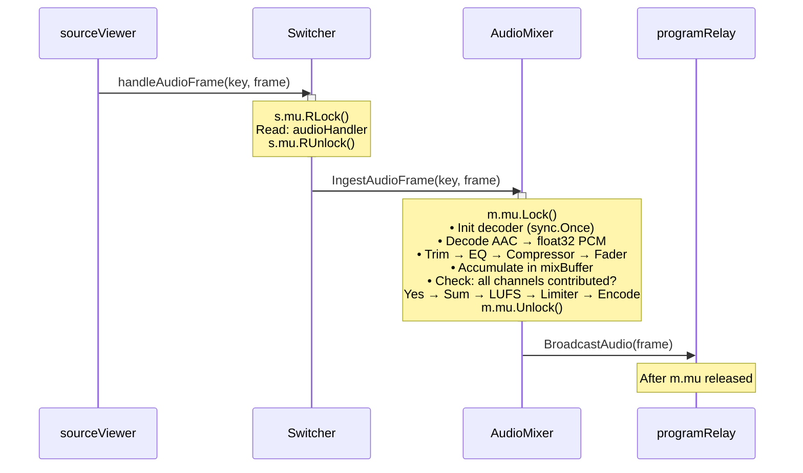
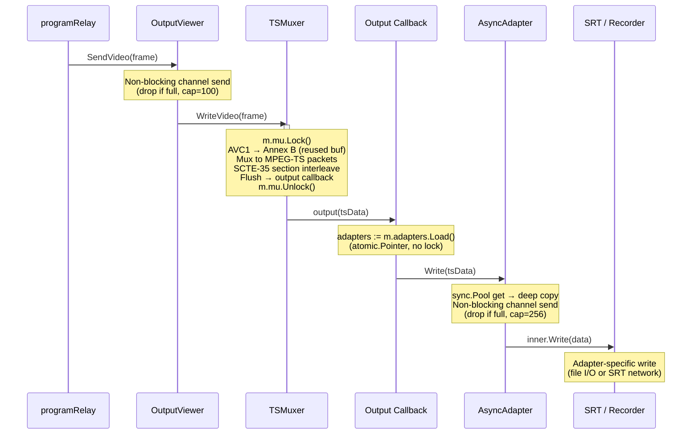
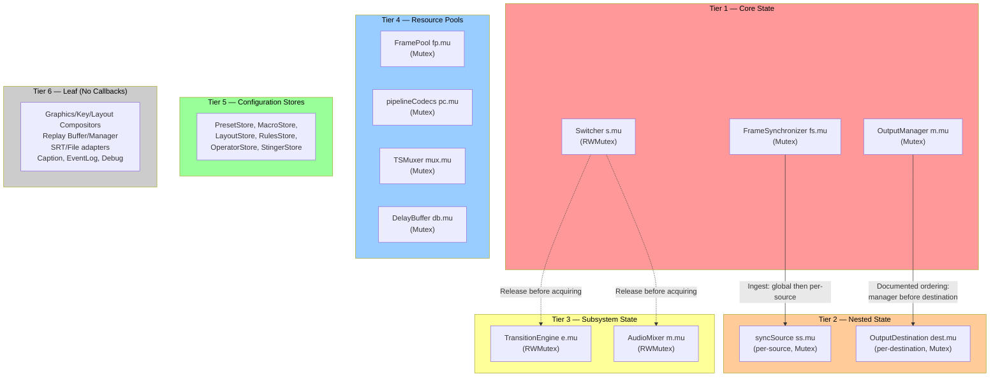

# Locking & Concurrency Model

1. [Design Philosophy](#1-design-philosophy)
2. [Goroutine Architecture](#2-goroutine-architecture)
3. [A Frame Flows Through](#3-a-frame-flows-through)
4. [A Cut Changes Program](#4-a-cut-changes-program)
5. [Two Sources Dissolve](#5-two-sources-dissolve)
6. [Audio Mixes](#6-audio-mixes)
7. [Output Delivers](#7-output-delivers)
8. [Lock Inventory](#8-lock-inventory)
9. [Lock-Free Inventory](#9-lock-free-inventory)
10. [Lock Ordering](#10-lock-ordering)
11. [Concurrency Patterns](#11-concurrency-patterns)
12. [Per-Frame Budget](#12-per-frame-budget)
13. [Deadlock-Free Guarantees](#13-deadlock-free-guarantees)

---

## 1. Design Philosophy

SwitchFrame processes video at 30--60 fps across dozens of goroutines. Three rules govern the concurrency model:

1. **Locks protect state, channels transport frames, atomics track metrics.** No lock is held while doing expensive work (decode, blend, encode).
2. **Every lock has a tier.** A goroutine holding a tier-N lock never acquires a tier-(N-1) lock. This strict ordering makes deadlocks structurally impossible.
3. **The hot path is sub-microsecond.** Lock hold times on the per-frame video path total under 1 us, leaving 99.997% of the 33 ms frame budget for actual processing.

The system has ~70 mutexes, ~130 atomic variables, ~90 channels, and 9 long-lived goroutines. This document maps the architecturally significant ones to their roles.

---

## 2. Goroutine Architecture

Each long-lived goroutine owns a specific piece of the pipeline. They communicate through buffered channels and atomic pointers -- never by sharing locked state across goroutine boundaries.



### Long-Lived Goroutines

| Goroutine | Started | Stopped | Purpose |
|-----------|---------|---------|---------|
| `videoProcessingLoop` | `New()` | `Close()` via `videoProcDone` | Drain `videoProcCh`, run pipeline, broadcast |
| `sourceDecoder.decodeLoop` | `RegisterSource()` | Channel close → `done` signal | Per-source H.264 → YUV420 decode |
| `mixDeadlineTicker` | `NewMixer()` | `stopTicker` close + `tickerWg.Wait()` | 25ms flush timeout for audio mix cycle |
| `OutputViewer.Run` | First output starts | `stopCh` close + `done` signal | Drain video/audio/caption to muxer |
| `AsyncAdapter.drain` | `NewAsyncAdapter()` | `stopCh` close + `doneCh` signal | Non-blocking write to slow outputs |
| `healthMonitor.checkLoop` | `start()` | `stopCh` close + `done` signal | Periodic source health with hysteresis |
| `SessionManager.cleanupLoop` | `NewSessionManager()` | `ctx.Done()` + `done` signal | 15s stale operator session cleanup |
| `SCTE-35 heartbeat` | `Injector.Start()` | `heartbeatStop` close | Periodic splice_null emission |
| `WebhookDispatcher.worker` | `NewWebhookDispatcher()` | `queue` close + `done` signal | Async SCTE-35 webhook POST |

### Per-Event Goroutines

Short-lived goroutines are spawned for specific events and guarded against duplication:

| Trigger | Guard | Lifetime |
|---------|-------|----------|
| SRT reconnect | `reconnecting` atomic CAS | Until connection succeeds or caller closes |
| Graphics fade/animation | `fadeDone`/`animDone` channels | Until animation completes or is cancelled |
| Delayed frame delivery | Generation counter + `stopped` atomic | Single `time.AfterFunc` callback |
| Replay playback | `context.WithCancel()` + `sync.Once` | Until `Stop()` or clip ends |
| Demo frame generation | `context.WithCancel()` | Until demo stops |
| SRT per-connection writer | `context.WithCancel()` per conn | Until connection removed |

---

## 3. A Frame Flows Through

The most common path: a single source is on program, no transition active. This is the hot path that runs 30--60 times per second.



### Lock Acquisitions on This Path

| Step | Lock | Hold Time | Purpose |
|------|------|-----------|---------|
| `FramePool.Acquire()` | `fp.mu` (Mutex) | ~50ns | LIFO pop from pre-allocated buffer stack |
| `handleRawVideoFrame` | `s.mu` (RLock) | ~100ns | Read program source, state, engine pointers |
| `encodeNode.Process()` | `pc.mu` (Mutex) | ~100ns | Check encoder init, update group ID |
| `FramePool.Release()` | `fp.mu` (Mutex) | ~50ns | LIFO push buffer back |

**Total: 4 acquisitions, ~300ns combined. Encode (5–30ms) runs entirely outside all locks.**

---

## 4. A Cut Changes Program

A cut swaps the program source. Because every source is continuously decoded by its own `sourceDecoder` goroutine, cuts are instant -- no keyframe wait, no decoder warmup.



### Lock Sequence

```
s.mu Lock → release → (abort outside lock) → s.mu RLock → release → m.mu Lock → release
```

Each lock is acquired and released independently -- no nesting. The `programEpoch` atomic counter ensures that any in-flight frames from the old source are discarded in `videoProcessingLoop`, preventing wrong-source flashes.

---

## 5. Two Sources Dissolve

During transitions, two sources feed the transition engine with pre-decoded YUV. The engine blends them and outputs to the pipeline.



### Lock Sequence

```
s.mu RLock → release → e.mu Lock → release → (blend, no lock) → s.mu RLock → release → pc.mu Lock → release
```

The transition engine receives raw YUV (no decode step under its lock) and blends in BT.709 colorspace. Transition output uses `epoch=0`, which bypasses the stale-epoch check in `videoProcessingLoop` -- transition frames are always valid regardless of program source changes.

---

## 6. Audio Mixes

Audio flows through the mixer on a path independent of video. The mixer accumulates decoded PCM from all active sources, applies the signal chain, and encodes the mixed output.



### Lock Sequence

```
s.mu RLock → release → m.mu Lock → release
```

The full mix cycle (decode through encode) runs under `m.mu`. This is acceptable because audio frames are small (~500 bytes AAC, ~4KB PCM) and the cycle completes in under 1ms. A background `mixDeadlineTicker` goroutine forces a flush after 25ms if a source stops sending, preventing the pipeline from stalling:

```
mixDeadlineTicker (every 10ms):
    m.mu.Lock()
    if mixStarted && time.Now() > mixDeadline:
        collectMixCycleLocked()
    m.mu.Unlock()
    if outputFrame != nil:
        recordAndOutput(frame)    ← outside lock
```

### Passthrough Optimization

When a single source is at unity gain with no processing enabled (EQ bypassed, compressor bypassed, not muted, master at 0 dB, no active transition), the mixer forwards raw AAC bytes without decoding or re-encoding -- zero CPU for audio. Peak metering still runs so VU meters always have data.

---

## 7. Output Delivers

From program relay through MPEG-TS muxing to SRT or file recording.



### Lock Sequence

```
mux.mu Lock → release → (atomic load, no lock) → adapter-specific lock → release
```

The `AsyncAdapter` decouples the muxer from slow outputs. The adapter list uses `atomic.Pointer` so the muxer callback never needs the `OutputManager` lock -- adapters are rebuilt under `OutputManager.mu` and atomically swapped into the pointer that the callback reads lock-free.

### OutputViewer Priority Select

The output viewer uses a two-stage select to prioritize video over audio, preventing video starvation when audio frames arrive at a higher rate:

```go
// Stage 1: always drain video first
select {
case frame := <-v.videoCh:
    muxer.WriteVideo(frame)
    continue
default:
}
// Stage 2: video, audio, captions, or stop
select {
case frame := <-v.videoCh:
case frame := <-v.audioCh:
case frame := <-v.captionCh:
case <-v.stopCh:
}
```

---

## 8. Lock Inventory

Every mutex in the system, what it protects, and whether it's on the per-frame hot path.

### Core Engine

| Component | Field | Type | Protects | Hot Path? |
|-----------|-------|------|----------|-----------|
| [Switcher](../server/switcher/switcher.go) | `s.mu` | `RWMutex` | sources, programSource, previewSource, state, transEngine, pipeCodecs, compositorRef, keyBridge, layoutCompositor | Yes (RLock) |
| [FramePool](../server/switcher/frame_pool.go) | `fp.mu` | `Mutex` | LIFO free list (pre-allocated YUV420 buffers), hit/miss counters | Yes |
| [FrameSynchronizer](../server/switcher/frame_sync.go) | `fs.mu` | `Mutex` | sources map, tickNum, releases slice | Yes |
| [syncSource](../server/switcher/frame_sync.go) | `ss.mu` | `Mutex` | per-source video/audio ring buffers, PTS tracking, audioQueue | Yes |
| [DelayBuffer](../server/switcher/delay_buffer.go) | `db.mu` | `Mutex` | sources map (delay configs per source) | Conditional |
| [pipelineCodecs](../server/switcher/pipeline_codecs.go) | `pc.mu` | `Mutex` | encoder, groupID, encWidth/Height, lastOutputPTS, avc1Buf, SPS/PPS | Yes |
| [TransitionEngine](../server/transition/engine.go) | `e.mu` | `RWMutex` | state, position, decoders, YUV buffers, blender | During transitions |
| [healthMonitor](../server/switcher/health.go) | `hm.mu` | `RWMutex` | source status map, pending status, consecutive counts | Periodic |

### Audio

| Component | Field | Type | Protects | Hot Path? |
|-----------|-------|------|----------|-----------|
| [AudioMixer](../server/audio/mixer.go) | `m.mu` | `RWMutex` | channels, masterLevel, mixBuffer, crossfade state, stinger audio, outputPTS | Yes |
| [AudioDelayBuffer](../server/audio/delay_buffer.go) | `db.mu` | `Mutex` | delayMs, ring buffer (head/tail/count/frames) | Yes |

### Output

| Component | Field | Type | Protects | Hot Path? |
|-----------|-------|------|----------|-----------|
| [OutputManager](../server/output/manager.go) | `m.mu` | `Mutex` | viewer, muxer, recorder, destinations, asyncWrappers, lifecycle flags | Config only |
| [OutputDestination](../server/output/destination.go) | `dest.mu` | `Mutex` | config, adapter, active flag | Config only |
| [TSMuxer](../server/output/muxer.go) | `m.mu` | `Mutex` | muxer state, output buffer, SCTE-35 pending sections, annexB/prepend buffers | Yes |
| [FileRecorder](../server/output/recorder.go) | `rec.mu` | `Mutex` | file handle, filename, state, fileBytes, fileIndex | Yes |
| [ConfidenceMonitor](../server/output/confidence.go) | `cm.mu` | `RWMutex` | JPEG thumbnail, lastUpdate, decoder | 1 fps |
| [SRTCaller](../server/output/srt_caller.go) | `c.mu` | `Mutex` | conn, ctx, cancel, ringBuf, backoff | Reconnect |
| [SRTListener](../server/output/srt_listener.go) | `l.mu` | `RWMutex` | conns map (per-connection channels) | Connection mgmt |

### Graphics & Layout

| Component | Field | Type | Protects | Hot Path? |
|-----------|-------|------|----------|-----------|
| [Compositor](../server/graphics/compositor.go) | `c.mu` | `RWMutex` | layers, nextID, sortedIDs, blendScratch, onStateChange | Config only |
| [KeyProcessor](../server/graphics/key_processor.go) | `kp.mu` | `RWMutex` | keys map, onChange, spillWorkBuf, maskBuf | Config only |
| [KeyProcessorBridge](../server/graphics/key_processor_bridge.go) | `b.mu` | `Mutex` | kp, fills map, scaledFills, scaleFunc | Config only |
| [Layout Compositor](../server/layout/compositor.go) | `c.mu` | `Mutex` | fills, scaleBufs, cropBufs, sortedSlots, animations | Config only |

### Replay

| Component | Field | Type | Protects | Hot Path? |
|-----------|-------|------|----------|-----------|
| [replayBuffer](../server/replay/buffer.go) | `b.mu` | `RWMutex` | frames, GOPs, bytesUsed, audioFrames | Background capture |
| [Manager](../server/replay/manager.go) | `m.mu` | `Mutex` | buffers, viewers, markIn/Out, player, playerState | Lifecycle |

### SCTE-35

| Component | Field | Type | Protects | Hot Path? |
|-----------|-------|------|----------|-----------|
| [Injector](../server/scte35/injector.go) | `inj.mu` | `Mutex` | activeEvents, eventLog, muxerSink, rules, ptsFn | Event injection |
| [RuleEngine](../server/scte35/rules.go) | `re.mu` | `RWMutex` | rules slice, defaultAction | Rule evaluation |
| [RulesStore](../server/scte35/rules_store.go) | `rs.mu` | `RWMutex` | path, rules, defaultAction, engine | CRUD |

### Configuration Stores

| Component | Field | Type | Protects | Hot Path? |
|-----------|-------|------|----------|-----------|
| [PresetStore](../server/preset/store.go) | `s.mu` | `RWMutex` | presets slice, filePath | CRUD |
| [MacroStore](../server/macro/store.go) | `s.mu` | `RWMutex` | macros slice, filePath | CRUD |
| [StingerStore](../server/stinger/store.go) | `s.mu` | `RWMutex` | clips map, dir path | CRUD |
| [LayoutStore](../server/layout/store.go) | `s.mu` | `RWMutex` | presets map | CRUD |
| [OperatorStore](../server/operator/store.go) | `s.mu` | `RWMutex` | operators, tokenIdx, filePath | CRUD |
| [SessionManager](../server/operator/session.go) | `sm.mu` | `Mutex` | sessions, locks, onStateChange | Session mgmt |

### Other

| Component | Field | Type | Protects | Hot Path? |
|-----------|-------|------|----------|-----------|
| [CaptionManager](../server/caption/manager.go) | `m.mu` | `Mutex` | mode, encoder, buffer, callbacks | Caption mode |
| [CaptionEncoder](../server/caption/encoder.go) | `e.mu` | `Mutex` | queue, inited flag | Encoding |
| [MXL Writer](../server/mxl/writer.go) | `w.mu` | `Mutex` | audioWriter, audioRate | MXL lifecycle |
| [DemoVideoReader](../server/mxl/demo.go) | `d.mu` | `Mutex` | index, closed | Test patterns |
| [EventLog](../server/debug/event_log.go) | `el.mu` | `Mutex` | events ring buffer, head/idx, count | Debug |
| [API](../server/control/api.go) | `a.macroMu` | `Mutex` | macroState, macroCancel | Macro execution |

---

## 9. Lock-Free Inventory

### Atomic Pointers (Hot-Swap Configuration)

These enable runtime reconfiguration without blocking the frame-processing goroutine:

| Component | Field | Type | Purpose | Hot Path? |
|-----------|-------|------|---------|-----------|
| Switcher | `pipeline` | `atomic.Pointer[Pipeline]` | Immutable node chain, swapped on reconfig | Yes |
| Switcher | `pipelineFormat` | `atomic.Pointer[PipelineFormat]` | Frame budget, encoder FPS | Yes |
| Switcher | `rawVideoSink` | `atomic.Pointer[RawVideoSink]` | MXL output tap (deep copy before encode) | Yes |
| Switcher | `rawMonitorSink` | `atomic.Pointer[RawVideoSink]` | Raw YUV program monitor MoQ track | Yes |
| sourceViewer | `srcDecoder` | `atomic.Pointer[sourceDecoder]` | Per-source H.264 → YUV decoder | Yes |
| sourceViewer | `delayBuffer` | `atomic.Pointer[DelayBuffer]` | Hot-swap delay buffer | Yes |
| sourceViewer | `frameSync` | `atomic.Pointer[FrameSynchronizer]` | Hot-swap frame synchronizer | Yes |
| OutputManager | `adapters` | `atomic.Pointer[[]OutputAdapter]` | Lock-free read in muxer callback | Yes |
| Layout Compositor | `layout` | `atomic.Pointer[Layout]` | Lock-free layout config read | Yes |
| AudioMixer | `rawAudioSink` | `atomic.Pointer[RawAudioSink]` | MXL raw audio output tap | Yes |
| Compressor | `params` | `atomic.Pointer[compressorParams]` | Lock-free parameter updates | Yes |
| MXL Writer | `videoRef` | `atomic.Pointer[videoWriterRef]` | Lock-free video writer ref | Yes |
| MXL Writer | `dataRef` | `atomic.Pointer[dataWriterRef]` | Lock-free data grain writer ref | Yes |
| MXL Writer | `latestV210` | `atomic.Pointer[v210Frame]` | Latest V210 for steady-rate ticker | Yes |
| SRTCaller | `state` | `atomic.Pointer[AdapterState]` | Connection state (lock-free reads) | No |
| SRTCaller | `lastError` | `atomic.Pointer[string]` | Last error message | No |
| SRTListener | `state` | `atomic.Pointer[AdapterState]` | Listener active state | No |
| API | `lastOperator` | `atomic.Pointer[string]` | Graphics state tracking | No |

### Atomic Flags and Counters

| Component | Field | Type | Purpose |
|-----------|-------|------|---------|
| DelayBuffer | `hasAnyDelay` | `atomic.Bool` | Skip lock when no sources have delay (fast path) |
| DelayBuffer | `stopped` | `atomic.Bool` | Prevent stale `time.AfterFunc` callbacks |
| sourceDelay | `generation` | `atomic.Uint64` | Invalidate in-flight timer callbacks on source removal |
| Switcher | `programEpoch` | `atomic.Uint64` | Discard stale-source frames after Cut |
| Switcher | `pipelineEpoch` | `atomic.Uint64` | Downstream format change detection |
| Switcher | `programGroupID` | `atomic.Uint32` | Monotonic GroupIDs across source switches |
| Switcher | `forceNextIDR` | `atomic.Bool` | Force keyframe when new output viewer joins |
| sourceState | `lastGroupID` | `atomic.Uint32` | Lock-free source stats (single-writer pattern) |
| SRTCaller | `reconnecting` | `atomic.Bool` | CAS guard prevents duplicate reconnect goroutines |
| SRTCaller | `pendingIDR` | `atomic.Bool` | Gate writes until keyframe after overflow |
| Limiter | `pendingReset` | `atomic.Bool` | Reset on next `Process()` call |
| Compressor | `pendingReset` | `atomic.Bool` | Reset on next `Process()` call |
| LoudnessMeter | `pendingReset` | `atomic.Bool` | Reset on next `Process()` call |
| SCTE-35 Injector | `closed` | `atomic.Bool` | Guard against post-close operations |
| SCTE-35 Injector | `eventIDCounter` | `atomic.Uint32` | Auto-increment event IDs |
| MXL Writer | `closed` | `atomic.Bool` | Guard against post-close writes |

### Atomic Float64 Encoding

Go has no `atomic.Float64`, so five components store float64 values as `atomic.Uint64` via `math.Float64bits()` / `math.Float64frombits()`:

| Component | Field | Stored Value |
|-----------|-------|-------------|
| Limiter | `gainReductionBits` | Gain reduction in dB (metering reads) |
| Compressor | `gainReductionBits` | Gain reduction in dB (metering reads) |
| LoudnessMeter | `momentaryLUFSBits` | 400ms loudness (LUFS) |
| LoudnessMeter | `shortTermLUFSBits` | 3s loudness (LUFS) |
| LoudnessMeter | `integratedLUFSBits` | Integrated loudness with dual gating (LUFS) |
| sourceDecoder | `avgFrameSizeBits` | EMA frame size for encoder param estimation |
| sourceDecoder | `avgFPSBits` | EMA FPS for encoder param estimation |

### Diagnostic Counters

The Switcher has 30+ `atomic.Int64` fields for instrumentation (cuts, transitions, frame routing, timing, FPS, deadline violations). These are never locked -- single-writer on the processing goroutine, read by the debug snapshot endpoint.

### Cache-Line Padding

The `sourceViewer` struct pads atomic counters to prevent false sharing between cores:

```go
videoSent   atomic.Int64
_pad1       [56]byte   // 56 + 8 = 64 bytes (one cache line)
audioSent   atomic.Int64
_pad2       [56]byte
captionSent atomic.Int64
```

These counters are incremented on every frame delivery from the relay goroutine. Without padding, concurrent access to adjacent atomics on different cache lines would cause cache-line bouncing between CPU cores.

### Memory Pools

| Pool | Location | Type | Seed Size | Purpose |
|------|----------|------|-----------|---------|
| `FramePool` | [`frame_pool.go`](../server/switcher/frame_pool.go) | Mutex-guarded LIFO | 32 × 1080p (97 MB) | YUV420 frame buffers (>99% hit rate) |
| `tsPacketPool` | [`async_adapter.go`](../server/output/async_adapter.go) | `sync.Pool` | 64 KB | MPEG-TS packet batch buffers |
| `lanczosIntermPool` | [`scaler_lanczos.go`](../server/transition/scaler_lanczos.go) | `sync.Pool` | 1080p floats | Lanczos horizontal pass intermediates |
| `boxShrinkPool` | [`scaler_lanczos.go`](../server/transition/scaler_lanczos.go) | `sync.Pool` | 1080p bytes | Box pre-shrink intermediate buffers |
| `crossfadeGainPool` | [`crossfade.go`](../server/audio/crossfade.go) | `sync.Pool` | 2048 floats | Gain buffers for SIMD crossfade |
| `crossfadePadPool` | [`crossfade.go`](../server/audio/crossfade.go) | `sync.Pool` | 2048 floats | Zero-padded input for length mismatch |

The custom `FramePool` uses LIFO ordering (stack discipline) to keep hot buffers in L1/L2 cache, achieving >99% hit rate versus ~19% with Go's `sync.Pool` (which periodically drains on GC). The pool never grows -- if exhausted, `Acquire()` falls back to `make()` (logged as a miss).

---

## 10. Lock Ordering

Locks are organized into tiers. A goroutine holding a tier-N lock may acquire a tier-(N+1) lock, but never a tier-(N-1) lock. This strict ordering makes circular dependencies -- and therefore deadlocks -- structurally impossible.



### Rules

1. **Switcher releases before calling out.** `handleRawVideoFrame` copies pointers under RLock, releases, then calls transition engine, key bridge, and layout compositor with no lock held. `Cut` releases `s.mu` before calling `mixer.OnCut()`.

2. **FrameSynchronizer uses two-level locking.** `fs.mu` (global) is held briefly to look up the per-source `syncSource`, then released. `ss.mu` (per-source) is acquired for ring buffer operations. Frame delivery callbacks fire after both locks are released.

3. **OutputManager releases before stopping.** `stopMuxerLocked` explicitly releases `m.mu` before calling `viewer.Stop()` to avoid deadlock with the muxer output callback (which reads the adapter list via atomic pointer). The lock ordering (`OutputManager.mu` → `OutputDestination.mu`) is documented in the struct comment.

4. **No cross-subsystem lock nesting.** Video (Switcher → Pipeline → pipelineCodecs) and audio (Switcher → Mixer) never hold each other's locks simultaneously. The Pipeline itself uses no locks -- it's immutable once built and replaced via `atomic.Pointer` swap.

5. **Transition engine releases before callbacks.** `IngestRawFrame` processes the blend under `e.mu`, then releases before the output callback fires, preventing the engine lock from blocking the switcher's broadcast path.

6. **All state callbacks fire outside locks.** Every component captures the callback function pointer under lock, releases, then invokes it. This applies to Switcher state broadcast, OutputManager state changes, graphics compositor state changes, operator session changes, and SCTE-35 event notifications.

---

## 11. Concurrency Patterns

### Pattern 1: Read-Copy-Update (RCU)

The switcher hot path reads state under RLock, copies values to locals, releases, then processes:

```go
handleRawVideoFrame:
    s.mu.RLock()
    programSource := s.programSource     // copy to local
    state := s.state                     // copy to local
    engine := s.transEngine              // copy pointer
    keyBridge := s.keyBridge             // copy pointer
    layoutComp := s.layoutCompositor     // copy pointer
    s.mu.RUnlock()
    // ... process using locals, no lock held ...
```

Writes (`Cut`, `SetPreview`, `StartTransition`) only block briefly to update fields. RLock contention is near-zero because multiple frame-handling goroutines can read concurrently.

### Pattern 2: Atomic Fast Path

The delay buffer checks an atomic flag before locking. When no source has delay (the common case), frames pass through with zero lock acquisitions:

```go
handleVideoFrame:
    if !db.hasAnyDelay.Load() {          // atomic check, ~1ns
        db.handler.handleVideoFrame(...) // direct passthrough
        return
    }
    db.mu.Lock()                         // only when delay is configured
    // ... schedule time.AfterFunc ...
    db.mu.Unlock()
```

### Pattern 3: Prepare Outside, Commit Under Lock

`pipelineCodecs.encode()` holds its mutex only for state checks and commits, not for the expensive H.264 encode:

```go
pc.mu.Lock()
encoder := pc.encoder                   // check encoder init
pc.mu.Unlock()                          // release before expensive work

encoded, isKF := encoder.Encode(yuv)    // 5-30ms, no lock

pc.mu.Lock()                            // brief commit
pc.groupID = ...
pc.mu.Unlock()
```

### Pattern 4: Atomic Pointer Swap

Three critical subsystems use atomic pointer swap for zero-downtime reconfiguration:

**Pipeline swap** -- when configuration changes (compositor toggled, key added, graphics layer enabled), a new `Pipeline` is built on the main goroutine and swapped in. The old pipeline drains in-flight frames via `sync.WaitGroup` in a background goroutine:

```go
swapPipeline:
    newPipeline := buildPipeline(...)
    old := s.pipeline.Swap(&newPipeline) // atomic, ~1ns
    s.drainWg.Add(1)
    go func() {
        old.Wait()                       // drain in-flight
        old.Close()                      // release resources
        s.drainWg.Done()
    }()
```

**Adapter list swap** -- OutputManager rebuilds the adapter slice under its mutex, then stores it atomically. The muxer callback reads it lock-free:

```go
rebuildAdaptersLocked:                   // called under m.mu
    list := buildAdapterList()
    m.adapters.Store(&list)              // atomic store

output callback:                         // called from muxer, no m.mu
    adapters := m.adapters.Load()        // atomic load, ~1ns
    for _, a := range *adapters { ... }
```

**Layout swap** -- `SetLayout` stores the new layout atomically. `ProcessFrame` reads it lock-free on the pipeline goroutine.

### Pattern 5: Channel Backpressure (Newest-Wins)

The video processing channel (`videoProcCh`, cap=8) decouples frame ingestion from encoding. When the encoder falls behind, the oldest frame is discarded:

```go
enqueueVideoWork:
    select {
    case s.videoProcCh <- work:          // normal: enqueue
    default:
        <-s.videoProcCh                  // drop oldest
        s.videoProcCh <- work            // enqueue newest
        s.videoProcDropped.Add(1)
    }
```

This is correct for live video: a stale frame is always less valuable than the current one. The dropped frame counter is exposed in the debug snapshot.

### Pattern 6: Generation Counter

The `DelayBuffer` uses a generation counter to safely invalidate in-flight `time.AfterFunc` callbacks when a source is removed:

```go
SetDelay:
    sd.generation.Add(1)                 // invalidate pending callbacks
    gen := sd.generation.Load()

    time.AfterFunc(delay, func() {
        if db.stopped.Load() { return }  // buffer closed
        if sd.generation.Load() != gen { // source removed/reconfigured
            return
        }
        db.handler.handleVideoFrame(...) // safe to deliver
    })
```

No lock needed in the callback -- atomic reads are sufficient.

### Pattern 7: CAS Guard

SRT caller uses compare-and-swap to ensure exactly one reconnect goroutine runs:

```go
Write (on failure):
    if c.reconnecting.CompareAndSwap(false, true) {
        go c.reconnectLoop()             // spawned at most once
    }
```

### Pattern 8: Epoch-Based Stale Frame Detection

When a cut happens, the `programEpoch` is incremented atomically. Frames enqueued before the cut carry the old epoch and are silently discarded:

```go
Cut:
    s.programEpoch.Add(1)

enqueueVideoWork:
    work.epoch = s.programEpoch.Load()

videoProcessingLoop:
    if work.epoch != 0 && work.epoch != s.programEpoch.Load() {
        s.programEpochStale.Add(1)
        return                           // discard stale frame
    }
```

Transition engine output uses `epoch=0`, which bypasses the check -- transition frames are always valid.

---

## 12. Per-Frame Budget

At 30 fps, each frame has a 33,333 us budget. Here's where lock time goes:

| Lock | Acquisitions/frame | Hold Time | Total |
|------|--------------------|-----------|-------|
| `fp.mu` (FramePool) | 2 (acquire + release) | ~50ns each | ~100ns |
| `s.mu` RLock (Switcher) | 1--2 | ~100ns each | ~200ns |
| `pc.mu` (pipelineCodecs) | 2 (check + commit) | ~100ns each | ~200ns |
| **Total lock overhead** | | | **~500ns** |
| **Frame budget** | | | **33,333,000ns** |
| **Lock overhead %** | | | **0.0015%** |

The actual expensive work runs entirely without locks:

| Operation | Duration | Locks Held |
|-----------|----------|------------|
| H.264 decode (FFmpeg) | 5--15ms | None (sourceDecoder goroutine) |
| YUV blend (transition) | 1--3ms | None (after `e.mu` release) |
| Pipeline nodes (key, PIP, DSK) | 0.5--2ms | None (immutable pipeline) |
| H.264 encode (x264/HW) | 5--30ms | None (released before encode) |
| MPEG-TS mux | 0.5--2ms | `mux.mu` (downstream, not on hot path) |

---

## 13. Deadlock-Free Guarantees

The system is deadlock-free because five structural properties hold simultaneously:

1. **No circular dependencies.** Lock ordering is a strict DAG. Every acquisition follows the tier hierarchy in [Section 10](#10-lock-ordering). There is no path from a lower tier back to a higher tier.

2. **No lock held during expensive operations.** Decode, blend, encode, and I/O run outside all locks. The maximum lock hold time on the hot path is ~100ns (pointer copy under RLock).

3. **No lock held across goroutine boundaries.** Every lock is acquired and released within the same function call (or deferred). No lock is passed to another goroutine or held across a channel send/receive.

4. **Channels never block producers on the hot path.** All hot-path channel sends use `select { default: }` for non-blocking behavior. The `videoProcCh`, `OutputViewer` channels, and `AsyncAdapter` buffer all use newest-wins or drop-on-full policies.

5. **Timeout-based forward progress.** The audio mixer's 25ms deadline ticker prevents indefinite waits if sources stop sending. The transition engine's 10-second watchdog aborts stuck transitions. SRT reconnect uses exponential backoff with a 30-second ceiling. The operator session manager cleans up stale sessions every 15 seconds.

---

## Further Reading

| | |
|---|---|
| **[Architecture](architecture.md)** | System design, data flow, design decisions |
| **[Pipeline](pipeline.md)** | Processing nodes, frame pool, atomic swap internals |
| **[SCTE-35](scte35.md)** | Ad insertion, rules engine, SCTE-104 integration |
| **[MXL](mxl.md)** | Shared-memory transport, V210 format, NMOS discovery |
| **[API Reference](api.md)** | REST endpoints with request/response examples |
| **[Deployment](deployment.md)** | CLI flags, Docker, TLS, monitoring |
