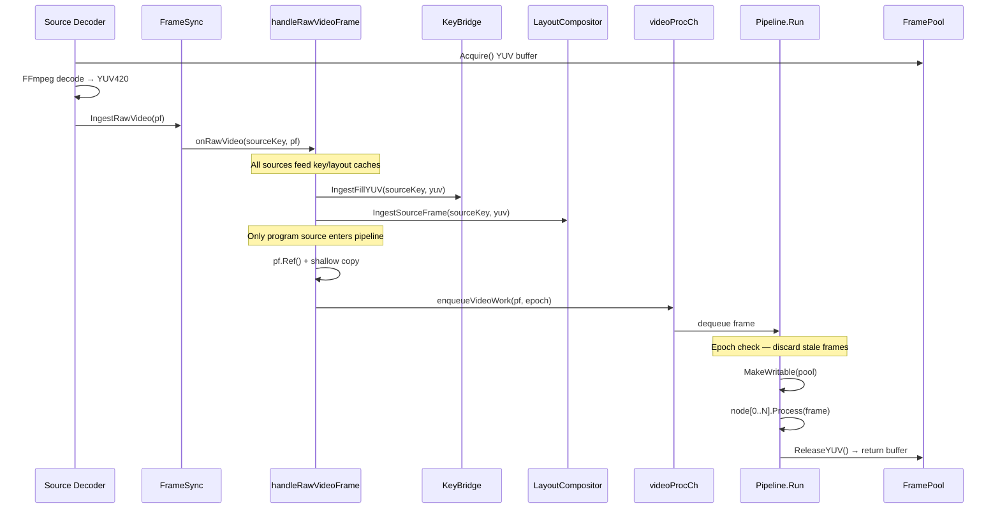
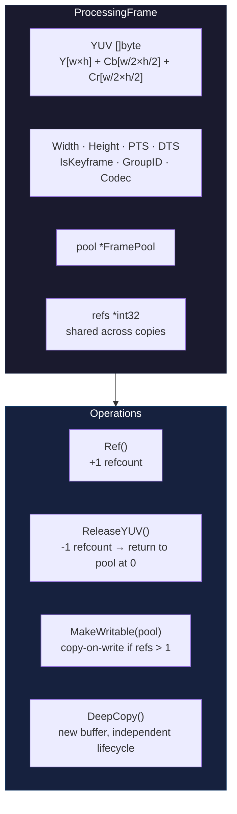
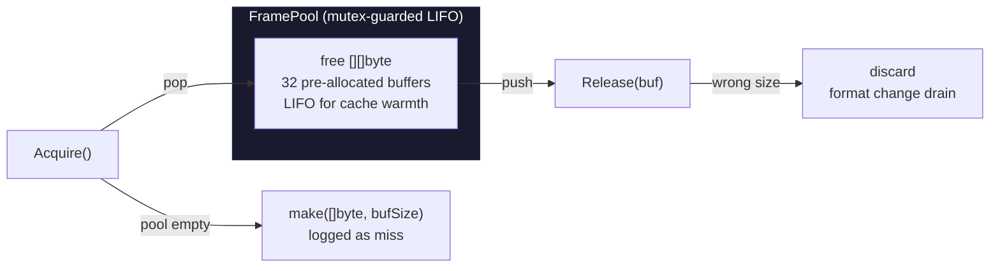
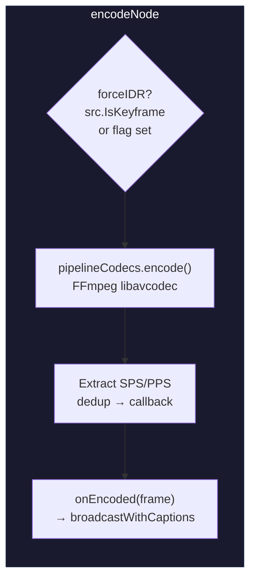
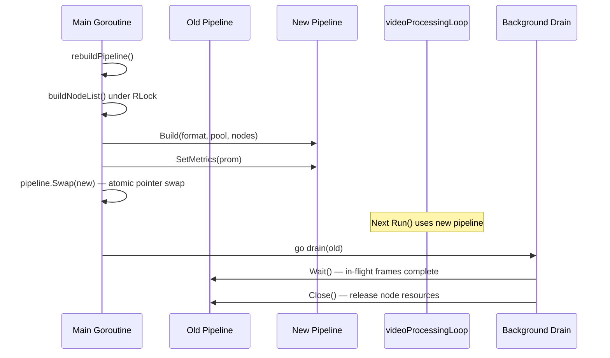
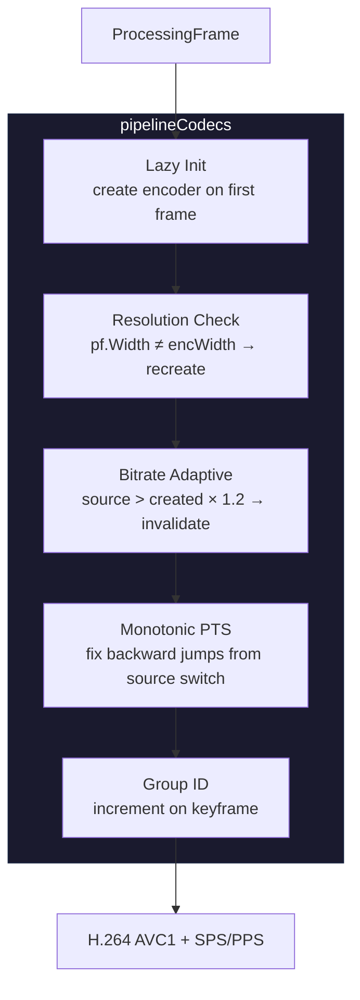
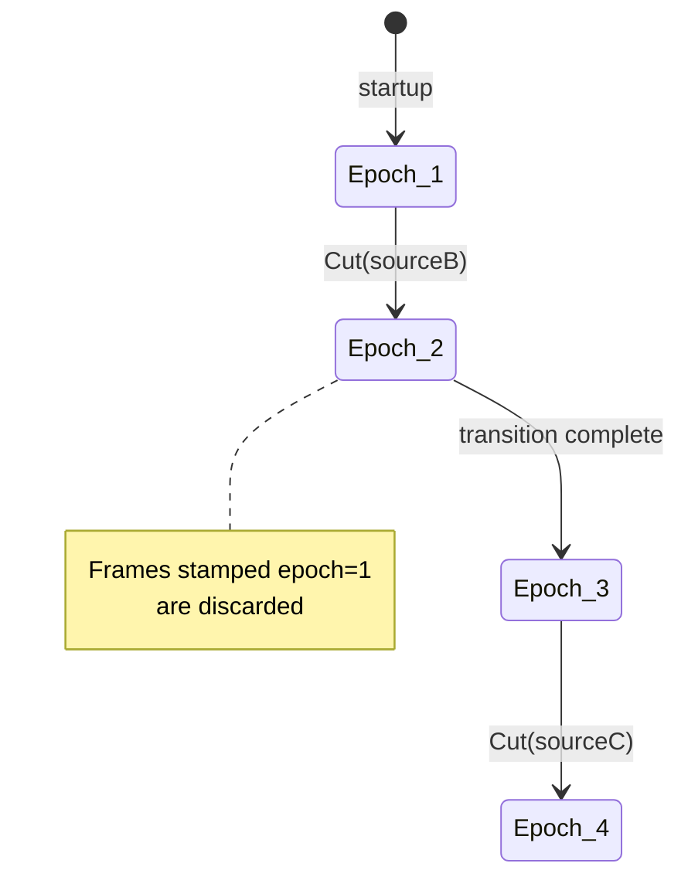

# Video Processing Pipeline

The pipeline transforms decoded YUV420 frames into H.264 program output. It is a chain of immutable processing nodes, atomically swapped at runtime for zero-frame-drop reconfiguration.

**Contents:** [Node Chain](#1-the-node-chain) · [Frame Lifecycle](#2-frame-lifecycle) · [ProcessingFrame](#3-processingframe) · [FramePool](#4-framepool) · [PipelineNode Interface](#5-pipelinenode-interface) · [Node Implementations](#6-node-implementations) · [Atomic Swap](#7-atomic-swap) · [Encoder Management](#8-encoder-management) · [Program Epoch](#9-program-epoch) · [Instrumentation](#10-instrumentation) · [Performance](#11-performance) · [Raw Program Monitor](#12-raw-program-monitor-wire-format)

---

## 1. The Node Chain

```mermaid
flowchart LR
    subgraph src ["Source Decoders"]
        style src fill:#1a1a2e,color:#fff,stroke:#16213e
        SD["Per-Source\nH.264 → YUV420"]
        MXL["MXL\nV210 → YUV420"]
    end

    subgraph sync ["Frame Routing"]
        style sync fill:#16213e,color:#fff,stroke:#0f3460
        FS["FrameSync\nalign timing"]
        DB["DelayBuffer\nlip-sync"]
        HRV["handleRawVideoFrame()"]
    end

    subgraph ch ["Async Handoff"]
        style ch fill:#0f3460,color:#fff,stroke:#533483
        VPC["videoProcCh\n8-frame buffer"]
    end

    subgraph pipeline ["Pipeline.Run()"]
        style pipeline fill:#533483,color:#fff,stroke:#e94560
        MW["MakeWritable\ncopy-on-write"]
        UK["upstream-key\nchroma / luma"]
        LC["layout-compositor\nPIP / split"]
        DSK["compositor\nDSK graphics"]
        RS1["raw-sink-mxl"]
        RS2["raw-sink-monitor"]
        ENC["h264-encode"]
    end

    subgraph out ["Program Output"]
        style out fill:#e94560,color:#fff,stroke:#e94560
        BR["programRelay\nBroadcastVideo()"]
    end

    SD --> FS
    MXL --> DB
    FS --> HRV
    DB --> HRV
    HRV --> VPC
    VPC --> MW --> UK --> LC --> DSK --> RS1 --> RS2 --> ENC --> BR
```



Six processing nodes execute in a fixed order on a single dedicated goroutine. Each node is a thin wrapper around an existing subsystem — the pipeline provides the sequencing, timing, and lifecycle management.

| Node | Subsystem | In-Place | Latency | Active When |
|------|-----------|----------|---------|-------------|
| `upstream-key` | [`KeyProcessorBridge`](../server/graphics/key_processor_bridge.go) | Yes | 100μs | Keys enabled with cached fills |
| `layout-compositor` | [`layout.Compositor`](../server/layout/compositor.go) | Yes | 1ms | Layout has enabled slots |
| `compositor` | [`graphics.Compositor`](../server/graphics/compositor.go) | Yes | 200μs | Graphics layers active |
| `raw-sink-mxl` | MXL shared-memory output | No (ref-counted tap) | 50μs | MXL output connected |
| `raw-sink-monitor` | Raw YUV program monitor | No (ref-counted tap) | 50μs | `--raw-program-monitor` flag |
| `h264-encode` | [`pipelineCodecs`](../server/switcher/pipeline_codecs.go) | N/A (terminal) | 10ms | Always |

Inactive nodes are filtered out at build time — zero overhead for disabled features.

---

## 2. Frame Lifecycle



Every source is continuously decoded (always-decode architecture), but only the current program source's frames enter the pipeline via [`broadcastProcessedFromPF()`](../server/switcher/switcher.go). Non-program sources contribute to the key bridge fill cache and layout compositor fill cache, then are filtered out.

During transitions, the [`Engine`](../server/transition/engine.go) blends frames from both sources and outputs through [`broadcastProcessed()`](../server/switcher/switcher.go), which also enters the pipeline via `videoProcCh`.

---

## 3. ProcessingFrame

The `ProcessingFrame` is the data carrier through the pipeline — a YUV420 buffer with reference counting modeled after FFmpeg's `AVBufferRef`.



### Reference Counting

The `refs` field is a shared `*int32` pointer. When a `ProcessingFrame` is value-copied (e.g., for the pipeline goroutine), both copies share the same `refs` pointer and the same `YUV` slice — like FFmpeg's `AVBufferRef` model.

| Operation | Effect |
|-----------|--------|
| `SetRefs(n)` | Allocate refs pointer, set initial count. Called once after creation. |
| `Ref()` | Increment shared refcount. Used before handing frame to another goroutine. |
| `ReleaseYUV()` | Decrement refcount. At zero, return buffer to `FramePool`. |
| `MakeWritable(pool)` | If refs > 1: acquire fresh buffer, copy YUV, decrement old refs. Detaches ownership. |
| `DeepCopy()` | New `ProcessingFrame` with copied YUV. Starts unmanaged (nil refs). |

### Copy-on-Write in the Pipeline

`Pipeline.Run()` calls `MakeWritable()` before the first node processes the frame. This ensures exclusive buffer ownership so in-place nodes (upstream key, layout compositor, DSK graphics) can modify `src.YUV` safely. The pattern prevents aliasing between the pipeline and `FrameSync`, which retains `lastRawVideo` with a shared refcount.

```
FrameSync retains pf  ←──shared refs──→  Pipeline receives shallow copy
                                              │
                                        MakeWritable()
                                              │
                                         new buffer, own refs
                                         safe for in-place modification
```

**Files:** [`processing_frame.go`](../server/switcher/processing_frame.go)

---

## 4. FramePool



The `FramePool` replaced `sync.Pool` because Go's GC drains pool entries every ~570ms (with `GOGC=400`), producing only a 19% hit rate. The LIFO free list achieves **>99% hit rate** and keeps recently-used buffers cache-warm.

### Buffer Budget (1080p)

Each YUV420 buffer at 1080p is `1920 × 1080 × 3/2 ≈ 3 MB`. The pool pre-allocates 32 buffers (~97 MB).

| Consumer | Buffers |
|----------|---------|
| Source decoder outputs (4 sources) | 4 |
| `videoProcCh` (being processed) | 1 |
| Raw sink taps (MXL + monitor) | 2 |
| FrameSync retained references | 2–3 |
| FRC retained frames | 2 |
| Headroom | ~20 |
| **Total** | **32** |

### Format Change

When [`SetPipelineFormat()`](../server/switcher/format.go) changes resolution, a new `FramePool` is created at the new dimensions. The old pool drains naturally — in-flight frames return buffers to the old pool, but `Release()` discards wrong-sized buffers. No synchronization needed.

**Files:** [`frame_pool.go`](../server/switcher/frame_pool.go)

---

## 5. PipelineNode Interface

```go
type PipelineNode interface {
    Name() string                                          // Prometheus label, debug snapshot
    Configure(format PipelineFormat) error                 // Once at build time (may alloc, may lock)
    Active() bool                                          // Build-time filter (must be concurrent-safe)
    Process(dst, src *ProcessingFrame) *ProcessingFrame    // Hot path (no alloc, no block)
    Err() error                                            // Last error for monitoring
    Latency() time.Duration                                // Estimated cost (summed for lip-sync hint)
    Close() error                                          // Cleanup after drain
}
```

| Method | When | Thread | Contract |
|--------|------|--------|----------|
| `Configure` | `Pipeline.Build()` | Main goroutine | May allocate, acquire locks, return errors |
| `Active` | `Pipeline.Build()` | Main goroutine | Filters `activeNodes` slice. Not checked per-frame. |
| `Process` | `Pipeline.Run()` | Video processing goroutine | Must not allocate. Must not block. Single-threaded. |
| `Err` | `Pipeline.Snapshot()` | Any goroutine | Atomic read of last error |
| `Latency` | `Pipeline.Build()` | Main goroutine | Summed into `totalLatency` for lip-sync |
| `Close` | `Pipeline.Close()` | Background drain goroutine | After all in-flight `Run()` calls complete |

In-place nodes modify `src.YUV` and return `src`. The `dst` parameter is reserved for future nodes needing a separate output buffer (e.g., resolution scaling).

**Files:** [`pipeline_node.go`](../server/switcher/pipeline_node.go)

---

## 6. Node Implementations

### upstream-key

Wraps [`KeyProcessorBridge.ProcessYUV()`](../server/graphics/key_processor_bridge.go). Applies per-source chroma/luma keying to the program frame before any compositing. Active only when the bridge has enabled keys with cached fill frames (`HasEnabledKeysWithFills()`).

Keying operates in the YUV420 domain using Cb/Cr squared distance for chroma and Y threshold for luma, with smoothness feathering. Fill frames are ingested separately via `IngestFillYUV()` in `handleRawVideoFrame()` — the node reads from the cached fills.

**File:** [`node_upstream_key.go`](../server/switcher/node_upstream_key.go) (34 lines)

### layout-compositor

Wraps [`layout.Compositor.ProcessFrame()`](../server/layout/compositor.go). Composites PIP, side-by-side, or quad-split overlays onto the program frame. Active only when a layout has enabled slots.

The compositor maintains a fill cache (`IngestSourceFrame()`) populated by `handleRawVideoFrame()` for every source matching a slot. `ProcessFrame()` deep-copies fills into per-slot snapshot buffers under a mutex, then composites without the lock — the pipeline goroutine never contends with source delivery goroutines.

**File:** [`node_layout_compositor.go`](../server/switcher/node_layout_compositor.go) (34 lines)

### compositor

Wraps [`graphics.Compositor.ProcessYUV()`](../server/graphics/compositor.go). Overlays up to 8 DSK graphics layers onto the program frame with per-layer animations (fade, fly, slide, pulse). Active only when `IsActive()` returns true (at least one layer on).

**File:** [`node_compositor.go`](../server/switcher/node_compositor.go) (27 lines)

### raw-sink

Wraps an `atomic.Pointer[RawVideoSink]` for lock-free dispatch. Taps the processed YUV420 frame for external consumers before H.264 encoding. Two instances exist in the node chain:

| Instance | Consumer | Purpose |
|----------|----------|---------|
| `raw-sink-mxl` | [`mxl.Output`](../server/mxl/output.go) | YUV420 → V210 conversion → shared memory |
| `raw-sink-monitor` | `program-raw` MoQ track | WebGL YUV renderer in browser (~4ms vs ~15ms with codec) |

The sink receives a reference-counted frame: `Ref()` before the callback, `ReleaseYUV()` after. The pipeline's own reference is unaffected.

**File:** [`node_raw_sink.go`](../server/switcher/node_raw_sink.go) (29 lines)

### h264-encode

Wraps [`pipelineCodecs.encode()`](../server/switcher/pipeline_codecs.go). Always active — encoding is mandatory for program output. The encoded H.264 AVC1 frame is delivered via `onEncoded` callback to [`broadcastWithCaptions()`](../server/switcher/switcher.go), which injects CEA-608 caption SEI NALUs and broadcasts to `programRelay`.



**Force-IDR logic:** The `forceNextIDR` atomic flag is set when a new output viewer joins the program relay (e.g., SRT output starts) or after a cut/transition. The encode node checks `src.IsKeyframe || forceNextIDR.CompareAndSwap(true, false)` to force immediate keyframe output.

**File:** [`node_encode.go`](../server/switcher/node_encode.go) (72 lines)

---

## 7. Atomic Swap



The pipeline is stored as an `atomic.Pointer[Pipeline]`. Reconfiguration builds a new pipeline, then atomically swaps the pointer. The old pipeline drains in a background goroutine tracked by `drainWg` for orderly shutdown. **Zero frames are dropped during the swap** — the processing goroutine seamlessly picks up the new pipeline on its next iteration.

### Rebuild Triggers

| Trigger | Method | Mechanism |
|---------|--------|-----------|
| DSK graphics change | `SetCompositor(c)` | Direct `rebuildPipeline()` call |
| Upstream key change | `SetKeyBridge(kb)` | Direct call |
| PIP layout change | `SetLayoutCompositor(c)` | Direct call + `OnActiveChange` callback |
| MXL output change | `SetRawVideoSink(sink)` | Direct call after atomic store |
| Raw monitor change | `SetRawMonitorSink(sink)` | Direct call after atomic store |
| Compositor state change | — | `OnStateChange(fn)` callback wired in `app.go` |
| Key processor change | — | `OnChange(fn)` callback wired in `app.go` |
| Format change | `SetPipelineFormat(f)` | Rebuilds with new format, pool, and frame budget |

### Pipeline Epoch

Each pipeline is assigned a monotonically increasing epoch at build time:

```go
p.epoch = s.pipelineEpoch.Add(1)
```

The epoch is exposed in [`Pipeline.Snapshot()`](../server/switcher/pipeline_loop.go) for downstream consumers (SRT output, recording, confidence monitor) to detect pipeline changes — e.g., forcing a keyframe or starting a new recording segment.

### Shutdown

```go
// In Switcher.Close():
if p := s.pipeline.Swap(nil); p != nil {
    p.Wait()   // drain in-flight Run() calls
    p.Close()  // close all nodes
}
s.drainWg.Wait()  // wait for background drain goroutines
```

The pipeline is swapped to nil (preventing new `Run()` calls), then drained and closed synchronously. `drainWg.Wait()` ensures all background drain goroutines from previous swaps have completed before encoder resources are freed.

**Files:** [`pipeline_loop.go`](../server/switcher/pipeline_loop.go) · [`switcher.go`](../server/switcher/switcher.go) (`buildNodeList`, `BuildPipeline`, `swapPipeline`, `rebuildPipeline`)

---

## 8. Encoder Management

The [`pipelineCodecs`](../server/switcher/pipeline_codecs.go) struct manages the H.264 encoder lifecycle, wrapped by `encodeNode`.



### Key Behaviors

**Lazy initialization:** The encoder is not created until the first frame arrives with resolution/FPS information. This avoids creating encoders with incorrect parameters during startup.

**Resolution change:** If `pf.Width != encWidth || pf.Height != encHeight`, the encoder is closed and recreated at the new resolution. This handles format preset changes and mixed-resolution source switches.

**Bitrate adaptation:** Source bitrate is estimated from `sourceDecoder.Stats()` via `updateSourceStats()` (uses `TryLock()` to avoid blocking the source delivery goroutine). The encoder is only invalidated when the source bitrate exceeds the encoder's creation bitrate by >20%. Resolution-based defaults provide a floor: 4K→20 Mbps, 1080p→10 Mbps, 720p→6 Mbps.

**Monotonic PTS:** Output PTS is forced monotonic — backward jumps (source switch, B-frame reorder) are clamped to `lastOutputPTS + frameDuration`. Large forward jumps (>3 frame durations) pass through to avoid accumulating drift.

**SPS/PPS deduplication:** After each encode, SPS and PPS NALUs are extracted from the AVC1 output and compared against cached copies. The `onVideoInfoChange` callback fires only when they change — avoiding redundant metadata broadcasts to the program relay.

**Files:** [`pipeline_codecs.go`](../server/switcher/pipeline_codecs.go) (315 lines)

---

## 9. Program Epoch



Separate from the pipeline epoch (which tracks pipeline rebuilds), the **program epoch** tracks program source changes. It prevents wrong-source frames from reaching the pipeline during concurrent `Cut()` or transition complete races.

| Event | Action |
|-------|--------|
| `Cut(newSource)` | `programEpoch.Add(1)` under write lock |
| `handleTransitionComplete` | `programEpoch.Add(1)` under write lock |
| `RemoveSource(programSource)` | `programEpoch.Add(1)` under write lock |
| `broadcastProcessedFromPF` | Stamp frame with `programEpoch.Load()` |
| `videoProcessingLoop` | Discard if `work.epoch != programEpoch.Load()` |

Transition engine output uses epoch=0 (always valid) since the engine's own state machine controls its lifecycle.

The `programEpochStale` counter in [`DebugSnapshot()`](../server/switcher/switcher.go) tracks how many frames have been discarded as stale — nonzero values confirm the race was hit and mitigated.

**Files:** [`switcher.go`](../server/switcher/switcher.go)

---

## 10. Instrumentation

### Per-Node Prometheus Histogram

```
switchframe_pipeline_node_duration_seconds{node="upstream-key"}
switchframe_pipeline_node_duration_seconds{node="layout-compositor"}
switchframe_pipeline_node_duration_seconds{node="compositor"}
switchframe_pipeline_node_duration_seconds{node="raw-sink-mxl"}
switchframe_pipeline_node_duration_seconds{node="raw-sink-monitor"}
switchframe_pipeline_node_duration_seconds{node="h264-encode"}
```

Bucket boundaries span 5 orders of magnitude (`10μs, 100μs, 1ms, 10ms, 100ms`), covering everything from compositor overlays to software encode.

### Pipeline Snapshot

The debug endpoint returns per-node timing, errors, and aggregate metrics:

```json
{
  "active_nodes": [
    {"name": "upstream-key",      "last_ns": 45000,   "max_ns": 120000,   "latency_us": 100},
    {"name": "layout-compositor", "last_ns": 150000,  "max_ns": 320000,   "latency_us": 1000},
    {"name": "compositor",        "last_ns": 98000,   "max_ns": 250000,   "latency_us": 200},
    {"name": "h264-encode",       "last_ns": 8500000, "max_ns": 12000000, "latency_us": 10000}
  ],
  "epoch": 3,
  "run_count": 14523,
  "last_run_ns": 8643000,
  "max_run_ns": 12370000,
  "total_latency_us": 11300,
  "lip_sync_hint_us": -10033
}
```

### Lip-Sync Hint

```
lip_sync_hint = totalVideoLatency − aacFrameDuration
```

Where `aacFrameDuration = 1024 / 48000 s ≈ 21.3ms`. Negative means video completes before one AAC frame is ready (audio leads). Positive means video takes longer (video leads). Logged at pipeline build time and exposed in `Snapshot()`.

### Frame Deadline Monitoring

`videoProcessingLoop` tracks per-frame processing time against the frame budget (`33ms` at 30fps, `16.7ms` at 60fps). Violations are counted in `deadlineViolations` and exposed in [`DebugSnapshot()`](../server/switcher/switcher.go).

**Files:** [`pipeline_loop.go`](../server/switcher/pipeline_loop.go) · [`metrics/metrics.go`](../server/metrics/metrics.go)

---

## 11. Performance

### Memory: sync.Pool vs FramePool

| Metric | sync.Pool | FramePool |
|--------|-----------|-----------|
| YUV allocation rate | 546 MB/s | ~50 MB/s |
| GC frequency | 1.8/s | <0.5/s |
| Hit rate | 19% | >99% |

### Timing Budget (1080p30)

| Node | Typical | Max |
|------|---------|-----|
| upstream-key | 50–200μs | — |
| layout-compositor | 150–320μs | — |
| compositor | 100–300μs | — |
| raw-sink × 2 | 30–100μs each | — |
| h264-encode (HW) | 5–15ms | — |
| h264-encode (SW) | 15–40ms | — |
| **Total (HW)** | **~6–16ms** | **33ms budget** |

Pipeline node dispatch (slice iteration + interface call) is below the pprof sampling threshold. The dominant cost is H.264 encoding at 10.6% CPU (hardware) or ~30% (software). Keying, compositing, and graphics blending consume <0.3% CPU combined.

### Thread Safety Summary

| Component | Mechanism | Scope |
|-----------|-----------|-------|
| `Pipeline.Run()` | Single-threaded | No lock needed — one goroutine |
| `pipelineCodecs.encode()` | `sync.Mutex` | Entire encode (safe: pipeline is single-threaded) |
| `FramePool` | `sync.Mutex` | Per Acquire/Release |
| `ProcessingFrame.refs` | `atomic.Int32` | Lock-free refcounting |
| Raw sink callbacks | `atomic.Pointer` | Lock-free dispatch |
| Pipeline pointer | `atomic.Pointer[Pipeline]` | Lock-free swap |
| Program epoch | `atomic.Uint64` | Lock-free stamp/check |

### PipelineFormat

```go
type PipelineFormat struct {
    Width  int    // e.g., 1920
    Height int    // e.g., 1080
    FPSNum int    // e.g., 30000
    FPSDen int    // e.g., 1001 (29.97fps NTSC)
    Name   string // e.g., "1080p29.97"
}
```

The format drives FramePool buffer sizing, frame budget for deadline monitoring, frame synchronizer tick rate, encoder bitrate/FPS, and node `Configure()` calls. Frame rate is rational for broadcast correctness.

---

## 12. Raw Program Monitor Wire Format

The `raw-sink-monitor` node feeds the `"program-raw"` MoQ track, enabled via `--raw-program-monitor`. Every frame is a keyframe (no inter-frame dependencies), so browsers can join at any point without waiting for an IDR.

### Binary Layout

```
Offset  Length           Field
──────  ──────────────   ────────────────────────
0       4 bytes          Width  (uint32 big-endian)
4       4 bytes          Height (uint32 big-endian)
8       W × H bytes      Y plane  (luma, full resolution)
8+W×H   W/2 × H/2 bytes Cb plane (chroma blue, quarter resolution)
...     W/2 × H/2 bytes Cr plane (chroma red, quarter resolution)
```

Total frame size: `8 + W×H×3/2` bytes (e.g., 1920×1080 → 3,110,408 bytes).

### Colorspace

BT.709 limited range: Y=[16,235], Cb/Cr=[16,240]. Planar YUV 4:2:0 (same as the pipeline's internal format).

### Downscaling

`--raw-monitor-scale` accepts `720p`, `480p`, or `360p`. When set, the raw sink applies `transition.ScaleYUV420` before writing to the MoQ track, reducing bandwidth (e.g., 360p → ~194 KB/frame at 30fps ≈ 46 Mbps vs 1080p → ~3 MB/frame ≈ 720 Mbps).

### Browser Rendering

`ui/src/lib/video/yuv-renderer.ts` provides a WebGL2/WebGL shader that uploads Y/Cb/Cr as separate textures and converts to RGB in the fragment shader using the BT.709 limited-range matrix.

---

## File Reference

| File | Purpose |
|------|---------|
| [`pipeline_node.go`](../server/switcher/pipeline_node.go) | `PipelineNode` interface (7 methods) |
| [`pipeline_loop.go`](../server/switcher/pipeline_loop.go) | `Pipeline` struct: Build, Run, Snapshot, Wait, Close |
| [`node_upstream_key.go`](../server/switcher/node_upstream_key.go) | Upstream chroma/luma key node |
| [`node_layout_compositor.go`](../server/switcher/node_layout_compositor.go) | PIP/split-screen layout node |
| [`node_compositor.go`](../server/switcher/node_compositor.go) | DSK graphics compositor node |
| [`node_raw_sink.go`](../server/switcher/node_raw_sink.go) | Raw video sink node (MXL, monitor) |
| [`node_encode.go`](../server/switcher/node_encode.go) | H.264 encode node |
| [`pipeline_codecs.go`](../server/switcher/pipeline_codecs.go) | Encoder lifecycle, bitrate adaptation, PTS normalization |
| [`frame_pool.go`](../server/switcher/frame_pool.go) | LIFO free list for YUV420 buffers |
| [`processing_frame.go`](../server/switcher/processing_frame.go) | Reference-counted YUV carrier |
| [`format.go`](../server/switcher/format.go) | `PipelineFormat` resolution/FPS presets |
| [`switcher.go`](../server/switcher/switcher.go) | Integration: buildNodeList, BuildPipeline, swapPipeline, rebuildPipeline |
| [`metrics/metrics.go`](../server/metrics/metrics.go) | `NodeProcessDuration` histogram definition |
