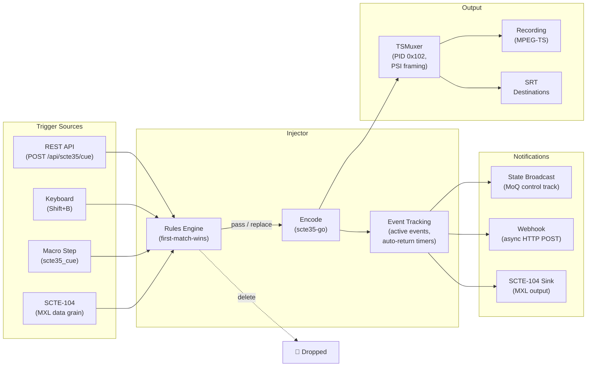
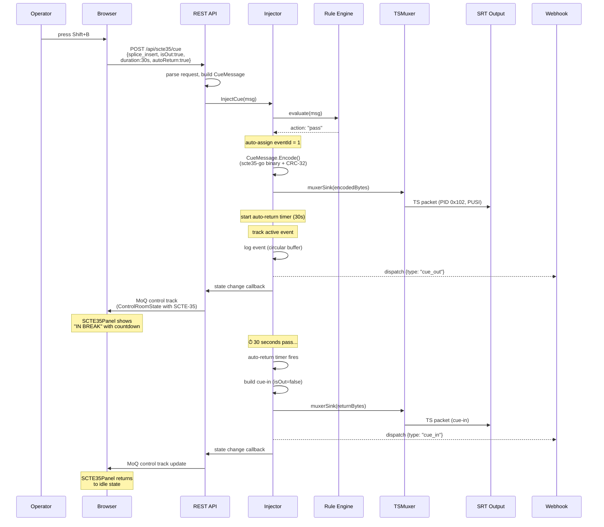
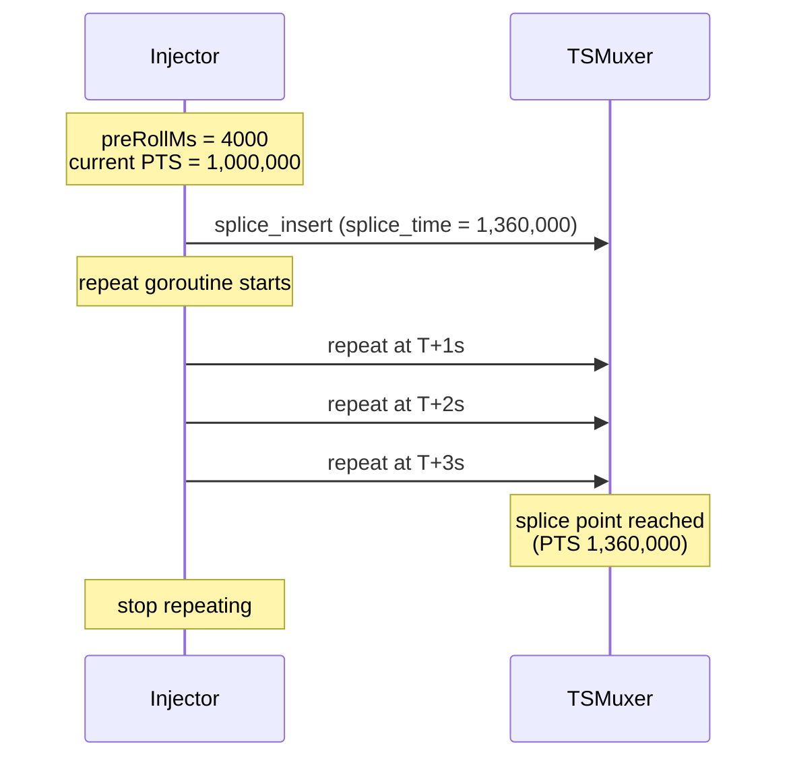
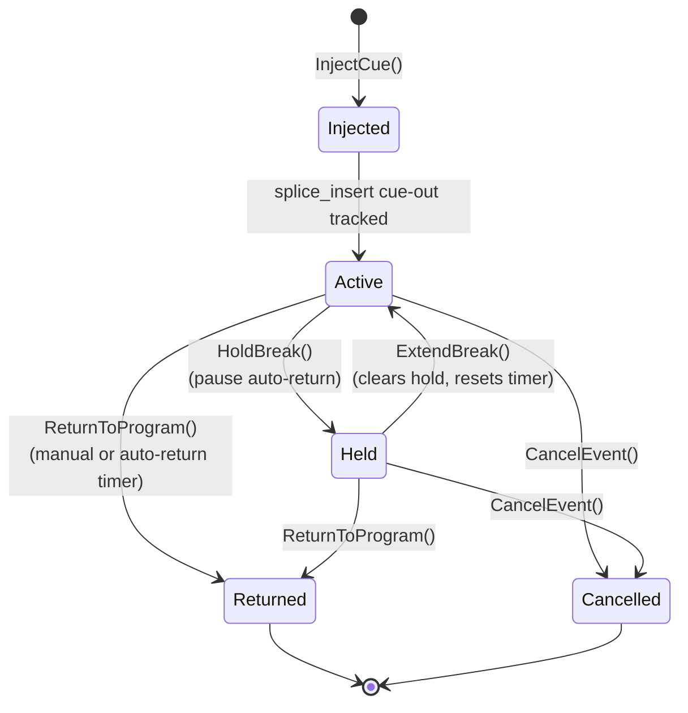
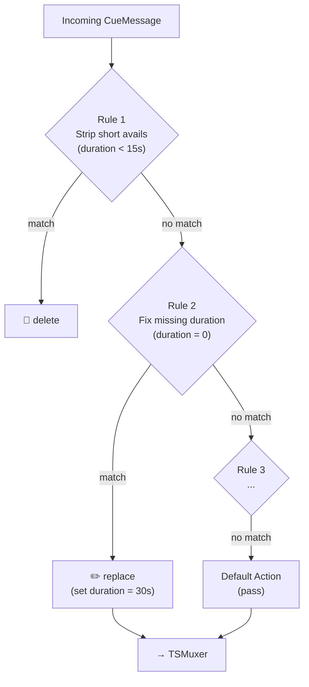
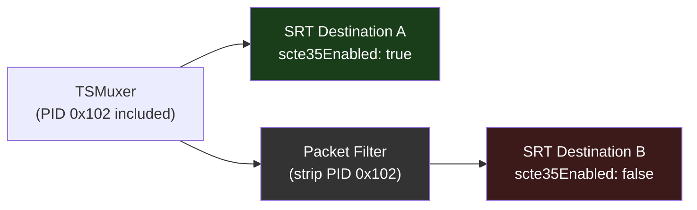

# SCTE-35 Ad Insertion & Signal Conditioning

1. [What SCTE-35 Does](#1-what-scte-35-does)
2. [An Ad Break Happens](#2-an-ad-break-happens)
3. [Command Types](#3-command-types)
4. [Timing & PTS Synchronization](#4-timing--pts-synchronization)
5. [Break Lifecycle](#5-break-lifecycle)
6. [Signal Conditioning Rules](#6-signal-conditioning-rules)
7. [MPEG-TS Muxing](#7-mpeg-ts-muxing)
8. [Per-Destination Filtering](#8-per-destination-filtering)
9. [SCTE-104 Automation](#9-scte-104-automation)
10. [The Browser](#10-the-browser)
11. [API Reference](#11-api-reference)
12. [Configuration](#12-configuration)

---

## 1. What SCTE-35 Does

SCTE-35 ([ANSI/SCTE 35](https://www.scte.org/standards/)) is the standard for splice signaling in MPEG-TS streams. Cable headends, OTT platforms, and server-side ad insertion (SSAI) systems read these signals to know when and where to insert ads.

SwitchFrame injects SCTE-35 signals in real time into its MPEG-TS output — recording files and SRT destinations. The implementation wraps [Comcast/scte35-go](https://github.com/Comcast/scte35-go) v1.7.1 for binary encoding and decoding.



---

## 2. An Ad Break Happens

Following a 30-second ad break from operator action to downstream delivery:



The injector manages the full lifecycle: injection, active event tracking with elapsed/remaining computation, auto-return timers, hold/extend state, and cleanup.

---

## 3. Command Types

SCTE-35 defines several command types. SwitchFrame implements the three most widely used:

### splice_insert (0x05)

The primary ad break signal. Supports cue-out (enter break) and cue-in (return to program).

```json
{
  "commandType": "splice_insert",
  "isOut": true,
  "durationMs": 30000,
  "autoReturn": true,
  "eventId": 0,
  "preRollMs": 0
}
```

| Field | Type | Description |
|-------|------|-------------|
| `commandType` | string | `"splice_insert"` |
| `isOut` | bool | `true` = cue-out (ad break), `false` = cue-in (return) |
| `durationMs` | int | Break duration in milliseconds. Optional. |
| `autoReturn` | bool | Auto-inject cue-in when duration expires |
| `preRollMs` | int | Advance notice in ms for scheduled splice. `0` = immediate. |
| `eventId` | uint32 | Splice event ID. Auto-assigned from counter if `0`. |
| `uniqueProgramId` | uint16 | Program identifier within the avail |
| `availNum` | uint8 | Avail number within the group |
| `availsExpected` | uint8 | Total avails in the group |

### time_signal (0x06)

Carries segmentation descriptors for content identification, placement opportunities, and program boundaries. Each descriptor has a segmentation type from [SCTE-35 Table 22](https://www.scte.org/standards/):

```json
{
  "commandType": "time_signal",
  "descriptors": [
    {
      "segmentationType": 52,
      "durationMs": 30000,
      "upidType": 9,
      "upid": "SIGNAL:abc123"
    }
  ]
}
```

| Segmentation Type | Name | Cue Direction |
|:-:|---|---|
| 0x22 | Break Start | Out |
| 0x23 | Break End | In |
| 0x30 | Provider Ad Start | Out |
| 0x31 | Provider Ad End | In |
| 0x34 | Provider PO Start | Out |
| 0x35 | Provider PO End | In |
| 0x36 | Distributor PO Start | Out |
| 0x37 | Distributor PO End | In |

The injector determines cue-out vs cue-in from the segmentation type. Matching Out/In pairs follow SCTE-35's convention: the End type ID is always the Start type + 1.

### splice_null (0x00)

A keepalive with no operational data. Sent periodically to confirm the SCTE-35 PID is active and keep downstream decoders alive. Configured via `--scte35-heartbeat`.

---

## 4. Timing & PTS Synchronization

### Immediate Mode

When `preRollMs` is `0` or omitted, the splice command is injected with `splice_immediate_flag` set. Downstream splicers act on it as soon as they receive the TS packet.

### Scheduled Mode

When `preRollMs > 0`, the injector computes a future splice time PTS:

```
splice_time_PTS = current_video_PTS + (preRollMs × 90)
```

The 90× multiplier converts milliseconds to 90 kHz MPEG-TS clock ticks. The current video PTS comes from `Switcher.LastBroadcastVideoPTS()` — an atomic load of the most recently broadcast video frame's PTS.

Scheduled cues are repeated every second until the splice point arrives, per [SCTE-67](https://www.scte.org/standards/) best practice. This repetition runs in a goroutine with a cancellable context, stopped on event return or cancel.



### PTS Wrapping

The 33-bit PTS field wraps at 2³³ = 8,589,934,592 ticks (~26.5 hours). The injector masks PTS values to 33 bits for correct wrapping behavior during long broadcasts.

---

## 5. Break Lifecycle

An active break transitions through several states. The operator can intervene at any point:



### Auto-Return

When `autoReturn: true` with a duration, a wall-clock timer starts on injection. When it fires, a cue-in is automatically injected for the event ID. The timer can be paused (hold) or reset (extend).

### Hold

Pauses the auto-return timer indefinitely. The break remains active until an explicit return or cancel. Useful when a commercial pod runs long.

```bash
curl -X POST https://localhost:8080/api/scte35/hold/1
```

### Extend

Sets a new total duration and resets the auto-return timer. Remaining time is calculated from the original start time. Also sends an updated splice_insert with the new break duration to downstream decoders.

```bash
curl -X POST https://localhost:8080/api/scte35/extend/1 \
  -H "Content-Type: application/json" \
  -d '{"durationMs": 90000}'
```

### Cancel

Sends a `splice_event_cancel_indicator` message and removes the event from tracking. For time_signal descriptors, a separate `segmentation_event_cancel_indicator` is supported:

```bash
curl -X POST https://localhost:8080/api/scte35/cancel/1            # splice_insert cancel
curl -X POST https://localhost:8080/api/scte35/cancel-segmentation/42  # descriptor cancel
```

### Late-Join (SRT Reconnect)

When an SRT client connects during an active break, `SyntheticBreakState()` generates a splice_insert with the remaining duration in immediate mode (no PTS, since the late-joiner has no PTS context). This lets the downstream splicer pick up the in-progress event.

---

## 6. Signal Conditioning Rules

The rules engine evaluates every cue before it reaches the muxer. Rules are ordered and evaluated first-match-wins — the first matching rule determines the action. If no rule matches, the default action applies (default: `"pass"`).



### Rule Structure

Each rule has conditions, logic, and an action:

```json
{
  "name": "Strip short avails",
  "enabled": true,
  "conditions": [
    {"field": "command_type", "operator": "=", "value": "5"},
    {"field": "duration", "operator": "<", "value": "15000"}
  ],
  "logic": "and",
  "action": "delete",
  "destinations": []
}
```

- **Logic**: `"and"` (all conditions must match) or `"or"` (any condition matches)
- **Action**: `"pass"` (inject unchanged), `"delete"` (drop silently), `"replace"` (modify via `replaceWith`)
- **Destinations**: Optional filter — empty applies to all outputs

### Condition Operators

| Operator | Description | Example |
|:--------:|-------------|---------|
| `=` | Equals | `command_type = 5` |
| `!=` | Not equals | `command_type != 0` |
| `>` | Greater than | `duration > 15000` |
| `<` | Less than | `duration < 15000` |
| `>=` | Greater or equal | `duration >= 30000` |
| `<=` | Less or equal | `duration <= 60000` |
| `contains` | String contains | `upid contains example.com` |
| `range` | Inclusive range | `segmentation_type_id range 52-55` |
| `matches` | Regex match | `upid matches ^https://` |

### Available Fields

| Field | Type | Source |
|-------|------|--------|
| `command_type` | int | SCTE-35 command type (`0` = splice_null, `5` = splice_insert, `6` = time_signal) |
| `is_out` | string | `"true"` or `"false"` |
| `duration` | int | Break duration in ms (from `BreakDuration` or first descriptor) |
| `event_id` | int | Splice event ID |
| `segmentation_type_id` | int | From first descriptor. `0` if no descriptors. |
| `upid` | string | From first descriptor. Empty if no descriptors. |

### Preset Templates

Five built-in templates are available via `GET /api/scte35/rules/templates`:

| Template | Action | What It Does |
|----------|:------:|-------------|
| Strip short avails | delete | Drop splice_insert with duration < 15s |
| Strip program boundaries | delete | Drop segmentation types 0x10–0x11 (program start/end) |
| Fix missing duration | replace | Set duration to 30s when missing |
| Pass placement opportunities | pass | Explicitly allow segmentation types 0x34–0x37 |
| Block non-SSAI signals | delete | Drop everything except splice_null |

Templates are created in disabled state. Enable after review.

### Persistence

Rules are stored at `~/.switchframe/scte35_rules.json` with atomic writes (temp file → fsync → rename). The internal `RuleEngine` is rebuilt from the store after every mutation.

---

## 7. MPEG-TS Muxing

SCTE-35 data is carried as a separate elementary stream in the MPEG-TS output:

| Property | Value |
|----------|-------|
| **PID** | `0x102` (configurable via `--scte35-pid`) |
| **PMT stream type** | `0x86` (SCTE-35) |
| **Registration descriptor** | CUEI (`0x43554549`) |
| **Framing** | PSI section (not PES) |
| **Continuity counter** | Per-PID, incrementing with each TS packet |

```
┌─────────────────── 188-byte TS Packet ───────────────────┐
│ Sync  │ PID    │ CC  │ PUSI │ Pointer │ splice_info_section │
│ 0x47  │ 0x0102 │ n   │  1   │  0x00   │ (SCTE-35 binary)    │
└────────────────────────────────────────────────────────────┘
```

The `TSMuxer` ([`output/muxer.go`](../server/output/muxer.go)) handles SCTE-35 integration:

- **`SetSCTE35PID(pid)`** — Configures the PID and registers stream type 0x86 in the PMT with a CUEI registration descriptor.
- **`WriteSCTE35(data)`** — Queues an encoded SCTE-35 section. Constructs one or more 188-byte TS packets with PUSI on the first packet.
- **Pre-init buffering** — Sections written before the first keyframe are queued internally and flushed after PAT/PMT initialization.

---

## 8. Per-Destination Filtering

Each SRT destination has a `scte35Enabled` flag (set via `/api/output/destinations`). When `false`, SCTE-35 PID packets are stripped from the MPEG-TS output before delivery to that destination.



This allows a direct-to-air feed to carry SCTE-35 while a social media simulcast does not, from the same program output.

---

## 9. SCTE-104 Automation

SCTE-104 is the automation-to-splicer protocol used by broadcast automation systems, typically embedded in SDI ancillary data (SMPTE ST 291 VANC). SwitchFrame supports bidirectional translation between SCTE-104 messages on [MXL](mxl.md) data flows and SCTE-35 cues in the MPEG-TS output.

### Prerequisites

- `--scte35` and `--scte104` flags enabled
- Built with MXL support (`-tags "cgo mxl"`)
- MXL source spec includes a data flow UUID: `videoUUID:audioUUID:dataUUID`

### Bidirectional Data Flow

```mermaid
flowchart LR
    subgraph inbound ["Inbound (MXL → SCTE-35)"]
        direction LR
        grain["MXL Data Grain<br/>(SDI VANC)"] --> parse["ParseST291<br/>(DID=0x41, SDID=0x07)"]
        parse --> decode104["scte104.Decode<br/>(SOM / MOM)"]
        decode104 --> translate["ToCueMessage<br/>(source='scte104')"]
        translate --> inject["Injector<br/>.InjectCue()"]
    end

    subgraph outbound ["Outbound (SCTE-35 → MXL)"]
        direction LR
        sink["Injector<br/>SCTE104Sink"] --> from["FromCueMessage"]
        from --> encode104["scte104.Encode<br/>(always MOM)"]
        encode104 --> wrap["WrapST291"]
        wrap --> write["MXL Output<br/>.WriteDataGrain()"]
    end

    inject -.->|"echo prevention:<br/>skip if source='scte104'"| sink
```



The `source` field on each `CueMessage` prevents echo loops: cues originating from SCTE-104 (`source="scte104"`) are not sent back through the SCTE-104 sink.

### Translation Rules

**Inbound (SCTE-104 → SCTE-35):**

| SCTE-104 Operation | SCTE-35 Result |
|---|---|
| splice_request (0x0101), start normal | splice_insert, isOut=true, timing="scheduled" |
| splice_request, start immediate | splice_insert, isOut=true, timing="immediate" |
| splice_request, end normal/immediate | splice_insert, isOut=false |
| splice_request, cancel | splice_insert with cancel indicator |
| splice_null (0x0102) | splice_null |
| time_signal_request (0x0104) + segmentation_descriptor_request (0x010B) | time_signal with descriptors |

**Outbound (SCTE-35 → SCTE-104):**

| SCTE-35 Command | SCTE-104 Result |
|---|---|
| splice_null | splice_null |
| splice_insert, isOut=true | splice_request, start immediate |
| splice_insert, isOut=false | splice_request, end immediate |
| splice_insert, cancel | splice_request, cancel |
| time_signal | time_signal_request + segmentation_descriptor_request per descriptor |

Break durations convert between SCTE-104's 100ms units and SCTE-35's `time.Duration` with 50ms rounding to avoid truncation.

### SMPTE ST 291 VANC Framing

SCTE-104 messages are wrapped in ST 291 ancillary data packets:

| Byte | Field | Value |
|------|-------|-------|
| 0 | DID | `0x41` (SCTE-104) |
| 1 | SDID | `0x07` |
| 2 | DC | Data count (payload + 1 for descriptor) |
| 3 | Descriptor | `0x00` (non-fragmented) |
| 4..N | Payload | SCTE-104 binary (MOM format) |
| N+1 | Checksum | Sum of all preceding bytes, masked to 0xFF |

Maximum single-packet payload is 254 bytes (DC field is 8-bit, max 255; one byte reserved for the payload descriptor). `WrapST291()` returns `ErrST291PayloadTooLarge` if the encoded SCTE-104 message exceeds this limit.

### Fragmentation Limitation

Only single-packet (non-fragmented) ST 291 messages are supported. `ParseST291()` rejects any packet with the `continued_pkt` or `following_pkt` bits set in the descriptor byte, returning `ErrST291Fragmented`. In practice this is rarely hit because SCTE-104 splice requests are small (~30-60 bytes), but compound messages with many segmentation descriptors could exceed the 254-byte limit and would need fragmentation that is not currently implemented.

---

## 10. The Browser

The SCTE-35 panel is accessible via the **SCTE** tab in the bottom panel.

### Three-Zone Layout

1. **Quick Actions** — Duration presets (30s, 60s, 90s, 120s), auto-return toggle, pre-roll selector, and AD BREAK / RETURN buttons. Active events appear as cards with countdown timers and hold/extend/cancel controls.

2. **Cue Builder** — Advanced form with splice_insert and time_signal tabs. splice_insert exposes all fields (event ID, duration, avail, unique program ID). time_signal exposes segmentation descriptor fields (type, UPID type, UPID value, duration).

3. **Event Log** — Reverse-chronological history with status badges (injected, returned, cancelled, held, extended).

### Keyboard Shortcuts

| Shortcut | Action |
|:--------:|--------|
| `Shift+B` | Start a 30-second ad break with auto-return |
| `Shift+R` | Return to program (most recent active event) |
| `Shift+H` | Hold the current break |
| `Shift+E` | Extend the current break by 30 seconds |

### Macro Actions

Five SCTE-35 actions are available in the [macro system](architecture.md#10-control--coordination):

| Action | Parameters |
|--------|-----------|
| `scte35_cue` | `commandType`, `isOut`, `durationMs`, `autoReturn` |
| `scte35_return` | `eventId` (optional; `0` returns most recent) |
| `scte35_cancel` | `eventId` |
| `scte35_hold` | `eventId` |
| `scte35_extend` | `eventId`, `durationMs` |

### State Broadcast

SCTE-35 state is included in `ControlRoomState.scte35`, pushed to browsers via the MoQ control track:

```typescript
interface SCTE35State {
  enabled: boolean;
  scte104Enabled?: boolean;
  activeEvents: Record<number, {
    eventId: number;
    commandType: string;     // "splice_insert" | "time_signal"
    isOut: boolean;
    durationMs?: number;
    elapsedMs: number;
    remainingMs?: number;
    autoReturn: boolean;
    held: boolean;
    spliceTimePts: number;
    startedAt: number;       // Unix ms
    descriptors?: SCTE35DescriptorInfo[];
  }>;
  eventLog: SCTE35Event[];
  heartbeatOk: boolean;
  config: {
    heartbeatIntervalMs: number;
    defaultPreRollMs: number;
    pid: number;
    verifyEncoding: boolean;
    webhookUrl: string;
  };
}
```

---

## 11. API Reference

All endpoints require `--scte35`. Returns `501 Not Implemented` when disabled.

### Cue Management

| Method | Path | Description |
|:------:|------|-------------|
| POST | `/api/scte35/cue` | Inject a cue (splice_insert or time_signal) |
| POST | `/api/scte35/return` | Return most recent active event |
| POST | `/api/scte35/return/{eventId}` | Return specific event |
| POST | `/api/scte35/cancel/{eventId}` | Cancel splice_insert event |
| POST | `/api/scte35/cancel-segmentation/{segEventId}` | Cancel segmentation descriptor |
| POST | `/api/scte35/hold/{eventId}` | Hold auto-return timer |
| POST | `/api/scte35/extend/{eventId}` | Extend break (`{"durationMs": N}`) |
| GET | `/api/scte35/status` | Injector state snapshot |
| GET | `/api/scte35/log` | Event log (circular buffer, 256 entries) |
| GET | `/api/scte35/active` | Active event IDs |

### Rules Management

| Method | Path | Description |
|:------:|------|-------------|
| GET | `/api/scte35/rules` | List all rules |
| POST | `/api/scte35/rules` | Create rule (ID auto-assigned) |
| PUT | `/api/scte35/rules/{id}` | Update rule |
| DELETE | `/api/scte35/rules/{id}` | Delete rule |
| PUT | `/api/scte35/rules/default` | Set default action (`{"action": "pass"}`) |
| POST | `/api/scte35/rules/reorder` | Reorder rules (`{"ids": [...]}`) |
| GET | `/api/scte35/rules/templates` | List 5 preset templates |
| POST | `/api/scte35/rules/from-template` | Create from template (`{"name": "..."}`) |

### Webhooks

When `--scte35-webhook URL` is configured, the injector sends async HTTP POST notifications:

| Event Type | Trigger |
|:----------:|---------|
| `cue_out` | Cue-out injected (splice_insert with isOut=true) |
| `cue_in` | Return to program |
| `cancel` | splice_event_cancel_indicator sent |
| `cancel_segmentation` | segmentation_event_cancel_indicator sent |
| `hold` | Auto-return timer paused |
| `extend` | Break duration changed |

The dispatcher is fire-and-forget with a bounded queue (64 events). Slow endpoints cause drops, not backpressure.

---

## 12. Configuration

### CLI Flags

| Flag | Default | Description |
|------|:-------:|-------------|
| `--scte35` | `false` | Enable SCTE-35 support |
| `--scte35-pid` | `0x102` | MPEG-TS PID for the SCTE-35 elementary stream |
| `--scte35-preroll` | `4000` | Default pre-roll time in milliseconds |
| `--scte35-heartbeat` | `5000` | splice_null heartbeat interval (ms). `0` to disable. |
| `--scte35-verify` | `true` | Round-trip CRC verification (encode → decode → compare) |
| `--scte35-webhook` | `""` | Webhook URL for event notifications |
| `--scte104` | `false` | Bidirectional SCTE-104 on MXL data flows (requires `--scte35` + MXL build) |

### Package Structure

```
server/scte35/
  message.go         CueMessage types, Encode/Decode (wraps Comcast/scte35-go)
  injector.go        Lifecycle: inject, schedule, auto-return, hold, extend, heartbeat
  parser.go          MPEG-TS extraction with CRC validation, PID detection
  rules.go           Signal conditioning: first-match-wins, AND/OR, 8 operators
  rules_store.go     File-based CRUD (~/.switchframe/scte35_rules.json)
  webhook.go         Async HTTP POST dispatcher (bounded queue, single worker)

server/scte104/
  message.go         Message, Operation, SpliceRequestData, SegmentationDescriptorRequest
  decode.go          Binary parser for SOM and MOM (Multiple Operation Message)
  encode.go          Binary serializer (always outputs MOM format)
  st291.go           SMPTE ST 291 VANC framing (DID=0x41, SDID=0x07)
  translate.go       ToCueMessage() and FromCueMessage() bidirectional translation

server/control/
  api_scte35.go      18 REST API handlers

server/output/
  muxer.go           TSMuxer: PID registration, PSI section framing, continuity counter
```

### Concurrency

The `Injector` uses a single `sync.Mutex` protecting the active events map, event log, and rule engine pointer. State change callbacks and webhook dispatch are invoked outside the lock to prevent deadlock (the callback may re-enter via `State()` which acquires the same mutex). The heartbeat goroutine is independent — `sendHeartbeat()` only calls `muxerSink` without acquiring the lock.

### Known Limitations

- **No splice_schedule (0x04)** — Rarely used in modern systems, not implemented.
- **No redundant transmission** — The spec recommends repeated injection. SwitchFrame sends each command once (except scheduled cues, which repeat per SCTE-67).
- **No encryption** — SCTE-35 section encryption is not supported.
- **No webhook retry** — Fire-and-forget. Failed requests are logged but not retried.
- **Single UPID per descriptor** — Multiple UPIDs per segmentation descriptor are not supported.
- **Library decoder workaround** — Comcast/scte35-go fails on spec-compliant cancel messages. SwitchFrame includes a fallback parser (`decodeSpliceInsertCancel`) and skips verification for cancel messages.
- **Per-destination rules** — Rules with the `destinations` field are evaluated at injection time with no destination context. True per-destination modification (different durations per output) is not yet implemented. Use per-destination SCTE-35 enable/disable for coarse filtering.

---

*See also: [Architecture](architecture.md) · [API Reference](api.md) · [MXL Integration](mxl.md) · [Deployment](deployment.md)*
